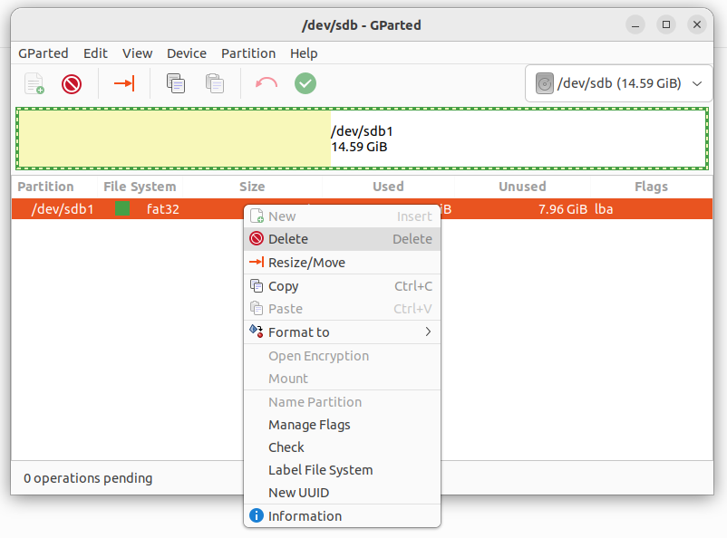
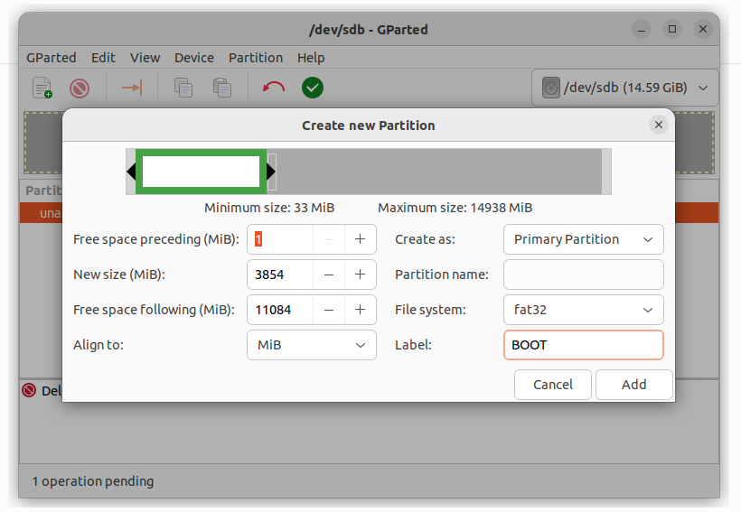
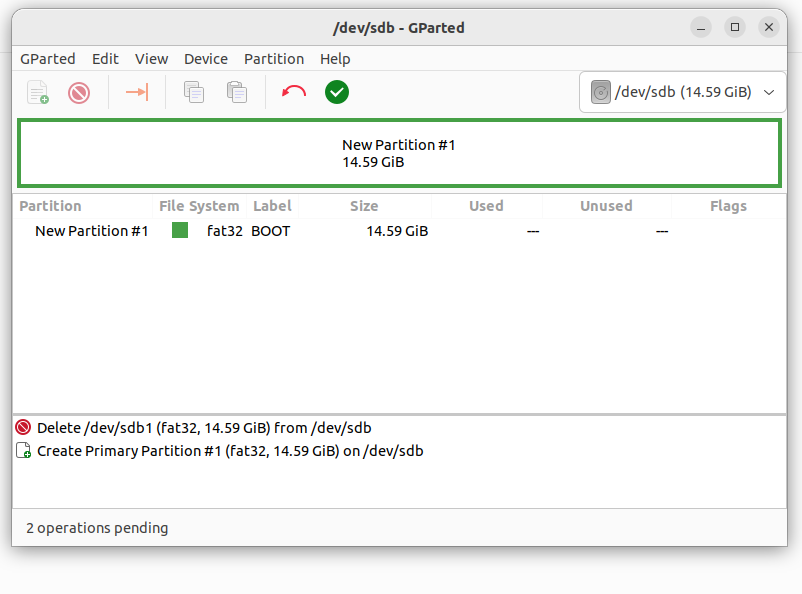
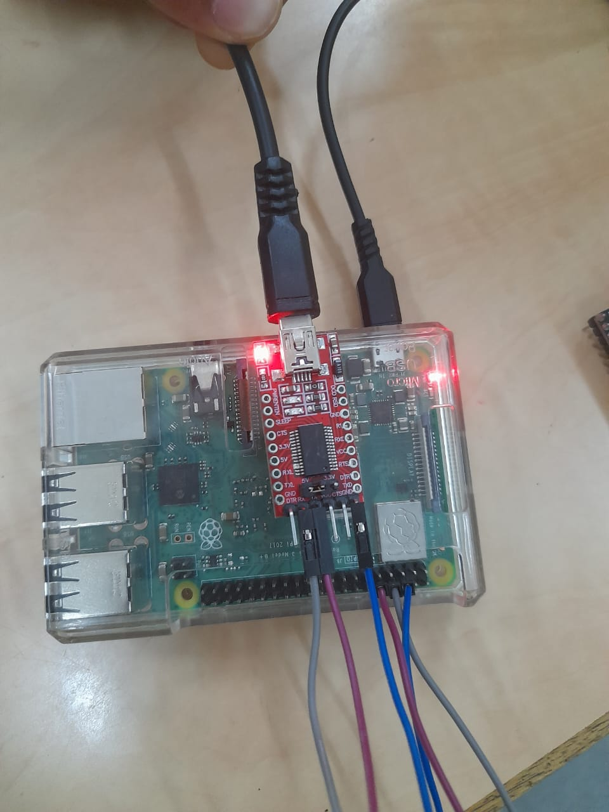
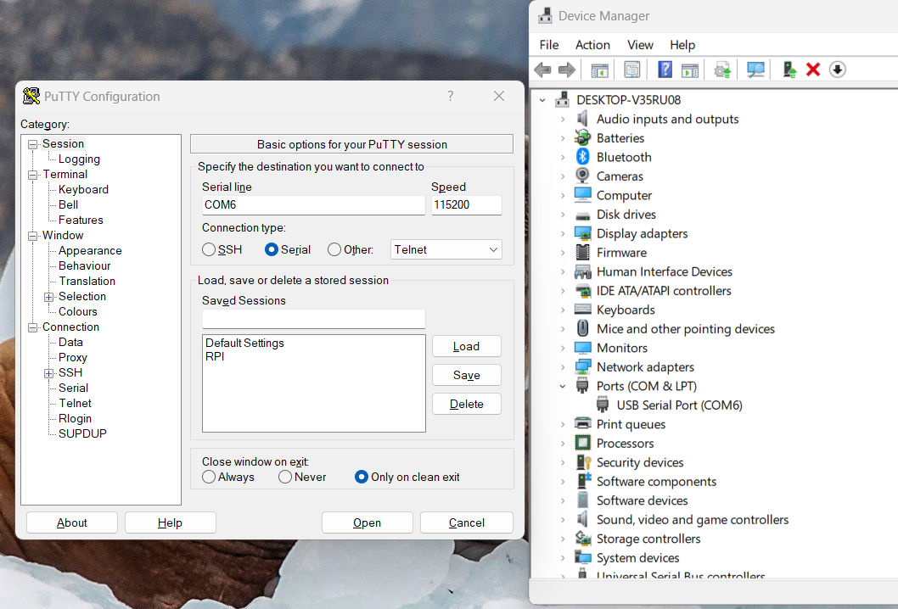
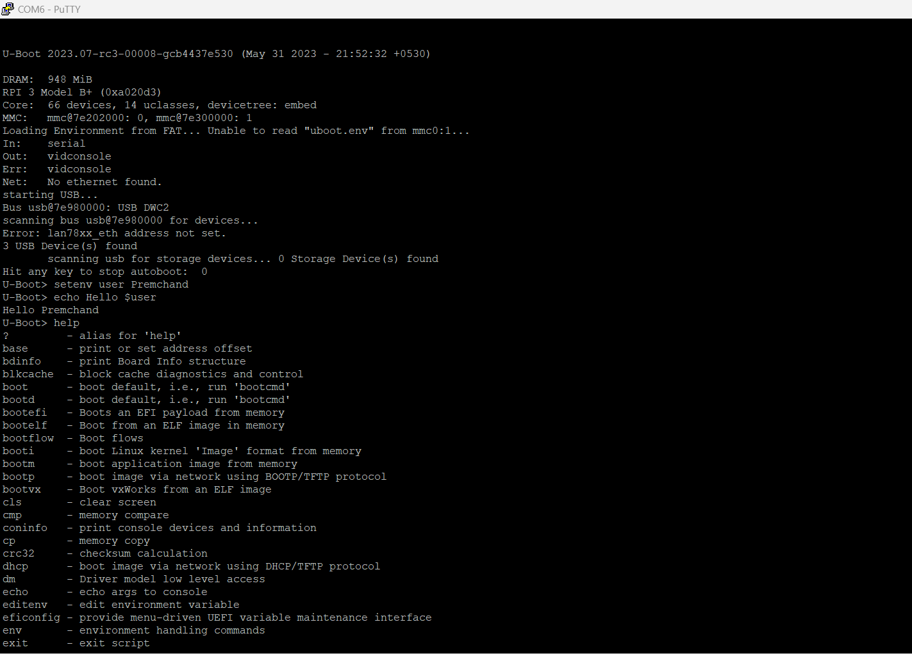

# U-BOOT on RPI 3B+ #
In this artical i have shown how we can build [U-BOOT](https://en.wikipedia.org/wiki/Das_U-Boot) image and use on [Raspberry Pi 3 B plus](https://www.raspberrypi.com/products/raspberry-pi-3-model-b-plus/)
-----------

## Prerequisites
Before we build the u-boot binay first we have to do some setup required to build u-boot

### First we Create Workspace where we can save nacessory files and folders
> `prem@Ubuntu:~/Desktop$` ***mkdir U-BOOT-RPI***  
> `prem@Ubuntu:~/Desktop$` ***cd U-BOOT-RPI/***
### Update __apt__ command
> `prem@Ubuntu:~/Desktop$` ***sudo apt update***
    

           
Command Output

           <pre>Hit:1 http://us.archive.ubuntu.com/ubuntu jammy InRelease                                
Get:2 http://us.archive.ubuntu.com/ubuntu jammy-updates InRelease [119 kB]   
Hit:3 http://security.ubuntu.com/ubuntu jammy-security InRelease
Get:4 http://us.archive.ubuntu.com/ubuntu jammy-backports InRelease [108 kB]
Get:5 http://us.archive.ubuntu.com/ubuntu jammy-updates/main i386 Packages [410 kB]
Get:5 http://us.archive.ubuntu.com/ubuntu jammy-updates/main i386 Packages [410 kB]
Get:5 http://us.archive.ubuntu.com/ubuntu jammy-updates/main i386 Packages [410 kB]
Get:5 http://us.archive.ubuntu.com/ubuntu jammy-updates/main i386 Packages [410 kB]
Get:5 http://us.archive.ubuntu.com/ubuntu jammy-updates/main i386 Packages [410 kB]
Get:5 http://us.archive.ubuntu.com/ubuntu jammy-updates/main i386 Packages [410 kB]
Get:5 http://us.archive.ubuntu.com/ubuntu jammy-updates/main i386 Packages [410 kB]
Get:5 http://us.archive.ubuntu.com/ubuntu jammy-updates/main i386 Packages [410 kB]
Get:5 http://us.archive.ubuntu.com/ubuntu jammy-updates/main i386 Packages [410 kB]
Get:5 http://us.archive.ubuntu.com/ubuntu jammy-updates/main i386 Packages [410 kB]
Get:5 http://us.archive.ubuntu.com/ubuntu jammy-updates/main i386 Packages [410 kB]
Get:5 http://us.archive.ubuntu.com/ubuntu jammy-updates/main i386 Packages [410 kB]
Get:5 http://us.archive.ubuntu.com/ubuntu jammy-updates/main i386 Packages [410 kB]
Get:5 http://us.archive.ubuntu.com/ubuntu jammy-updates/main i386 Packages [410 kB]
Get:5 http://us.archive.ubuntu.com/ubuntu jammy-updates/main i386 Packages [410 kB]
Get:5 http://us.archive.ubuntu.com/ubuntu jammy-updates/main i386 Packages [410 kB]
Get:5 http://us.archive.ubuntu.com/ubuntu jammy-updates/main i386 Packages [410 kB]
Get:5 http://us.archive.ubuntu.com/ubuntu jammy-updates/main i386 Packages [410 kB]
Get:5 http://us.archive.ubuntu.com/ubuntu jammy-updates/main i386 Packages [410 kB]
Get:5 http://us.archive.ubuntu.com/ubuntu jammy-updates/main i386 Packages [410 kB]
Get:5 http://us.archive.ubuntu.com/ubuntu jammy-updates/main i386 Packages [410 kB]
Get:5 http://us.archive.ubuntu.com/ubuntu jammy-updates/main i386 Packages [410 kB]
Get:27 http://us.archive.ubuntu.com/ubuntu jammy-updates/main amd64 Packages [660kB]                                                                                                                     
Get:27 http://us.archive.ubuntu.com/ubuntu jammy-updates/main amd64 Packages [660kB]                                                                                                                     
Get:27 http://us.archive.ubuntu.com/ubuntu jammy-updates/main amd64 Packages [660kB]                                                                                                                     
Get:27 http://us.archive.ubuntu.com/ubuntu jammy-updates/main amd64 Packages [660kB]                                                                                                                     
Get:27 http://us.archive.ubuntu.com/ubuntu jammy-updates/main amd64 Packages [660kB]                                                                                                                     
Get:27 http://us.archive.ubuntu.com/ubuntu jammy-updates/main amd64 Packages [660kB]                                                                                                                     
Get:27 http://us.archive.ubuntu.com/ubuntu jammy-updates/main amd64 Packages [660kB]                                                                                                                     
Get:27 http://us.archive.ubuntu.com/ubuntu jammy-updates/main amd64 Packages [660kB]                                                                                                                     
Get:27 http://us.archive.ubuntu.com/ubuntu jammy-updates/main amd64 Packages [660kB]                                                                                                                     
Get:27 http://us.archive.ubuntu.com/ubuntu jammy-updates/main amd64 Packages [660kB]                                                                                                                     
Get:27 http://us.archive.ubuntu.com/ubuntu jammy-updates/main amd64 Packages [660kB]                                                                                                                     
Get:27 http://us.archive.ubuntu.com/ubuntu jammy-updates/main amd64 Packages [660kB]                                                                                                                     
Get:27 http://us.archive.ubuntu.com/ubuntu jammy-updates/main amd64 Packages [660kB]                                                                                                                     
Get:27 http://us.archive.ubuntu.com/ubuntu jammy-updates/main amd64 Packages [660kB]                                                                                                                     
Get:27 http://us.archive.ubuntu.com/ubuntu jammy-updates/main amd64 Packages [660kB]                                                                                                                     
Get:27 http://us.archive.ubuntu.com/ubuntu jammy-updates/main amd64 Packages [660kB]                                                                                                                     
Get:27 http://us.archive.ubuntu.com/ubuntu jammy-updates/main amd64 Packages [660kB]                                                                                                                     
Get:44 http://us.archive.ubuntu.com/ubuntu jammy-updates/main amd64 DEP-11 Metadata [102kB]                                                                                                              
Get:45 http://us.archive.ubuntu.com/ubuntu jammy-updates/universe i386 Packages [616kB]                                                                                                                  
Get:46 http://us.archive.ubuntu.com/ubuntu jammy-updates/universe amd64 Packages [907kB]                                                                                                                 
Get:47 http://us.archive.ubuntu.com/ubuntu jammy-updates/universe amd64 DEP-11 Metadata [269kB]                                                                                                          
Get:48 http://us.archive.ubuntu.com/ubuntu jammy-updates/multiverse amd64 DEP-11 Metadata [940B]                                                                                                         
Get:49 http://us.archive.ubuntu.com/ubuntu jammy-backports/main amd64 DEP-11 Metadata [7,980B]                                                                                                           
Get:50 http://us.archive.ubuntu.com/ubuntu jammy-backports/universe amd64 DEP-11 Metadata [16.9kB]                                                                                                       
Fetched 3,216 kB in 39s (83.0 kBs)                                                                                                                                                                       
Reading package lists... Done
Building dependency tree... Done
Reading state information... Done
196 packages can be upgraded. Run 'apt list --upgradable' to see them.
</pre>

### Clone __U-BOOT__ source code using git command
> `prem@Ubuntu:~/Desktop/U-BOOT-RPI$` ***git clone https://github.com/u-boot/u-boot.git***
    

           
Command Output

           <pre>Cloning into 'u-boot'...
remote: Enumerating objects: 924901, done.
remote: Counting objects: 100% (37/37), done.
remote: Compressing objects: 100% (22/22), done.
remote: Total 924901 (delta 15), reused 29 (delta 15), pack-reused 924864
Receiving objects: 100% (924901/924901), 217.96 MiB | 158.00 KiB/s, done.
Resolving deltas: 100% (758321/758321), done.
</pre>
         

### Install tools and softwares required to build U-BOOT binary
> `prem@Ubuntu:~/Desktop/U-BOOT-RPI$` ***sudo apt-get install bc bison build-essential coccinelle \
  device-tree-compiler dfu-util efitools flex gdisk graphviz imagemagick \
  liblz4-tool libgnutls28-dev libguestfs-tools libncurses-dev \
  libpython3-dev libsdl2-dev libssl-dev lz4 lzma lzma-alone openssl \
  pkg-config python3 python3-asteval python3-coverage python3-filelock \
  python3-pkg-resources python3-pycryptodome python3-pyelftools \
  python3-pytest python3-pytest-xdist python3-sphinxcontrib.apidoc \
  python3-sphinx-rtd-theme python3-subunit python3-testtools \
  python3-virtualenv swig uuid-dev -y***
    

           
Command Output

           <pre>Reading package lists... Done
Building dependency tree... Done
Reading state information... Done
bc is already the newest version (1.07.1-3build1).
bc set to manually installed.
gdisk is already the newest version (1.0.8-4build1).
gdisk set to manually installed.
python3 is already the newest version (3.10.6-1\~22.04).
python3 set to manually installed.
python3-pkg-resources is already the newest version (59.6.0-1.2ubuntu0.22.04.1).
python3-pkg-resources set to manually installed.
The following additional packages will be installed:
  attr augeas-lenses binutils binutils-common binutils-x86-64-linux-gnu bsdmainutils btrfs-progs cpp-11 cpu-checker cryptsetup-bin curl db-util db5.3-util debootstrap dmeventd docutils-common dpkg-dev
  exfatprogs extlinux f2fs-tools fakeroot finalrd fonts-font-awesome fonts-lato g++ g++-11 gawk gcc gcc-11 gcc-11-base gsfonts guestfish guestfs-tools guestmount hfsplus ibverbs-providers icoutils
  imagemagick-6-common imagemagick-6.q16 ipxe-qemu ipxe-qemu-256k-compat-efi-roms javascript-common kpartx ldmtool ledit libafflib0v5 libaio1 libalgorithm-diff-perl libalgorithm-diff-xs-perl
  libalgorithm-merge-perl libann0 libaom3 libasan6 libasound2-dev libaugeas0 libbfio1 libbinutils libblkid-dev libc-dev-bin libc-devtools libc6-dev libcacard0 libcc1-0 libcdt5 libcgraph6 libconfig9
  libcrypt-dev libctf-nobfd0 libctf0 libcurl4 libdate-manip-perl libdav1d5 libdaxctl1 libdbus-1-dev libde265-0 libdecor-0-0 libdecor-0-dev libdecor-0-plugin-1-cairo libdevmapper-event1.02.1
  libdpkg-perl libdrm-dev libegl-dev libegl1-mesa-dev libewf2 libexpat1-dev libfakeroot libfdt1 libffi-dev libfftw3-double3 libfile-fcntllock-perl libfindlib-ocaml libfindlib-ocaml-dev libfl-dev libfl2
  libfuse2 libgbm-dev libgcc-11-dev libgfapi0 libgfrpc0 libgfxdr0 libgl-dev libgles-dev libgles1 libglib2.0-0 libglib2.0-bin libglib2.0-dev libglib2.0-dev-bin libglu1-mesa-dev libglusterfs0
  libglvnd-core-dev libglvnd-dev libglx-dev libgmp-dev libgmpxx4ldbl libgnutls-dane0 libgnutls-openssl27 libgnutls30 libgnutlsxx28 libgts-0.7-5 libgts-bin libguestfs-hfsplus libguestfs-perl
  libguestfs-reiserfs libguestfs-xfs libguestfs0 libgvc6 libgvpr2 libheif1 libhfsp0 libhivex0 libibus-1.0-dev libibverbs1 libice-dev libidn2-dev libilmbase25 libintl-perl libintl-xs-perl libiscsi7
  libitm1 libjs-jquery libjs-sphinxdoc libjs-underscore libjxr-tools libjxr0 liblab-gamut1 libldm-1.0-0 liblqr-1-0 liblsan0 liblvm2cmd2.03 libmagickcore-6.q16-6 libmagickcore-6.q16-6-extra
  libmagickwand-6.q16-6 libmount-dev libncurses6 libncursesw6 libndctl6 libnetpbm10 libnsl-dev libnss-systemd libopenexr25 libopengl-dev libp11-kit-dev libpam-systemd libparmap-ocaml libpathplan4
  libpciaccess-dev libpcre16-3 libpcre2-16-0 libpcre2-dev libpcre2-posix3 libpcre3-dev libpcre32-3 libpcrecpp0v5 libpmem1 libpmemobj1 libpthread-stubs0-dev libpulse-dev libpulse-mainloop-glib0
  libpulse0 libpulsedsp libpython3.10 libpython3.10-dev libpython3.10-minimal libpython3.10-stdlib libquadmath0 librados2 librbd1 librdmacm1 librpm9 librpmio9 libsdl2-2.0-0 libselinux1-dev libsepol-dev
  libsigsegv2 libslirp0 libsm-dev libsndio-dev libsndio7.0 libspice-server1 libssl3 libstdc++-11-dev libstdcompat-ocaml libstring-shellquote-perl libsys-virt-perl libsystemd0 libtasn1-6-dev
  libtasn1-doc libtinfo6 libtirpc-dev libtsan0 libtsk19 libubsan1 libudev-dev libudev1 libunbound8 liburing2 libusbredirparser1 libvhdi1 libvirglrenderer1 libvirt0 libvmdk1 libwayland-bin
  libwayland-dev libwin-hivex-perl libx11-dev libx265-199 libxau-dev libxcb1-dev libxcursor-dev libxdmcp-dev libxext-dev libxfixes-dev libxi-dev libxinerama-dev libxkbcommon-dev libxml-xpath-perl
  libxrandr-dev libxrender-dev libxss-dev libxt-dev libxv-dev libxxf86vm-dev libyara8 linux-libc-dev lsscsi lto-disabled-list lvm2 lzop m4 make manpages-dev mdadm msr-tools mtools ncal netpbm
  nettle-dev ocaml ocaml-base ocaml-compiler-libs ocaml-findlib ocaml-interp ocaml-man osinfo-db ovmf pulseaudio pulseaudio-module-bluetooth pulseaudio-utils python-babel-localedata python3-alabaster
  python3-attr python3-babel python3-dev python3-distlib python3-distutils python3-docutils python3-execnet python3-extras python3-fixtures python3-imagesize python3-iniconfig python3-jinja2
  python3-packaging python3-pbr python3-pip python3-pip-whl python3-platformdirs python3-pluggy python3-py python3-pygments python3-pytest-forked python3-roman python3-setuptools python3-setuptools-whl
  python3-snowballstemmer python3-sphinx python3-toml python3-wheel python3-wheel-whl python3.10 python3.10-dev python3.10-minimal qemu-block-extra qemu-system-common qemu-system-data qemu-system-gui
  qemu-system-x86 qemu-utils reiserfsprogs rpcsvc-proto rpm-common scrub seabios sleuthkit sphinx-common sphinx-rtd-theme-common supermin swig4.0 syslinux syslinux-common systemd systemd-oomd
  systemd-sysv systemd-timesyncd thin-provisioning-tools udev virt-p2v x11proto-dev xfsprogs xorg-sgml-doctools xtrans-dev zerofree zlib1g-dev
Suggested packages:
  augeas-doc binutils-doc bison-doc calendar whois vacation mailutils duperemove coccinelle-doc vim-addon-manager gcc-11-locales squid-deb-proxy-client debian-archive-keyring arch-test debian-keyring
  flex-doc g++-multilib g++-11-multilib gcc-11-doc gawk-doc gcc-multilib autoconf automake libtool gcc-doc gcc-11-multilib graphviz-doc libterm-readline-gnu-perl | libterm-readline-perl-perl
  imagemagick-doc autotrace enscript ffmpeg gimp gnuplot grads hp2xx html2ps libwmf-bin mplayer povray radiance texlive-base-bin transfig ufraw-batch apache2 | lighttpd | httpd libasound2-doc
  augeas-tools glibc-doc bzr libfftw3-bin libfftw3-dev libgirepository1.0-dev libglib2.0-doc libxml2-utils gmp-doc libgmp10-doc libmpfr-dev gnutls-bin gnutls-doc libguestfs-gfs2 libguestfs-jfs
  libguestfs-nilfs libguestfs-rescue libguestfs-rsync libguestfs-zfs libice-doc inkscape ncurses-doc p11-kit-doc libsm-doc sndiod gstreamer1.0-libav gstreamer1.0-plugins-ugly libssl-doc
  libstdc++-11-doc libwayland-doc libx11-doc libxcb-doc libxext-doc libxt-doc m4-doc make-doc default-mta | mail-transport-agent dracut-core floppyd ocaml-doc elpa-tuareg camlp4 pavumeter pavucontrol
  paprefs ubuntu-sounds gstreamer1.0-plugins-bad python-attr-doc python-coverage-doc docutils-doc fonts-linuxlibertine | ttf-linux-libertine texlive-lang-french texlive-latex-base
  texlive-latex-recommended execnet-doc python-jinja2-doc subversion python-pygments-doc ttf-bitstream-vera python-setuptools-doc python3-stemmer dvipng fonts-freefont-otf latexmk libjs-mathjax
  sphinx-doc tex-gyre texlive-fonts-recommended texlive-latex-extra texlive-plain-generic python-testtools-doc python2-pip-whl python2-setuptools-whl python3.10-venv python3.10-doc binfmt-support samba
  vde2 autopsy mac-robber swig-doc swig-examples swig4.0-examples swig4.0-doc systemd-container libtss2-rc0 xfsdump quota
Recommended packages:
  linux-image-amd64
The following NEW packages will be installed:
  attr augeas-lenses binutils binutils-common binutils-x86-64-linux-gnu bison bsdmainutils btrfs-progs build-essential coccinelle cpu-checker cryptsetup-bin curl db-util db5.3-util debootstrap
  device-tree-compiler dfu-util dmeventd docutils-common dpkg-dev efitools exfatprogs extlinux f2fs-tools fakeroot finalrd flex fonts-font-awesome fonts-lato g++ g++-11 gawk gcc gcc-11 graphviz gsfonts
  guestfish guestfs-tools guestmount hfsplus ibverbs-providers icoutils imagemagick imagemagick-6-common imagemagick-6.q16 ipxe-qemu ipxe-qemu-256k-compat-efi-roms javascript-common kpartx ldmtool
  ledit libafflib0v5 libaio1 libalgorithm-diff-perl libalgorithm-diff-xs-perl libalgorithm-merge-perl libann0 libaom3 libasan6 libasound2-dev libaugeas0 libbfio1 libbinutils libblkid-dev libc-dev-bin
  libc-devtools libc6-dev libcacard0 libcc1-0 libcdt5 libcgraph6 libconfig9 libcrypt-dev libctf-nobfd0 libctf0 libdate-manip-perl libdav1d5 libdaxctl1 libdbus-1-dev libde265-0 libdecor-0-0
  libdecor-0-dev libdecor-0-plugin-1-cairo libdevmapper-event1.02.1 libdpkg-perl libdrm-dev libegl-dev libegl1-mesa-dev libewf2 libexpat1-dev libfakeroot libfdt1 libffi-dev libfftw3-double3
  libfile-fcntllock-perl libfindlib-ocaml libfindlib-ocaml-dev libfl-dev libfl2 libfuse2 libgbm-dev libgcc-11-dev libgfapi0 libgfrpc0 libgfxdr0 libgl-dev libgles-dev libgles1 libglib2.0-dev
  libglib2.0-dev-bin libglu1-mesa-dev libglusterfs0 libglvnd-core-dev libglvnd-dev libglx-dev libgmp-dev libgmpxx4ldbl libgnutls-dane0 libgnutls-openssl27 libgnutls28-dev libgnutlsxx28 libgts-0.7-5
  libgts-bin libguestfs-hfsplus libguestfs-perl libguestfs-reiserfs libguestfs-tools libguestfs-xfs libguestfs0 libgvc6 libgvpr2 libheif1 libhfsp0 libhivex0 libibus-1.0-dev libibverbs1 libice-dev
  libidn2-dev libilmbase25 libintl-perl libintl-xs-perl libiscsi7 libitm1 libjs-jquery libjs-sphinxdoc libjs-underscore libjxr-tools libjxr0 liblab-gamut1 libldm-1.0-0 liblqr-1-0 liblsan0
  liblvm2cmd2.03 liblz4-tool libmagickcore-6.q16-6 libmagickcore-6.q16-6-extra libmagickwand-6.q16-6 libmount-dev libncurses-dev libndctl6 libnetpbm10 libnsl-dev libopenexr25 libopengl-dev
  libp11-kit-dev libparmap-ocaml libpathplan4 libpciaccess-dev libpcre16-3 libpcre2-16-0 libpcre2-dev libpcre2-posix3 libpcre3-dev libpcre32-3 libpcrecpp0v5 libpmem1 libpmemobj1 libpthread-stubs0-dev
  libpulse-dev libpython3-dev libpython3.10-dev libquadmath0 librados2 librbd1 librdmacm1 librpm9 librpmio9 libsdl2-2.0-0 libsdl2-dev libselinux1-dev libsepol-dev libsigsegv2 libslirp0 libsm-dev
  libsndio-dev libsndio7.0 libspice-server1 libssl-dev libstdc++-11-dev libstdcompat-ocaml libstring-shellquote-perl libsys-virt-perl libtasn1-6-dev libtasn1-doc libtirpc-dev libtsan0 libtsk19
  libubsan1 libudev-dev libunbound8 liburing2 libusbredirparser1 libvhdi1 libvirglrenderer1 libvirt0 libvmdk1 libwayland-bin libwayland-dev libwin-hivex-perl libx11-dev libx265-199 libxau-dev
  libxcb1-dev libxcursor-dev libxdmcp-dev libxext-dev libxfixes-dev libxi-dev libxinerama-dev libxkbcommon-dev libxml-xpath-perl libxrandr-dev libxrender-dev libxss-dev libxt-dev libxv-dev
  libxxf86vm-dev libyara8 linux-libc-dev lsscsi lto-disabled-list lvm2 lz4 lzma lzma-alone lzop m4 make manpages-dev mdadm msr-tools mtools ncal netpbm nettle-dev ocaml ocaml-base ocaml-compiler-libs
  ocaml-findlib ocaml-interp ocaml-man osinfo-db ovmf pkg-config python-babel-localedata python3-alabaster python3-asteval python3-attr python3-babel python3-coverage python3-dev python3-distlib
  python3-distutils python3-docutils python3-execnet python3-extras python3-filelock python3-fixtures python3-imagesize python3-iniconfig python3-jinja2 python3-packaging python3-pbr python3-pip
  python3-pip-whl python3-platformdirs python3-pluggy python3-py python3-pycryptodome python3-pyelftools python3-pygments python3-pytest python3-pytest-forked python3-pytest-xdist python3-roman
  python3-setuptools python3-setuptools-whl python3-snowballstemmer python3-sphinx python3-sphinx-rtd-theme python3-sphinxcontrib.apidoc python3-subunit python3-testtools python3-toml
  python3-virtualenv python3-wheel python3-wheel-whl python3.10-dev qemu-block-extra qemu-system-common qemu-system-data qemu-system-gui qemu-system-x86 qemu-utils reiserfsprogs rpcsvc-proto rpm-common
  scrub seabios sleuthkit sphinx-common sphinx-rtd-theme-common supermin swig swig4.0 syslinux syslinux-common thin-provisioning-tools uuid-dev virt-p2v x11proto-dev xfsprogs xorg-sgml-doctools
  xtrans-dev zerofree zlib1g-dev
The following packages will be upgraded:
  cpp-11 gcc-11-base libcurl4 libglib2.0-0 libglib2.0-bin libgnutls30 libncurses6 libncursesw6 libnss-systemd libpam-systemd libpulse-mainloop-glib0 libpulse0 libpulsedsp libpython3.10
  libpython3.10-minimal libpython3.10-stdlib libssl3 libsystemd0 libtinfo6 libudev1 openssl pulseaudio pulseaudio-module-bluetooth pulseaudio-utils python3.10 python3.10-minimal systemd systemd-oomd
  systemd-sysv systemd-timesyncd udev
31 upgraded, 337 newly installed, 0 to remove and 165 not upgraded.
Need to get 347 MB of archives.
After this operation, 1,154 MB of additional disk space will be used.
Get:1 http://us.archive.ubuntu.com/ubuntu jammy-updates/main amd64 libglib2.0-0 amd64 2.72.4-0ubuntu2 [1,462 kB]
Get:2 http://us.archive.ubuntu.com/ubuntu jammy/universe amd64 liblqr-1-0 amd64 0.4.2-2.1 [27.7 kB]
Get:3 http://us.archive.ubuntu.com/ubuntu jammy/main amd64 libaio1 amd64 0.3.112-13build1 [7,176 B]
Get:4 http://us.archive.ubuntu.com/ubuntu jammy/main amd64 libdevmapper-event1.02.1 amd64 2:1.02.175-2.1ubuntu4 [12.6 kB]
Get:5 http://us.archive.ubuntu.com/ubuntu jammy/main amd64 liblvm2cmd2.03 amd64 2.03.11-2.1ubuntu4 [756 kB]
Get:6 http://us.archive.ubuntu.com/ubuntu jammy/main amd64 dmeventd amd64 2:1.02.175-2.1ubuntu4 [38.4 kB]
Get:7 http://us.archive.ubuntu.com/ubuntu jammy/main amd64 lvm2 amd64 2.03.11-2.1ubuntu4 [1,154 kB]
Get:8 http://us.archive.ubuntu.com/ubuntu jammy-updates/main amd64 libpulse-mainloop-glib0 amd64 1:15.99.1+dfsg1-1ubuntu2.1 [12.4 kB]                                                                     
Get:9 http://us.archive.ubuntu.com/ubuntu jammy-updates/main amd64 libpulsedsp amd64 1:15.99.1+dfsg1-1ubuntu2.1 [23.3 kB]                                                                                 
Get:10 http://us.archive.ubuntu.com/ubuntu jammy-updates/main amd64 pulseaudio-utils amd64 1:15.99.1+dfsg1-1ubuntu2.1 [76.1 kB]                                                                           
Get:11 http://us.archive.ubuntu.com/ubuntu jammy-updates/main amd64 pulseaudio-module-bluetooth amd64 1:15.99.1+dfsg1-1ubuntu2.1 [99.5 kB]                                                                
Get:12 http://us.archive.ubuntu.com/ubuntu jammy-updates/main amd64 pulseaudio amd64 1:15.99.1+dfsg1-1ubuntu2.1 [914 kB]                                                                                  
Get:13 http://us.archive.ubuntu.com/ubuntu jammy-updates/main amd64 libpulse0 amd64 1:15.99.1+dfsg1-1ubuntu2.1 [297 kB]                                                                                   
Get:14 http://us.archive.ubuntu.com/ubuntu jammy/main amd64 attr amd64 1:2.5.1-1build1 [22.6 kB]                                                                                                          
Get:15 http://us.archive.ubuntu.com/ubuntu jammy/universe amd64 augeas-lenses all 1.13.0-1 [321 kB]                                                                                                       
Get:16 http://us.archive.ubuntu.com/ubuntu jammy/main amd64 bison amd64 2:3.8.2+dfsg-1build1 [748 kB]                                                                                                     
Get:17 http://us.archive.ubuntu.com/ubuntu jammy/universe amd64 ncal amd64 12.1.7+nmu3ubuntu2 [20.2 kB]                                                                                                   
Get:18 http://us.archive.ubuntu.com/ubuntu jammy/universe amd64 bsdmainutils all 12.1.7+nmu3ubuntu2 [3,170 B]                                                                                             
Get:19 http://us.archive.ubuntu.com/ubuntu jammy/main amd64 btrfs-progs amd64 5.16.2-1 [824 kB]                                                                                                           
Get:20 http://us.archive.ubuntu.com/ubuntu jammy-updates/main amd64 libc-dev-bin amd64 2.35-0ubuntu3.1 [20.4 kB]                                                                                          
Get:21 http://us.archive.ubuntu.com/ubuntu jammy/main amd64 libcrypt-dev amd64 1:4.4.27-1 [112 kB]                                                                                                        
Get:22 http://us.archive.ubuntu.com/ubuntu jammy/main amd64 rpcsvc-proto amd64 1.4.2-0ubuntu6 [68.5 kB]                                                                                                   
Get:23 http://us.archive.ubuntu.com/ubuntu jammy/main amd64 libnsl-dev amd64 1.3.0-2build2 [71.3 kB]                                                                                                      
Get:24 http://us.archive.ubuntu.com/ubuntu jammy-updates/main amd64 libc6-dev amd64 2.35-0ubuntu3.1 [2,099 kB]                                                                                            
Get:25 http://us.archive.ubuntu.com/ubuntu jammy/main amd64 gcc amd64 4:11.2.0-1ubuntu1 [5,112 B]                                                                                                         
Get:26 http://us.archive.ubuntu.com/ubuntu jammy/main amd64 g++ amd64 4:11.2.0-1ubuntu1 [1,412 B]                                                                                                         
Get:27 http://us.archive.ubuntu.com/ubuntu jammy/main amd64 make amd64 4.3-4.1build1 [180 kB]                                                                                                             
Get:28 http://us.archive.ubuntu.com/ubuntu jammy-updates/main amd64 libdpkg-perl all 1.21.1ubuntu2.2 [237 kB]                                                                                             
Get:29 http://us.archive.ubuntu.com/ubuntu jammy/main amd64 lto-disabled-list all 24 [12.5 kB]                                                                                                            
Get:30 http://us.archive.ubuntu.com/ubuntu jammy-updates/main amd64 dpkg-dev all 1.21.1ubuntu2.2 [922 kB]                                                                                                 
Get:31 http://us.archive.ubuntu.com/ubuntu jammy/main amd64 build-essential amd64 12.9ubuntu3 [4,744 B]                                                                                                   
Get:32 http://us.archive.ubuntu.com/ubuntu jammy/main amd64 msr-tools amd64 1.3-4 [10.3 kB]                                                                                                               
Get:33 http://us.archive.ubuntu.com/ubuntu jammy/main amd64 cpu-checker amd64 0.7-1.3build1 [6,800 B]                                                                                                     
Get:34 http://us.archive.ubuntu.com/ubuntu jammy-updates/main amd64 cryptsetup-bin amd64 2:2.4.3-1ubuntu1.1 [145 kB]                                                                                      
Get:35 http://us.archive.ubuntu.com/ubuntu jammy/main amd64 db5.3-util amd64 5.3.28+dfsg1-0.8ubuntu3 [65.5 kB]                                                                                            
Get:36 http://us.archive.ubuntu.com/ubuntu jammy/main amd64 docutils-common all 0.17.1+dfsg-2 [117 kB]                                                                                                    
Get:37 http://us.archive.ubuntu.com/ubuntu jammy/universe amd64 efitools amd64 1.9.2-1ubuntu3 [151 kB]                                                                                                    
Get:38 http://us.archive.ubuntu.com/ubuntu jammy/universe amd64 exfatprogs amd64 1.1.3-1 [40.3 kB]                                                                                                        
Get:39 http://us.archive.ubuntu.com/ubuntu jammy/universe amd64 extlinux amd64 3:6.04\~git20190206.bf6db5b4+dfsg1-3ubuntu1 [151 kB]                                                                        
Get:40 http://us.archive.ubuntu.com/ubuntu jammy/universe amd64 f2fs-tools amd64 1.14.0-2build1 [169 kB]                                                                                                  
Get:41 http://us.archive.ubuntu.com/ubuntu jammy/main amd64 libfakeroot amd64 1.28-1ubuntu1 [31.5 kB]                                                                                                     
Get:42 http://us.archive.ubuntu.com/ubuntu jammy/main amd64 fakeroot amd64 1.28-1ubuntu1 [60.4 kB]                                                                                                        
Get:43 http://us.archive.ubuntu.com/ubuntu jammy/main amd64 finalrd all 9build1 [7,306 B]                                                                                                                 
Get:44 http://us.archive.ubuntu.com/ubuntu jammy/main amd64 fonts-font-awesome all 5.0.10+really4.7.0\~dfsg-4.1 [516 kB]                                                                                   
Get:45 http://us.archive.ubuntu.com/ubuntu jammy/universe amd64 libann0 amd64 1.1.2+doc-7build1 [26.0 kB]                                                                                                 
Get:46 http://us.archive.ubuntu.com/ubuntu jammy/universe amd64 libcdt5 amd64 2.42.2-6 [21.1 kB]                                                                                                          
Get:47 http://us.archive.ubuntu.com/ubuntu jammy/universe amd64 libcgraph6 amd64 2.42.2-6 [45.8 kB]                                                                                                       
Get:48 http://us.archive.ubuntu.com/ubuntu jammy/universe amd64 libgts-0.7-5 amd64 0.7.6+darcs121130-5 [164 kB]                                                                                           
Get:49 http://us.archive.ubuntu.com/ubuntu jammy/universe amd64 libpathplan4 amd64 2.42.2-6 [23.5 kB]                                                                                                     
Get:50 http://us.archive.ubuntu.com/ubuntu jammy/universe amd64 libgvc6 amd64 2.42.2-6 [726 kB]                                                                                                           
Get:51 http://us.archive.ubuntu.com/ubuntu jammy/universe amd64 libgvpr2 amd64 2.42.2-6 [191 kB]                                                                                                          
Get:52 http://us.archive.ubuntu.com/ubuntu jammy/universe amd64 liblab-gamut1 amd64 2.42.2-6 [1,964 kB]                                                                                                   
Get:53 http://us.archive.ubuntu.com/ubuntu jammy/universe amd64 graphviz amd64 2.42.2-6 [650 kB]                                                                                                          
Get:54 http://us.archive.ubuntu.com/ubuntu jammy/universe amd64 gsfonts all 1:8.11+urwcyr1.0.7\~pre44-4.5 [3,120 kB]                                                                                       
Get:55 http://us.archive.ubuntu.com/ubuntu jammy/universe amd64 libaugeas0 amd64 1.13.0-1 [200 kB]                                                                                                        
Get:56 http://us.archive.ubuntu.com/ubuntu jammy/universe amd64 libfuse2 amd64 2.9.9-5ubuntu3 [90.3 kB]                                                                                                   
Get:57 http://us.archive.ubuntu.com/ubuntu jammy/universe amd64 libhivex0 amd64 1.3.21-1ubuntu5 [26.0 kB]                                                                                                 
Get:58 http://us.archive.ubuntu.com/ubuntu jammy/universe amd64 librpmio9 amd64 4.17.0+dfsg1-4build1 [93.2 kB]                                                                                            
Get:59 http://us.archive.ubuntu.com/ubuntu jammy/universe amd64 librpm9 amd64 4.17.0+dfsg1-4build1 [189 kB]                                                                                               
Get:60 http://us.archive.ubuntu.com/ubuntu jammy/universe amd64 libafflib0v5 amd64 3.7.19-2build1 [222 kB]                                                                                                
Get:61 http://us.archive.ubuntu.com/ubuntu jammy/universe amd64 libewf2 amd64 20140807-2ubuntu2 [586 kB]                                                                                                  
Get:62 http://us.archive.ubuntu.com/ubuntu jammy/universe amd64 libvhdi1 amd64 20210425-1build1 [446 kB]                                                                                                  
Get:63 http://us.archive.ubuntu.com/ubuntu jammy/universe amd64 libbfio1 amd64 20170123-6 [306 kB]                                                                                                        
Get:64 http://us.archive.ubuntu.com/ubuntu jammy/universe amd64 libvmdk1 amd64 20200926-2build1 [473 kB]                                                                                                  
Get:65 http://us.archive.ubuntu.com/ubuntu jammy/universe amd64 libtsk19 amd64 4.11.1+dfsg-1 [447 kB]                                                                                                     
Get:66 http://us.archive.ubuntu.com/ubuntu jammy/universe amd64 libyara8 amd64 4.1.3-1build1 [157 kB]                                                                                                     
Get:67 http://us.archive.ubuntu.com/ubuntu jammy/universe amd64 supermin amd64 5.2.1-4ubuntu2 [441 kB]                                                                                                    
Get:68 http://us.archive.ubuntu.com/ubuntu jammy/main amd64 libfdt1 amd64 1.6.1-1 [20.0 kB]                                                                                                               
Get:69 http://us.archive.ubuntu.com/ubuntu jammy/main amd64 libibverbs1 amd64 39.0-1 [69.3 kB]                                                                                                            
Get:70 http://us.archive.ubuntu.com/ubuntu jammy/main amd64 libdaxctl1 amd64 72.1-1 [19.8 kB]                                                                                                             
Get:71 http://us.archive.ubuntu.com/ubuntu jammy/main amd64 libndctl6 amd64 72.1-1 [57.7 kB]                                                                                                              
Get:72 http://us.archive.ubuntu.com/ubuntu jammy/main amd64 libpmem1 amd64 1.11.1-3build1 [81.4 kB]                                                                                                       
Get:73 http://us.archive.ubuntu.com/ubuntu jammy/main amd64 librdmacm1 amd64 39.0-1 [71.2 kB]                                                                                                             
Get:74 http://us.archive.ubuntu.com/ubuntu jammy/main amd64 libslirp0 amd64 4.6.1-1build1 [61.5 kB]                                                                                                       
Get:75 http://us.archive.ubuntu.com/ubuntu jammy/main amd64 liburing2 amd64 2.1-2build1 [10.3 kB]                                                                                                         
Get:76 http://us.archive.ubuntu.com/ubuntu jammy/main amd64 libcacard0 amd64 1:2.8.0-3build2 [38.0 kB]                                                                                                    
Get:77 http://us.archive.ubuntu.com/ubuntu jammy/main amd64 libspice-server1 amd64 0.15.0-2ubuntu4 [351 kB]                                                                                               
Get:78 http://us.archive.ubuntu.com/ubuntu jammy/main amd64 libusbredirparser1 amd64 0.11.0-2build1 [15.9 kB]                                                                                             
Get:79 http://us.archive.ubuntu.com/ubuntu jammy-updates/main amd64 qemu-system-common amd64 1:6.2+dfsg-2ubuntu6.8 [2,047 kB]                                                                             
Get:80 http://us.archive.ubuntu.com/ubuntu jammy-updates/main amd64 qemu-system-data all 1:6.2+dfsg-2ubuntu6.8 [1,431 kB]                                                                                 
Get:81 http://us.archive.ubuntu.com/ubuntu jammy/main amd64 seabios all 1.15.0-1 [174 kB]                                                                                                                 
Get:82 http://us.archive.ubuntu.com/ubuntu jammy/main amd64 ipxe-qemu all 1.21.1+git-20220113.fbbdc3926-0ubuntu1 [1,569 kB]                                                                               
Get:83 http://us.archive.ubuntu.com/ubuntu jammy/main amd64 ipxe-qemu-256k-compat-efi-roms all 1.0.0+git-20150424.a25a16d-0ubuntu4 [552 kB]                                                               
Get:84 http://us.archive.ubuntu.com/ubuntu jammy-updates/main amd64 qemu-system-x86 amd64 1:6.2+dfsg-2ubuntu6.8 [10.1 MB]                                                                                 
Ign:84 http://us.archive.ubuntu.com/ubuntu jammy-updates/main amd64 qemu-system-x86 amd64 1:6.2+dfsg-2ubuntu6.8                                                                                           
Get:85 http://us.archive.ubuntu.com/ubuntu jammy/main amd64 db-util all 1:5.3.21\~exp1ubuntu4 [2,714 B]                                                                                                    
Get:86 http://us.archive.ubuntu.com/ubuntu jammy/universe amd64 icoutils amd64 0.32.3-4 [56.6 kB]                                                                                                         
Get:87 http://us.archive.ubuntu.com/ubuntu jammy/universe amd64 libnetpbm10 amd64 2:10.0-15.4 [59.1 kB]                                                                                                   
Get:88 http://us.archive.ubuntu.com/ubuntu jammy/universe amd64 netpbm amd64 2:10.0-15.4 [1,007 kB]                                                                                                       
Get:89 http://us.archive.ubuntu.com/ubuntu jammy-updates/universe amd64 osinfo-db all 0.20220214-1ubuntu2.1 [140 kB]                                                                                      
Get:90 http://us.archive.ubuntu.com/ubuntu jammy-updates/main amd64 debootstrap all 1.0.126+nmu1ubuntu0.2 [40.9 kB]                                                                                       
Get:91 http://us.archive.ubuntu.com/ubuntu jammy/universe amd64 libldm-1.0-0 amd64 0.2.5-1 [23.4 kB]                                                                                                      
Get:92 http://us.archive.ubuntu.com/ubuntu jammy/universe amd64 ldmtool amd64 0.2.5-1 [13.3 kB]                                                                                                           
Get:93 http://us.archive.ubuntu.com/ubuntu jammy/main amd64 lsscsi amd64 0.31-1build2 [48.5 kB]                                                                                                           
Get:94 http://us.archive.ubuntu.com/ubuntu jammy/main amd64 lzop amd64 1.04-2build2 [83.7 kB]                                                                                                             
Get:95 http://us.archive.ubuntu.com/ubuntu jammy-updates/main amd64 mdadm amd64 4.2-0ubuntu2 [464 kB]                                                                                                     
Get:96 http://us.archive.ubuntu.com/ubuntu jammy/main amd64 mtools amd64 4.0.33-1+really4.0.32-1build1 [201 kB]                                                                                           
Get:97 http://us.archive.ubuntu.com/ubuntu jammy-updates/main amd64 qemu-utils amd64 1:6.2+dfsg-2ubuntu6.8 [1,525 kB]                                                                                     
Get:98 http://us.archive.ubuntu.com/ubuntu jammy/universe amd64 scrub amd64 2.6.1-1build2 [30.8 kB]                                                                                                       
Get:99 http://us.archive.ubuntu.com/ubuntu jammy/main amd64 libdate-manip-perl all 6.86-1 [946 kB]                                                                                                        
Get:100 http://us.archive.ubuntu.com/ubuntu jammy/universe amd64 sleuthkit amd64 4.11.1+dfsg-1 [365 kB]                                                                                                   
Get:101 http://us.archive.ubuntu.com/ubuntu jammy/universe amd64 syslinux amd64 3:6.04\~git20190206.bf6db5b4+dfsg1-3ubuntu1 [161 kB]                                                                       
Get:102 http://us.archive.ubuntu.com/ubuntu jammy/main amd64 zerofree amd64 1.1.1-1build3 [8,814 B]                                                                                                       
Get:103 http://us.archive.ubuntu.com/ubuntu jammy/universe amd64 libguestfs0 amd64 1:1.46.2-10ubuntu3 [3,236 kB]                                                                                          
Get:104 http://us.archive.ubuntu.com/ubuntu jammy/universe amd64 libconfig9 amd64 1.5-0.4build1 [22.3 kB]                                                                                                 
Get:105 http://us.archive.ubuntu.com/ubuntu jammy/universe amd64 guestfish amd64 1:1.46.2-10ubuntu3 [648 kB]                                                                                              
Get:106 http://us.archive.ubuntu.com/ubuntu jammy/universe amd64 libxml-xpath-perl all 1.44-1 [66.2 kB]                                                                                                   
Get:107 http://us.archive.ubuntu.com/ubuntu jammy/universe amd64 libwin-hivex-perl amd64 1.3.21-1ubuntu5 [40.5 kB]                                                                                        
Get:108 http://us.archive.ubuntu.com/ubuntu jammy/universe amd64 libsys-virt-perl amd64 8.0.0-1build1 [294 kB]                                                                                            
Get:109 http://us.archive.ubuntu.com/ubuntu jammy/universe amd64 libguestfs-perl amd64 1:1.46.2-10ubuntu3 [321 kB]                                                                                        
Get:110 http://us.archive.ubuntu.com/ubuntu jammy/main amd64 libintl-perl all 1.26-3build2 [731 kB]                                                                                                       
Get:111 http://us.archive.ubuntu.com/ubuntu jammy/main amd64 libstring-shellquote-perl all 1.04-1 [12.0 kB]                                                                                               
Get:112 http://us.archive.ubuntu.com/ubuntu jammy/universe amd64 guestfs-tools amd64 1.46.1-4ubuntu2 [4,144 kB]                                                                                           
Get:113 http://us.archive.ubuntu.com/ubuntu jammy/universe amd64 guestmount amd64 1:1.46.2-10ubuntu3 [58.9 kB]                                                                                            
Get:114 http://us.archive.ubuntu.com/ubuntu jammy/main amd64 libhfsp0 amd64 1.0.4-16build2 [38.8 kB]                                                                                                      
Get:115 http://us.archive.ubuntu.com/ubuntu jammy/main amd64 hfsplus amd64 1.0.4-16build2 [36.9 kB]                                                                                                       
Get:116 http://us.archive.ubuntu.com/ubuntu jammy/main amd64 ibverbs-providers amd64 39.0-1 [341 kB]                                                                                                      
Get:117 http://us.archive.ubuntu.com/ubuntu jammy/main amd64 javascript-common all 11+nmu1 [5,936 B]                                                                                                      
Get:118 http://us.archive.ubuntu.com/ubuntu jammy/universe amd64 ledit all 2.04-6build2 [59.0 kB]                                                                                                         
Get:119 http://us.archive.ubuntu.com/ubuntu jammy/main amd64 libalgorithm-diff-perl all 1.201-1 [41.8 kB]                                                                                                 
Get:120 http://us.archive.ubuntu.com/ubuntu jammy/main amd64 libalgorithm-diff-xs-perl amd64 0.04-6build3 [11.9 kB]                                                                                       
Get:121 http://us.archive.ubuntu.com/ubuntu jammy/main amd64 libalgorithm-merge-perl all 0.08-3 [12.0 kB]                                                                                                 
Get:122 http://us.archive.ubuntu.com/ubuntu jammy/main amd64 libasound2-dev amd64 1.2.6.1-1ubuntu1 [110 kB]                                                                                               
Get:123 http://us.archive.ubuntu.com/ubuntu jammy-updates/main amd64 libc-devtools amd64 2.35-0ubuntu3.1 [28.9 kB]                                                                                        
Get:124 http://us.archive.ubuntu.com/ubuntu jammy/main amd64 pkg-config amd64 0.29.2-1ubuntu3 [48.2 kB]                                                                                                   
Get:125 http://us.archive.ubuntu.com/ubuntu jammy/main amd64 libdecor-0-0 amd64 0.1.0-3build1 [15.1 kB]                                                                                                   
Get:126 http://us.archive.ubuntu.com/ubuntu jammy/main amd64 libffi-dev amd64 3.4.2-4 [63.7 kB]                                                                                                           
Get:127 http://us.archive.ubuntu.com/ubuntu jammy/main amd64 libdecor-0-dev amd64 0.1.0-3build1 [5,544 B]                                                                                                 
Get:128 http://us.archive.ubuntu.com/ubuntu jammy/main amd64 libdecor-0-plugin-1-cairo amd64 0.1.0-3build1 [20.4 kB]                                                                                      
Get:129 http://us.archive.ubuntu.com/ubuntu jammy/main amd64 libpciaccess-dev amd64 0.16-3 [21.9 kB]                                                                                                      
Get:130 http://us.archive.ubuntu.com/ubuntu jammy-updates/main amd64 libdrm-dev amd64 2.4.113-2\~ubuntu0.22.04.1 [292 kB]                                                                                  
Get:131 http://us.archive.ubuntu.com/ubuntu jammy/main amd64 xorg-sgml-doctools all 1:1.11-1.1 [10.9 kB]                                                                                                  
Get:132 http://us.archive.ubuntu.com/ubuntu jammy/main amd64 x11proto-dev all 2021.5-1 [604 kB]                                                                                                           
Get:133 http://us.archive.ubuntu.com/ubuntu jammy/main amd64 libxau-dev amd64 1:1.0.9-1build5 [9,724 B]                                                                                                   
Get:134 http://us.archive.ubuntu.com/ubuntu jammy/main amd64 libxdmcp-dev amd64 1:1.1.3-0ubuntu5 [26.5 kB]                                                                                                
Get:135 http://us.archive.ubuntu.com/ubuntu jammy/main amd64 xtrans-dev all 1.4.0-1 [68.9 kB]                                                                                                             
Get:136 http://us.archive.ubuntu.com/ubuntu jammy/main amd64 libpthread-stubs0-dev amd64 0.4-1build2 [5,516 B]                                                                                            
Get:137 http://us.archive.ubuntu.com/ubuntu jammy/main amd64 libxcb1-dev amd64 1.14-3ubuntu3 [86.5 kB]                                                                                                    
Get:138 http://us.archive.ubuntu.com/ubuntu jammy/main amd64 libx11-dev amd64 2:1.7.5-1 [744 kB]                                                                                                          
Get:139 http://us.archive.ubuntu.com/ubuntu jammy/main amd64 libglx-dev amd64 1.4.0-1 [14.1 kB]                                                                                                           
Get:140 http://us.archive.ubuntu.com/ubuntu jammy/main amd64 libgl-dev amd64 1.4.0-1 [101 kB]                                                                                                             
Get:141 http://us.archive.ubuntu.com/ubuntu jammy/main amd64 libegl-dev amd64 1.4.0-1 [18.0 kB]                                                                                                           
Get:142 http://us.archive.ubuntu.com/ubuntu jammy/main amd64 libglvnd-core-dev amd64 1.4.0-1 [12.7 kB]                                                                                                    
Get:143 http://us.archive.ubuntu.com/ubuntu jammy/main amd64 libgles1 amd64 1.4.0-1 [11.5 kB]                                                                                                             
Get:144 http://us.archive.ubuntu.com/ubuntu jammy/main amd64 libgles-dev amd64 1.4.0-1 [49.4 kB]                                                                                                          
Get:145 http://us.archive.ubuntu.com/ubuntu jammy/main amd64 libopengl-dev amd64 1.4.0-1 [3,400 B]                                                                                                        
Get:146 http://us.archive.ubuntu.com/ubuntu jammy/main amd64 libglvnd-dev amd64 1.4.0-1 [3,162 B]                                                                                                         
Get:147 http://us.archive.ubuntu.com/ubuntu jammy-updates/main amd64 libegl1-mesa-dev amd64 22.2.5-0ubuntu0.1\~22.04.1 [8,030 B]                                                                           
Get:148 http://us.archive.ubuntu.com/ubuntu jammy/main amd64 libfile-fcntllock-perl amd64 0.22-3build7 [33.9 kB]                                                                                          
Get:149 http://us.archive.ubuntu.com/ubuntu jammy/universe amd64 ocaml-compiler-libs amd64 4.13.1-3ubuntu1 [36.2 MB]                                                                                      
Get:150 http://us.archive.ubuntu.com/ubuntu jammy/universe amd64 ocaml-interp amd64 4.13.1-3ubuntu1 [7,488 kB]                                                                                            
Get:151 http://us.archive.ubuntu.com/ubuntu jammy/universe amd64 ocaml amd64 4.13.1-3ubuntu1 [87.7 MB]                                                                                                    
74% [151 ocaml 51.5 MB/87.7 MB 59%]                                                                                                                                                                        Ign:151 http://us.archive.ubuntu.com/ubuntu jammy/universe amd64 ocaml amd64 4.13.1-3ubuntu1
Get:152 http://us.archive.ubuntu.com/ubuntu jammy/universe amd64 libfindlib-ocaml-dev amd64 1.9.1-1build2 [172 kB]
Get:153 http://us.archive.ubuntu.com/ubuntu jammy/main amd64 libfl2 amd64 2.6.4-8build2 [10.7 kB]
Get:154 http://us.archive.ubuntu.com/ubuntu jammy/main amd64 libfl-dev amd64 2.6.4-8build2 [6,236 B]
Get:155 http://us.archive.ubuntu.com/ubuntu jammy-updates/main amd64 libgbm-dev amd64 22.2.5-0ubuntu0.1\~22.04.1 [9,296 B]
Get:156 http://us.archive.ubuntu.com/ubuntu jammy/main amd64 libgfxdr0 amd64 10.1-1 [22.1 kB]
Get:157 http://us.archive.ubuntu.com/ubuntu jammy/main amd64 libglusterfs0 amd64 10.1-1 [288 kB]
Get:158 http://us.archive.ubuntu.com/ubuntu jammy/main amd64 libgfrpc0 amd64 10.1-1 [47.1 kB]                                                                                                             
Get:159 http://us.archive.ubuntu.com/ubuntu jammy/main amd64 libgfapi0 amd64 10.1-1 [77.3 kB]                                                                                                             
Get:160 http://us.archive.ubuntu.com/ubuntu jammy-updates/main amd64 python3-distutils all 3.10.6-1\~22.04 [139 kB]                                                                                        
Get:161 http://us.archive.ubuntu.com/ubuntu jammy-updates/main amd64 libglib2.0-dev-bin amd64 2.72.4-0ubuntu2 [116 kB]                                                                                    
Get:162 http://us.archive.ubuntu.com/ubuntu jammy/main amd64 uuid-dev amd64 2.37.2-4ubuntu3 [33.1 kB]                                                                                                     
Get:163 http://us.archive.ubuntu.com/ubuntu jammy/main amd64 libblkid-dev amd64 2.37.2-4ubuntu3 [185 kB]                                                                                                  
Get:164 http://us.archive.ubuntu.com/ubuntu jammy/main amd64 libsepol-dev amd64 3.3-1build1 [378 kB]                                                                                                      
Get:165 http://us.archive.ubuntu.com/ubuntu jammy/main amd64 libselinux1-dev amd64 3.3-1build2 [158 kB]                                                                                                   
Get:166 http://us.archive.ubuntu.com/ubuntu jammy/main amd64 libmount-dev amd64 2.37.2-4ubuntu3 [14.5 kB]                                                                                                 
Get:167 http://us.archive.ubuntu.com/ubuntu jammy-updates/main amd64 libglib2.0-dev amd64 2.72.4-0ubuntu2 [1,738 kB]                                                                                      
Get:168 http://us.archive.ubuntu.com/ubuntu jammy/main amd64 libglu1-mesa-dev amd64 9.0.2-1 [231 kB]                                                                                                      
Get:169 http://us.archive.ubuntu.com/ubuntu jammy/main amd64 libgmpxx4ldbl amd64 2:6.2.1+dfsg-3ubuntu1 [9,580 B]                                                                                          
Get:170 http://us.archive.ubuntu.com/ubuntu jammy/main amd64 libgmp-dev amd64 2:6.2.1+dfsg-3ubuntu1 [337 kB]                                                                                              
Get:171 http://us.archive.ubuntu.com/ubuntu jammy/main amd64 libidn2-dev amd64 2.3.2-2build1 [86.7 kB]                                                                                                    
Get:172 http://us.archive.ubuntu.com/ubuntu jammy/main amd64 libp11-kit-dev amd64 0.24.0-6build1 [20.2 kB]                                                                                                
Get:173 http://us.archive.ubuntu.com/ubuntu jammy/main amd64 libtasn1-6-dev amd64 4.18.0-4build1 [91.6 kB]                                                                                                
Get:174 http://us.archive.ubuntu.com/ubuntu jammy/main amd64 nettle-dev amd64 3.7.3-1build2 [1,135 kB]                                                                                                    
Get:175 http://us.archive.ubuntu.com/ubuntu jammy/universe amd64 libgts-bin amd64 0.7.6+darcs121130-5 [44.3 kB]                                                                                           
Get:176 http://us.archive.ubuntu.com/ubuntu jammy/main amd64 libibus-1.0-dev amd64 1.5.26-4 [185 kB]                                                                                                      
Get:177 http://us.archive.ubuntu.com/ubuntu jammy/main amd64 libice-dev amd64 2:1.0.10-1build2 [51.4 kB]                                                                                                  
Get:178 http://us.archive.ubuntu.com/ubuntu jammy/universe amd64 libilmbase25 amd64 2.5.7-2 [175 kB]                                                                                                      
Get:179 http://us.archive.ubuntu.com/ubuntu jammy/main amd64 libintl-xs-perl amd64 1.26-3build2 [12.7 kB]                                                                                                 
Get:180 http://us.archive.ubuntu.com/ubuntu jammy/main amd64 libiscsi7 amd64 1.19.0-3build2 [70.6 kB]                                                                                                     
Get:181 http://us.archive.ubuntu.com/ubuntu jammy/main amd64 libjs-jquery all 3.6.0+dfsg+\~3.5.13-1 [321 kB]                                                                                               
Get:182 http://us.archive.ubuntu.com/ubuntu jammy/main amd64 libjs-underscore all 1.13.2\~dfsg-2 [118 kB]                                                                                                  
Get:183 http://us.archive.ubuntu.com/ubuntu jammy/main amd64 libjs-sphinxdoc all 4.3.2-1 [139 kB]                                                                                                         
Get:184 http://us.archive.ubuntu.com/ubuntu jammy/universe amd64 libjxr0 amd64 1.2\~git20170615.f752187-5 [174 kB]                                                                                         
Get:185 http://us.archive.ubuntu.com/ubuntu jammy/universe amd64 libjxr-tools amd64 1.2\~git20170615.f752187-5 [16.0 kB]                                                                                   
Get:186 http://us.archive.ubuntu.com/ubuntu jammy/universe amd64 libopenexr25 amd64 2.5.7-1 [780 kB]                                                                                                      
Get:187 http://us.archive.ubuntu.com/ubuntu jammy/main amd64 libpmemobj1 amd64 1.11.1-3build1 [124 kB]                                                                                                    
Get:188 http://us.archive.ubuntu.com/ubuntu jammy-updates/main amd64 libpulse-dev amd64 1:15.99.1+dfsg1-1ubuntu2.1 [75.6 kB]                                                                              
Get:189 http://us.archive.ubuntu.com/ubuntu jammy-updates/main amd64 libpython3-dev amd64 3.10.6-1\~22.04 [7,166 B]                                                                                        
Get:190 http://us.archive.ubuntu.com/ubuntu jammy-updates/main amd64 libsdl2-2.0-0 amd64 2.0.20+dfsg-2ubuntu1.22.04.1 [582 kB]                                                                            
Get:191 http://us.archive.ubuntu.com/ubuntu jammy/universe amd64 libsndio7.0 amd64 1.8.1-1.1 [29.3 kB]                                                                                                    
Get:192 http://us.archive.ubuntu.com/ubuntu jammy/universe amd64 libsndio-dev amd64 1.8.1-1.1 [17.8 kB]                                                                                                   
Get:193 http://us.archive.ubuntu.com/ubuntu jammy-updates/main amd64 libudev-dev amd64 249.11-0ubuntu3.9 [20.7 kB]                                                                                        
Get:194 http://us.archive.ubuntu.com/ubuntu jammy/main amd64 libxrender-dev amd64 1:0.9.10-1build4 [26.7 kB]                                                                                              
Get:195 http://us.archive.ubuntu.com/ubuntu jammy/main amd64 libxfixes-dev amd64 1:6.0.0-1 [12.2 kB]                                                                                                      
Get:196 http://us.archive.ubuntu.com/ubuntu jammy/main amd64 libxcursor-dev amd64 1:1.2.0-2build4 [28.2 kB]                                                                                               
Get:197 http://us.archive.ubuntu.com/ubuntu jammy/main amd64 libxext-dev amd64 2:1.3.4-1build1 [84.7 kB]                                                                                                  
Get:198 http://us.archive.ubuntu.com/ubuntu jammy/main amd64 libxi-dev amd64 2:1.8-1build1 [193 kB]                                                                                                       
Get:199 http://us.archive.ubuntu.com/ubuntu jammy/main amd64 libxinerama-dev amd64 2:1.1.4-3 [8,104 B]                                                                                                    
Get:200 http://us.archive.ubuntu.com/ubuntu jammy/main amd64 libxkbcommon-dev amd64 1.4.0-1 [54.9 kB]                                                                                                     
Get:201 http://us.archive.ubuntu.com/ubuntu jammy/main amd64 libxrandr-dev amd64 2:1.5.2-1build1 [26.7 kB]                                                                                                
Get:202 http://us.archive.ubuntu.com/ubuntu jammy/main amd64 libxss-dev amd64 1:1.2.3-1build2 [12.3 kB]                                                                                                   
Get:203 http://us.archive.ubuntu.com/ubuntu jammy/main amd64 libsm-dev amd64 2:1.2.3-1build2 [18.1 kB]                                                                                                    
Get:204 http://us.archive.ubuntu.com/ubuntu jammy/main amd64 libxt-dev amd64 1:1.2.1-1 [396 kB]                                                                                                           
Get:205 http://us.archive.ubuntu.com/ubuntu jammy/main amd64 libxv-dev amd64 2:1.0.11-1build2 [33.4 kB]                                                                                                   
Get:206 http://us.archive.ubuntu.com/ubuntu jammy/main amd64 libxxf86vm-dev amd64 1:1.1.4-1build3 [13.9 kB]                                                                                               
Get:207 http://us.archive.ubuntu.com/ubuntu jammy-updates/universe amd64 libsdl2-dev amd64 2.0.20+dfsg-2ubuntu1.22.04.1 [1,767 kB]                                                                        
Get:208 http://us.archive.ubuntu.com/ubuntu jammy/main amd64 libvirglrenderer1 amd64 0.9.1-1\~exp1ubuntu2 [188 kB]                                                                                         
Get:209 http://us.archive.ubuntu.com/ubuntu jammy/main amd64 lz4 amd64 1.9.3-2build2 [90.0 kB]                                                                                                            
Get:210 http://us.archive.ubuntu.com/ubuntu jammy/universe amd64 lzma amd64 9.22-2.2 [47.3 kB]                                                                                                            
Get:211 http://us.archive.ubuntu.com/ubuntu jammy/universe amd64 lzma-alone amd64 9.22-2.2 [68.7 kB]                                                                                                      
Get:212 http://us.archive.ubuntu.com/ubuntu jammy/main amd64 manpages-dev all 5.10-1ubuntu1 [2,309 kB]                                                                                                    
Get:213 http://us.archive.ubuntu.com/ubuntu jammy/universe amd64 ocaml-man all 4.13.1-3ubuntu1 [519 kB]                                                                                                   
Get:214 http://us.archive.ubuntu.com/ubuntu jammy/main amd64 python-babel-localedata all 2.8.0+dfsg.1-7 [4,982 kB]                                                                                        
Get:215 http://us.archive.ubuntu.com/ubuntu jammy/universe amd64 python3-asteval all 0.9.25-2 [17.8 kB]                                                                                                   
Get:216 http://us.archive.ubuntu.com/ubuntu jammy/main amd64 python3-attr all 21.2.0-1 [44.0 kB]                                                                                                          
Get:217 http://us.archive.ubuntu.com/ubuntu jammy/main amd64 python3-babel all 2.8.0+dfsg.1-7 [85.1 kB]                                                                                                   
Get:218 http://us.archive.ubuntu.com/ubuntu jammy/universe amd64 python3-coverage amd64 6.2+dfsg1-2build1 [131 kB]                                                                                        
Get:219 http://us.archive.ubuntu.com/ubuntu jammy-updates/main amd64 python3-dev amd64 3.10.6-1\~22.04 [26.0 kB]                                                                                           
Get:220 http://us.archive.ubuntu.com/ubuntu jammy/universe amd64 python3-distlib all 0.3.4-1 [269 kB]                                                                                                     
Get:221 http://us.archive.ubuntu.com/ubuntu jammy/main amd64 python3-roman all 3.3-1 [10.6 kB]                                                                                                            
Get:222 http://us.archive.ubuntu.com/ubuntu jammy/main amd64 python3-docutils all 0.17.1+dfsg-2 [387 kB]                                                                                                  
Get:223 http://us.archive.ubuntu.com/ubuntu jammy/universe amd64 python3-execnet all 1.9.0-1 [33.5 kB]                                                                                                    
Get:224 http://us.archive.ubuntu.com/ubuntu jammy/main amd64 python3-extras all 1.0.0-4build1 [7,640 B]                                                                                                   
Get:225 http://us.archive.ubuntu.com/ubuntu jammy/universe amd64 python3-filelock all 3.6.0-1 [8,788 B]                                                                                                   
Get:226 http://us.archive.ubuntu.com/ubuntu jammy/main amd64 python3-pbr all 5.8.0-0ubuntu1 [66.5 kB]                                                                                                     
Get:227 http://us.archive.ubuntu.com/ubuntu jammy/main amd64 python3-testtools all 2.5.0-3ubuntu2 [123 kB]                                                                                                
Get:228 http://us.archive.ubuntu.com/ubuntu jammy/main amd64 python3-fixtures all 3.0.0-4 [32.6 kB]                                                                                                       
Get:229 http://us.archive.ubuntu.com/ubuntu jammy/main amd64 python3-imagesize all 1.3.0-1 [6,458 B]                                                                                                      
Get:230 http://us.archive.ubuntu.com/ubuntu jammy/universe amd64 python3-iniconfig all 1.1.1-2 [6,024 B]                                                                                                  
Get:231 http://us.archive.ubuntu.com/ubuntu jammy/main amd64 python3-jinja2 all 3.0.3-1 [108 kB]                                                                                                          
Get:232 http://us.archive.ubuntu.com/ubuntu jammy/main amd64 python3-packaging all 21.3-1 [30.7 kB]                                                                                                       
Get:233 http://us.archive.ubuntu.com/ubuntu jammy/universe amd64 python3-platformdirs all 2.5.1-1 [14.2 kB]                                                                                               
Get:234 http://us.archive.ubuntu.com/ubuntu jammy/universe amd64 python3-pluggy all 0.13.0-7.1 [19.0 kB]                                                                                                  
Get:235 http://us.archive.ubuntu.com/ubuntu jammy/universe amd64 python3-py all 1.10.0-1 [71.9 kB]                                                                                                        
Get:236 http://us.archive.ubuntu.com/ubuntu jammy/main amd64 python3-pycryptodome amd64 3.11.0+dfsg1-3build1 [1,027 kB]                                                                                   
Get:237 http://us.archive.ubuntu.com/ubuntu jammy/main amd64 python3-pygments all 2.11.2+dfsg-2 [750 kB]                                                                                                  
Get:238 http://us.archive.ubuntu.com/ubuntu jammy/universe amd64 python3-toml all 0.10.2-1 [16.5 kB]                                                                                                      
Get:239 http://us.archive.ubuntu.com/ubuntu jammy/universe amd64 python3-pytest all 6.2.5-1ubuntu2 [214 kB]                                                                                               
Get:240 http://us.archive.ubuntu.com/ubuntu jammy/universe amd64 python3-pytest-forked all 1.4.0-1 [7,316 B]                                                                                              
Get:241 http://us.archive.ubuntu.com/ubuntu jammy/universe amd64 python3-pytest-xdist all 2.5.0-1 [39.8 kB]                                                                                               
Get:242 http://us.archive.ubuntu.com/ubuntu jammy/main amd64 python3-snowballstemmer all 2.2.0-1build1 [60.2 kB]                                                                                          
Get:243 http://us.archive.ubuntu.com/ubuntu jammy/main amd64 sphinx-common all 4.3.2-1 [680 kB]                                                                                                           
Get:244 http://us.archive.ubuntu.com/ubuntu jammy/main amd64 python3-alabaster all 0.7.12-1 [17.8 kB]                                                                                                     
Get:245 http://us.archive.ubuntu.com/ubuntu jammy/main amd64 python3-sphinx all 4.3.2-1 [541 kB]                                                                                                          
Get:246 http://us.archive.ubuntu.com/ubuntu jammy/main amd64 sphinx-rtd-theme-common all 1.0.0+dfsg-1 [991 kB]                                                                                            
Get:247 http://us.archive.ubuntu.com/ubuntu jammy/main amd64 python3-sphinx-rtd-theme all 1.0.0+dfsg-1 [21.3 kB]                                                                                          
Get:248 http://us.archive.ubuntu.com/ubuntu jammy/universe amd64 python3-sphinxcontrib.apidoc all 0.3.0-2ubuntu1 [8,032 B]                                                                                
Get:249 http://us.archive.ubuntu.com/ubuntu jammy/universe amd64 python3-subunit all 1.4.0-3 [62.0 kB]                                                                                                    
Get:250 http://us.archive.ubuntu.com/ubuntu jammy/universe amd64 python3-virtualenv all 20.13.0+ds-2 [80.3 kB]                                                                                            
Get:251 http://us.archive.ubuntu.com/ubuntu jammy-updates/main amd64 qemu-block-extra amd64 1:6.2+dfsg-2ubuntu6.8 [68.1 kB]                                                                               
Get:252 http://us.archive.ubuntu.com/ubuntu jammy-updates/main amd64 qemu-system-gui amd64 1:6.2+dfsg-2ubuntu6.8 [220 kB]                                                                                 
Get:253 http://us.archive.ubuntu.com/ubuntu jammy/main amd64 reiserfsprogs amd64 1:3.6.27-4build4 [263 kB]                                                                                                
Get:254 http://us.archive.ubuntu.com/ubuntu jammy/universe amd64 rpm-common amd64 4.17.0+dfsg1-4build1 [33.7 kB]                                                                                          
Get:255 http://us.archive.ubuntu.com/ubuntu jammy/universe amd64 swig4.0 amd64 4.0.2-1ubuntu1 [1,110 kB]                                                                                                  
Get:256 http://us.archive.ubuntu.com/ubuntu jammy/universe amd64 swig all 4.0.2-1ubuntu1 [5,632 B]                                                                                                        
Get:257 http://us.archive.ubuntu.com/ubuntu jammy/main amd64 syslinux-common all 3:6.04\~git20190206.bf6db5b4+dfsg1-3ubuntu1 [1,271 kB]                                                                    
Get:258 http://us.archive.ubuntu.com/ubuntu jammy/main amd64 thin-provisioning-tools amd64 0.9.0-2ubuntu1 [426 kB]                                                                                        
Get:259 http://us.archive.ubuntu.com/ubuntu jammy/universe amd64 libguestfs-tools amd64 1:1.46.2-10ubuntu3 [34.8 kB]                                                                                      
Get:260 http://us.archive.ubuntu.com/ubuntu jammy/universe amd64 virt-p2v amd64 1.42.0-4 [231 kB]                                                                                                         
Get:261 http://us.archive.ubuntu.com/ubuntu jammy/main amd64 xfsprogs amd64 5.13.0-1ubuntu2 [870 kB]                                                                                                      
Get:262 http://us.archive.ubuntu.com/ubuntu jammy/main amd64 device-tree-compiler amd64 1.6.1-1 [228 kB]                                                                                                  
Get:263 http://us.archive.ubuntu.com/ubuntu jammy/universe amd64 dfu-util amd64 0.9-1 [33.1 kB]                                                                                                           
Get:264 http://us.archive.ubuntu.com/ubuntu jammy/universe amd64 libguestfs-hfsplus amd64 1:1.46.2-10ubuntu3 [1,578 B]                                                                                    
Get:265 http://us.archive.ubuntu.com/ubuntu jammy/universe amd64 libguestfs-reiserfs amd64 1:1.46.2-10ubuntu3 [1,584 B]                                                                                   
Get:266 http://us.archive.ubuntu.com/ubuntu jammy/universe amd64 libguestfs-xfs amd64 1:1.46.2-10ubuntu3 [1,580 B]                                                                                        
Get:267 http://us.archive.ubuntu.com/ubuntu jammy/universe amd64 liblz4-tool all 1.9.3-2build2 [2,342 B]                                                                                                  
Get:268 http://us.archive.ubuntu.com/ubuntu jammy/main amd64 libtasn1-doc all 4.18.0-4build1 [305 kB]                                                                                                     
Get:269 http://us.archive.ubuntu.com/ubuntu jammy-updates/main amd64 ovmf all 2022.02-3ubuntu0.22.04.1 [7,553 kB]                                                                                         
Get:270 http://us.archive.ubuntu.com/ubuntu jammy/main amd64 python3-pyelftools all 0.27-1 [97.4 kB]                                                                                                      
Get:84 http://us.archive.ubuntu.com/ubuntu jammy-updates/main amd64 qemu-system-x86 amd64 1:6.2+dfsg-2ubuntu6.8 [10.1 MB]                                                                                 
Get:151 http://us.archive.ubuntu.com/ubuntu jammy/universe amd64 ocaml amd64 4.13.1-3ubuntu1 [87.7 MB]
Fetched 169 MB in 24min 30s (115 kB/s)                                                                                                                                                                    
Extracting templates from packages: 100%
Preconfiguring packages ...
(Reading database ... 162298 files and directories currently installed.)
Preparing to unpack .../libnss-systemd_249.11-0ubuntu3.9_amd64.deb ...
Unpacking libnss-systemd:amd64 (249.11-0ubuntu3.9) over (249.11-0ubuntu3.6) ...
Preparing to unpack .../libsystemd0_249.11-0ubuntu3.9_amd64.deb ...
Unpacking libsystemd0:amd64 (249.11-0ubuntu3.9) over (249.11-0ubuntu3.6) ...
Setting up libsystemd0:amd64 (249.11-0ubuntu3.9) ...
(Reading database ... 162298 files and directories currently installed.)
Preparing to unpack .../0-systemd-timesyncd_249.11-0ubuntu3.9_amd64.deb ...
Unpacking systemd-timesyncd (249.11-0ubuntu3.9) over (249.11-0ubuntu3.6) ...
Preparing to unpack .../1-systemd-sysv_249.11-0ubuntu3.9_amd64.deb ...
Unpacking systemd-sysv (249.11-0ubuntu3.9) over (249.11-0ubuntu3.6) ...
Preparing to unpack .../2-systemd-oomd_249.11-0ubuntu3.9_amd64.deb ...
Unpacking systemd-oomd (249.11-0ubuntu3.9) over (249.11-0ubuntu3.6) ...
Preparing to unpack .../3-libpam-systemd_249.11-0ubuntu3.9_amd64.deb ...
Unpacking libpam-systemd:amd64 (249.11-0ubuntu3.9) over (249.11-0ubuntu3.6) ...
Preparing to unpack .../4-systemd_249.11-0ubuntu3.9_amd64.deb ...
Unpacking systemd (249.11-0ubuntu3.9) over (249.11-0ubuntu3.6) ...
Preparing to unpack .../5-udev_249.11-0ubuntu3.9_amd64.deb ...
Unpacking udev (249.11-0ubuntu3.9) over (249.11-0ubuntu3.6) ...
Preparing to unpack .../6-libudev1_249.11-0ubuntu3.9_amd64.deb ...
Unpacking libudev1:amd64 (249.11-0ubuntu3.9) over (249.11-0ubuntu3.6) ...
Setting up libudev1:amd64 (249.11-0ubuntu3.9) ...
(Reading database ... 162298 files and directories currently installed.)
Preparing to unpack .../libgnutls30_3.7.3-4ubuntu1.2_amd64.deb ...
Unpacking libgnutls30:amd64 (3.7.3-4ubuntu1.2) over (3.7.3-4ubuntu1.1) ...
Setting up libgnutls30:amd64 (3.7.3-4ubuntu1.2) ...
(Reading database ... 162298 files and directories currently installed.)
Preparing to unpack .../libssl3_3.0.2-0ubuntu1.10_amd64.deb ...
Unpacking libssl3:amd64 (3.0.2-0ubuntu1.10) over (3.0.2-0ubuntu1.8) ...
Setting up libssl3:amd64 (3.0.2-0ubuntu1.10) ...
(Reading database ... 162298 files and directories currently installed.)
Preparing to unpack .../0-libpython3.10_3.10.6-1\~22.04.2ubuntu1_amd64.deb ...
Unpacking libpython3.10:amd64 (3.10.6-1\~22.04.2ubuntu1) over (3.10.6-1\~22.04.2) ...
Preparing to unpack .../1-python3.10_3.10.6-1\~22.04.2ubuntu1_amd64.deb ...
Unpacking python3.10 (3.10.6-1\~22.04.2ubuntu1) over (3.10.6-1\~22.04.2) ...
Preparing to unpack .../2-libpython3.10-stdlib_3.10.6-1\~22.04.2ubuntu1_amd64.deb ...
Unpacking libpython3.10-stdlib:amd64 (3.10.6-1\~22.04.2ubuntu1) over (3.10.6-1\~22.04.2) ...
Preparing to unpack .../3-python3.10-minimal_3.10.6-1\~22.04.2ubuntu1_amd64.deb ...
Unpacking python3.10-minimal (3.10.6-1\~22.04.2ubuntu1) over (3.10.6-1\~22.04.2) ...
Preparing to unpack .../4-libpython3.10-minimal_3.10.6-1\~22.04.2ubuntu1_amd64.deb ...
Unpacking libpython3.10-minimal:amd64 (3.10.6-1\~22.04.2ubuntu1) over (3.10.6-1\~22.04.2) ...
Preparing to unpack .../5-libncurses6_6.3-2ubuntu0.1_amd64.deb ...
Unpacking libncurses6:amd64 (6.3-2ubuntu0.1) over (6.3-2) ...
Preparing to unpack .../6-libncursesw6_6.3-2ubuntu0.1_amd64.deb ...
Unpacking libncursesw6:amd64 (6.3-2ubuntu0.1) over (6.3-2) ...
Preparing to unpack .../7-libtinfo6_6.3-2ubuntu0.1_amd64.deb ...
Unpacking libtinfo6:amd64 (6.3-2ubuntu0.1) over (6.3-2) ...
Setting up libtinfo6:amd64 (6.3-2ubuntu0.1) ...
Selecting previously unselected package ocaml-base.
(Reading database ... 162298 files and directories currently installed.)
Preparing to unpack .../0-ocaml-base_4.13.1-3ubuntu1_amd64.deb ...
Unpacking ocaml-base (4.13.1-3ubuntu1) ...
Selecting previously unselected package libparmap-ocaml.
Preparing to unpack .../1-libparmap-ocaml_1.2.4-1_amd64.deb ...
Unpacking libparmap-ocaml (1.2.4-1) ...
Selecting previously unselected package libfindlib-ocaml.
Preparing to unpack .../2-libfindlib-ocaml_1.9.1-1build2_amd64.deb ...
Unpacking libfindlib-ocaml (1.9.1-1build2) ...
Selecting previously unselected package ocaml-findlib.
Preparing to unpack .../3-ocaml-findlib_1.9.1-1build2_amd64.deb ...
Unpacking ocaml-findlib (1.9.1-1build2) ...
Selecting previously unselected package libstdcompat-ocaml.
Preparing to unpack .../4-libstdcompat-ocaml_18-1_amd64.deb ...
Unpacking libstdcompat-ocaml (18-1) ...
Selecting previously unselected package coccinelle.
Preparing to unpack .../5-coccinelle_1.1.1.deb-1build2_amd64.deb ...
Unpacking coccinelle (1.1.1.deb-1build2) ...
Selecting previously unselected package libsigsegv2:amd64.
Preparing to unpack .../6-libsigsegv2_2.13-1ubuntu3_amd64.deb ...
Unpacking libsigsegv2:amd64 (2.13-1ubuntu3) ...
Selecting previously unselected package m4.
Preparing to unpack .../7-m4_1.4.18-5ubuntu2_amd64.deb ...
Unpacking m4 (1.4.18-5ubuntu2) ...
Selecting previously unselected package flex.
Preparing to unpack .../8-flex_2.6.4-8build2_amd64.deb ...
Unpacking flex (2.6.4-8build2) ...
Selecting previously unselected package fonts-lato.
Preparing to unpack .../9-fonts-lato_2.0-2.1_all.deb ...
Unpacking fonts-lato (2.0-2.1) ...
Setting up libsigsegv2:amd64 (2.13-1ubuntu3) ...
Selecting previously unselected package gawk.
(Reading database ... 162629 files and directories currently installed.)
Preparing to unpack .../000-gawk_1%3a5.1.0-1build3_amd64.deb ...
Unpacking gawk (1:5.1.0-1build3) ...
Selecting previously unselected package libfftw3-double3:amd64.
Preparing to unpack .../001-libfftw3-double3_3.3.8-2ubuntu8_amd64.deb ...
Unpacking libfftw3-double3:amd64 (3.3.8-2ubuntu8) ...
Selecting previously unselected package libaom3:amd64.
Preparing to unpack .../002-libaom3_3.3.0-1_amd64.deb ...
Unpacking libaom3:amd64 (3.3.0-1) ...
Selecting previously unselected package libdav1d5:amd64.
Preparing to unpack .../003-libdav1d5_0.9.2-1_amd64.deb ...
Unpacking libdav1d5:amd64 (0.9.2-1) ...
Selecting previously unselected package libde265-0:amd64.
Preparing to unpack .../004-libde265-0_1.0.8-1_amd64.deb ...
Unpacking libde265-0:amd64 (1.0.8-1) ...
Selecting previously unselected package libx265-199:amd64.
Preparing to unpack .../005-libx265-199_3.5-2_amd64.deb ...
Unpacking libx265-199:amd64 (3.5-2) ...
Selecting previously unselected package libheif1:amd64.
Preparing to unpack .../006-libheif1_1.12.0-2build1_amd64.deb ...
Unpacking libheif1:amd64 (1.12.0-2build1) ...
Preparing to unpack .../007-libglib2.0-bin_2.72.4-0ubuntu2_amd64.deb ...
Unpacking libglib2.0-bin (2.72.4-0ubuntu2) over (2.72.4-0ubuntu1) ...
Preparing to unpack .../008-libglib2.0-0_2.72.4-0ubuntu2_amd64.deb ...
Unpacking libglib2.0-0:amd64 (2.72.4-0ubuntu2) over (2.72.4-0ubuntu1) ...
Selecting previously unselected package liblqr-1-0:amd64.
Preparing to unpack .../009-liblqr-1-0_0.4.2-2.1_amd64.deb ...
Unpacking liblqr-1-0:amd64 (0.4.2-2.1) ...
Selecting previously unselected package imagemagick-6-common.
Preparing to unpack .../010-imagemagick-6-common_8%3a6.9.11.60+dfsg-1.3ubuntu0.22.04.3_all.deb ...
Unpacking imagemagick-6-common (8:6.9.11.60+dfsg-1.3ubuntu0.22.04.3) ...
Selecting previously unselected package libmagickcore-6.q16-6:amd64.
Preparing to unpack .../011-libmagickcore-6.q16-6_8%3a6.9.11.60+dfsg-1.3ubuntu0.22.04.3_amd64.deb ...
Unpacking libmagickcore-6.q16-6:amd64 (8:6.9.11.60+dfsg-1.3ubuntu0.22.04.3) ...
Selecting previously unselected package libmagickwand-6.q16-6:amd64.
Preparing to unpack .../012-libmagickwand-6.q16-6_8%3a6.9.11.60+dfsg-1.3ubuntu0.22.04.3_amd64.deb ...
Unpacking libmagickwand-6.q16-6:amd64 (8:6.9.11.60+dfsg-1.3ubuntu0.22.04.3) ...
Selecting previously unselected package libaio1:amd64.
Preparing to unpack .../013-libaio1_0.3.112-13build1_amd64.deb ...
Unpacking libaio1:amd64 (0.3.112-13build1) ...
Selecting previously unselected package libdevmapper-event1.02.1:amd64.
Preparing to unpack .../014-libdevmapper-event1.02.1_2%3a1.02.175-2.1ubuntu4_amd64.deb ...
Unpacking libdevmapper-event1.02.1:amd64 (2:1.02.175-2.1ubuntu4) ...
Selecting previously unselected package liblvm2cmd2.03:amd64.
Preparing to unpack .../015-liblvm2cmd2.03_2.03.11-2.1ubuntu4_amd64.deb ...
Unpacking liblvm2cmd2.03:amd64 (2.03.11-2.1ubuntu4) ...
Selecting previously unselected package dmeventd.
Preparing to unpack .../016-dmeventd_2%3a1.02.175-2.1ubuntu4_amd64.deb ...
Unpacking dmeventd (2:1.02.175-2.1ubuntu4) ...
Selecting previously unselected package lvm2.
Preparing to unpack .../017-lvm2_2.03.11-2.1ubuntu4_amd64.deb ...
Unpacking lvm2 (2.03.11-2.1ubuntu4) ...
Preparing to unpack .../018-libpulse-mainloop-glib0_1%3a15.99.1+dfsg1-1ubuntu2.1_amd64.deb ...
Unpacking libpulse-mainloop-glib0:amd64 (1:15.99.1+dfsg1-1ubuntu2.1) over (1:15.99.1+dfsg1-1ubuntu2) ...
Preparing to unpack .../019-libpulsedsp_1%3a15.99.1+dfsg1-1ubuntu2.1_amd64.deb ...
Unpacking libpulsedsp:amd64 (1:15.99.1+dfsg1-1ubuntu2.1) over (1:15.99.1+dfsg1-1ubuntu2) ...
Preparing to unpack .../020-pulseaudio-utils_1%3a15.99.1+dfsg1-1ubuntu2.1_amd64.deb ...
Unpacking pulseaudio-utils (1:15.99.1+dfsg1-1ubuntu2.1) over (1:15.99.1+dfsg1-1ubuntu2) ...
Preparing to unpack .../021-pulseaudio-module-bluetooth_1%3a15.99.1+dfsg1-1ubuntu2.1_amd64.deb ...
Unpacking pulseaudio-module-bluetooth (1:15.99.1+dfsg1-1ubuntu2.1) over (1:15.99.1+dfsg1-1ubuntu2) ...
Preparing to unpack .../022-pulseaudio_1%3a15.99.1+dfsg1-1ubuntu2.1_amd64.deb ...
Unpacking pulseaudio (1:15.99.1+dfsg1-1ubuntu2.1) over (1:15.99.1+dfsg1-1ubuntu2) ...
Preparing to unpack .../023-libpulse0_1%3a15.99.1+dfsg1-1ubuntu2.1_amd64.deb ...
Unpacking libpulse0:amd64 (1:15.99.1+dfsg1-1ubuntu2.1) over (1:15.99.1+dfsg1-1ubuntu2) ...
Preparing to unpack .../024-openssl_3.0.2-0ubuntu1.10_amd64.deb ...
Unpacking openssl (3.0.2-0ubuntu1.10) over (3.0.2-0ubuntu1.8) ...
Selecting previously unselected package attr.
Preparing to unpack .../025-attr_1%3a2.5.1-1build1_amd64.deb ...
Unpacking attr (1:2.5.1-1build1) ...
Selecting previously unselected package augeas-lenses.
Preparing to unpack .../026-augeas-lenses_1.13.0-1_all.deb ...
Unpacking augeas-lenses (1.13.0-1) ...
Selecting previously unselected package binutils-common:amd64.
Preparing to unpack .../027-binutils-common_2.38-4ubuntu2.2_amd64.deb ...
Unpacking binutils-common:amd64 (2.38-4ubuntu2.2) ...
Selecting previously unselected package libbinutils:amd64.
Preparing to unpack .../028-libbinutils_2.38-4ubuntu2.2_amd64.deb ...
Unpacking libbinutils:amd64 (2.38-4ubuntu2.2) ...
Selecting previously unselected package libctf-nobfd0:amd64.
Preparing to unpack .../029-libctf-nobfd0_2.38-4ubuntu2.2_amd64.deb ...
Unpacking libctf-nobfd0:amd64 (2.38-4ubuntu2.2) ...
Selecting previously unselected package libctf0:amd64.
Preparing to unpack .../030-libctf0_2.38-4ubuntu2.2_amd64.deb ...
Unpacking libctf0:amd64 (2.38-4ubuntu2.2) ...
Selecting previously unselected package binutils-x86-64-linux-gnu.
Preparing to unpack .../031-binutils-x86-64-linux-gnu_2.38-4ubuntu2.2_amd64.deb ...
Unpacking binutils-x86-64-linux-gnu (2.38-4ubuntu2.2) ...
Selecting previously unselected package binutils.
Preparing to unpack .../032-binutils_2.38-4ubuntu2.2_amd64.deb ...
Unpacking binutils (2.38-4ubuntu2.2) ...
Selecting previously unselected package bison.
Preparing to unpack .../033-bison_2%3a3.8.2+dfsg-1build1_amd64.deb ...
Unpacking bison (2:3.8.2+dfsg-1build1) ...
Selecting previously unselected package ncal.
Preparing to unpack .../034-ncal_12.1.7+nmu3ubuntu2_amd64.deb ...
Unpacking ncal (12.1.7+nmu3ubuntu2) ...
Selecting previously unselected package bsdmainutils.
Preparing to unpack .../035-bsdmainutils_12.1.7+nmu3ubuntu2_all.deb ...
Unpacking bsdmainutils (12.1.7+nmu3ubuntu2) ...
Selecting previously unselected package btrfs-progs.
Preparing to unpack .../036-btrfs-progs_5.16.2-1_amd64.deb ...
Unpacking btrfs-progs (5.16.2-1) ...
Selecting previously unselected package libc-dev-bin.
Preparing to unpack .../037-libc-dev-bin_2.35-0ubuntu3.1_amd64.deb ...
Unpacking libc-dev-bin (2.35-0ubuntu3.1) ...
Selecting previously unselected package linux-libc-dev:amd64.
Preparing to unpack .../038-linux-libc-dev_5.15.0-73.80_amd64.deb ...
Unpacking linux-libc-dev:amd64 (5.15.0-73.80) ...
Selecting previously unselected package libcrypt-dev:amd64.
Preparing to unpack .../039-libcrypt-dev_1%3a4.4.27-1_amd64.deb ...
Unpacking libcrypt-dev:amd64 (1:4.4.27-1) ...
Selecting previously unselected package rpcsvc-proto.
Preparing to unpack .../040-rpcsvc-proto_1.4.2-0ubuntu6_amd64.deb ...
Unpacking rpcsvc-proto (1.4.2-0ubuntu6) ...
Selecting previously unselected package libtirpc-dev:amd64.
Preparing to unpack .../041-libtirpc-dev_1.3.2-2ubuntu0.1_amd64.deb ...
Unpacking libtirpc-dev:amd64 (1.3.2-2ubuntu0.1) ...
Selecting previously unselected package libnsl-dev:amd64.
Preparing to unpack .../042-libnsl-dev_1.3.0-2build2_amd64.deb ...
Unpacking libnsl-dev:amd64 (1.3.0-2build2) ...
Selecting previously unselected package libc6-dev:amd64.
Preparing to unpack .../043-libc6-dev_2.35-0ubuntu3.1_amd64.deb ...
Unpacking libc6-dev:amd64 (2.35-0ubuntu3.1) ...
Preparing to unpack .../044-cpp-11_11.3.0-1ubuntu1\~22.04.1_amd64.deb ...
Unpacking cpp-11 (11.3.0-1ubuntu1\~22.04.1) over (11.3.0-1ubuntu1\~22.04) ...
Preparing to unpack .../045-gcc-11-base_11.3.0-1ubuntu1\~22.04.1_amd64.deb ...
Unpacking gcc-11-base:amd64 (11.3.0-1ubuntu1\~22.04.1) over (11.3.0-1ubuntu1\~22.04) ...
Selecting previously unselected package libcc1-0:amd64.
Preparing to unpack .../046-libcc1-0_12.1.0-2ubuntu1\~22.04_amd64.deb ...
Unpacking libcc1-0:amd64 (12.1.0-2ubuntu1\~22.04) ...
Selecting previously unselected package libitm1:amd64.
Preparing to unpack .../047-libitm1_12.1.0-2ubuntu1\~22.04_amd64.deb ...
Unpacking libitm1:amd64 (12.1.0-2ubuntu1\~22.04) ...
Selecting previously unselected package libasan6:amd64.
Preparing to unpack .../048-libasan6_11.3.0-1ubuntu1\~22.04.1_amd64.deb ...
Unpacking libasan6:amd64 (11.3.0-1ubuntu1\~22.04.1) ...
Selecting previously unselected package liblsan0:amd64.
Preparing to unpack .../049-liblsan0_12.1.0-2ubuntu1\~22.04_amd64.deb ...
Unpacking liblsan0:amd64 (12.1.0-2ubuntu1\~22.04) ...
Selecting previously unselected package libtsan0:amd64.
Preparing to unpack .../050-libtsan0_11.3.0-1ubuntu1\~22.04.1_amd64.deb ...
Unpacking libtsan0:amd64 (11.3.0-1ubuntu1\~22.04.1) ...
Selecting previously unselected package libubsan1:amd64.
Preparing to unpack .../051-libubsan1_12.1.0-2ubuntu1\~22.04_amd64.deb ...
Unpacking libubsan1:amd64 (12.1.0-2ubuntu1\~22.04) ...
Selecting previously unselected package libquadmath0:amd64.
Preparing to unpack .../052-libquadmath0_12.1.0-2ubuntu1\~22.04_amd64.deb ...
Unpacking libquadmath0:amd64 (12.1.0-2ubuntu1\~22.04) ...
Selecting previously unselected package libgcc-11-dev:amd64.
Preparing to unpack .../053-libgcc-11-dev_11.3.0-1ubuntu1\~22.04.1_amd64.deb ...
Unpacking libgcc-11-dev:amd64 (11.3.0-1ubuntu1\~22.04.1) ...
Selecting previously unselected package gcc-11.
Preparing to unpack .../054-gcc-11_11.3.0-1ubuntu1\~22.04.1_amd64.deb ...
Unpacking gcc-11 (11.3.0-1ubuntu1\~22.04.1) ...
Selecting previously unselected package gcc.
Preparing to unpack .../055-gcc_4%3a11.2.0-1ubuntu1_amd64.deb ...
Unpacking gcc (4:11.2.0-1ubuntu1) ...
Selecting previously unselected package libstdc++-11-dev:amd64.
Preparing to unpack .../056-libstdc++-11-dev_11.3.0-1ubuntu1\~22.04.1_amd64.deb ...
Unpacking libstdc++-11-dev:amd64 (11.3.0-1ubuntu1\~22.04.1) ...
Selecting previously unselected package g++-11.
Preparing to unpack .../057-g++-11_11.3.0-1ubuntu1\~22.04.1_amd64.deb ...
Unpacking g++-11 (11.3.0-1ubuntu1\~22.04.1) ...
Selecting previously unselected package g++.
Preparing to unpack .../058-g++_4%3a11.2.0-1ubuntu1_amd64.deb ...
Unpacking g++ (4:11.2.0-1ubuntu1) ...
Selecting previously unselected package make.
Preparing to unpack .../059-make_4.3-4.1build1_amd64.deb ...
Unpacking make (4.3-4.1build1) ...
Selecting previously unselected package libdpkg-perl.
Preparing to unpack .../060-libdpkg-perl_1.21.1ubuntu2.2_all.deb ...
Unpacking libdpkg-perl (1.21.1ubuntu2.2) ...
Selecting previously unselected package lto-disabled-list.
Preparing to unpack .../061-lto-disabled-list_24_all.deb ...
Unpacking lto-disabled-list (24) ...
Selecting previously unselected package dpkg-dev.
Preparing to unpack .../062-dpkg-dev_1.21.1ubuntu2.2_all.deb ...
Unpacking dpkg-dev (1.21.1ubuntu2.2) ...
Selecting previously unselected package build-essential.
Preparing to unpack .../063-build-essential_12.9ubuntu3_amd64.deb ...
Unpacking build-essential (12.9ubuntu3) ...
Selecting previously unselected package msr-tools.
Preparing to unpack .../064-msr-tools_1.3-4_amd64.deb ...
Unpacking msr-tools (1.3-4) ...
Selecting previously unselected package cpu-checker.
Preparing to unpack .../065-cpu-checker_0.7-1.3build1_amd64.deb ...
Unpacking cpu-checker (0.7-1.3build1) ...
Selecting previously unselected package cryptsetup-bin.
Preparing to unpack .../066-cryptsetup-bin_2%3a2.4.3-1ubuntu1.1_amd64.deb ...
Unpacking cryptsetup-bin (2:2.4.3-1ubuntu1.1) ...
Preparing to unpack .../067-libcurl4_7.81.0-1ubuntu1.10_amd64.deb ...
Unpacking libcurl4:amd64 (7.81.0-1ubuntu1.10) over (7.81.0-1ubuntu1.7) ...
Selecting previously unselected package curl.
Preparing to unpack .../068-curl_7.81.0-1ubuntu1.10_amd64.deb ...
Unpacking curl (7.81.0-1ubuntu1.10) ...
Selecting previously unselected package db5.3-util.
Preparing to unpack .../069-db5.3-util_5.3.28+dfsg1-0.8ubuntu3_amd64.deb ...
Unpacking db5.3-util (5.3.28+dfsg1-0.8ubuntu3) ...
Selecting previously unselected package docutils-common.
Preparing to unpack .../070-docutils-common_0.17.1+dfsg-2_all.deb ...
Unpacking docutils-common (0.17.1+dfsg-2) ...
Selecting previously unselected package efitools.
Preparing to unpack .../071-efitools_1.9.2-1ubuntu3_amd64.deb ...
Unpacking efitools (1.9.2-1ubuntu3) ...
Selecting previously unselected package exfatprogs.
Preparing to unpack .../072-exfatprogs_1.1.3-1_amd64.deb ...
Unpacking exfatprogs (1.1.3-1) ...
Selecting previously unselected package extlinux.
Preparing to unpack .../073-extlinux_3%3a6.04\~git20190206.bf6db5b4+dfsg1-3ubuntu1_amd64.deb ...
Unpacking extlinux (3:6.04\~git20190206.bf6db5b4+dfsg1-3ubuntu1) ...
Selecting previously unselected package f2fs-tools.
Preparing to unpack .../074-f2fs-tools_1.14.0-2build1_amd64.deb ...
Unpacking f2fs-tools (1.14.0-2build1) ...
Selecting previously unselected package libfakeroot:amd64.
Preparing to unpack .../075-libfakeroot_1.28-1ubuntu1_amd64.deb ...
Unpacking libfakeroot:amd64 (1.28-1ubuntu1) ...
Selecting previously unselected package fakeroot.
Preparing to unpack .../076-fakeroot_1.28-1ubuntu1_amd64.deb ...
Unpacking fakeroot (1.28-1ubuntu1) ...
Selecting previously unselected package finalrd.
Preparing to unpack .../077-finalrd_9build1_all.deb ...
Unpacking finalrd (9build1) ...
Selecting previously unselected package fonts-font-awesome.
Preparing to unpack .../078-fonts-font-awesome_5.0.10+really4.7.0\~dfsg-4.1_all.deb ...
Unpacking fonts-font-awesome (5.0.10+really4.7.0\~dfsg-4.1) ...
Selecting previously unselected package libann0.
Preparing to unpack .../079-libann0_1.1.2+doc-7build1_amd64.deb ...
Unpacking libann0 (1.1.2+doc-7build1) ...
Selecting previously unselected package libcdt5:amd64.
Preparing to unpack .../080-libcdt5_2.42.2-6_amd64.deb ...
Unpacking libcdt5:amd64 (2.42.2-6) ...
Selecting previously unselected package libcgraph6:amd64.
Preparing to unpack .../081-libcgraph6_2.42.2-6_amd64.deb ...
Unpacking libcgraph6:amd64 (2.42.2-6) ...
Selecting previously unselected package libgts-0.7-5:amd64.
Preparing to unpack .../082-libgts-0.7-5_0.7.6+darcs121130-5_amd64.deb ...
Unpacking libgts-0.7-5:amd64 (0.7.6+darcs121130-5) ...
Selecting previously unselected package libpathplan4:amd64.
Preparing to unpack .../083-libpathplan4_2.42.2-6_amd64.deb ...
Unpacking libpathplan4:amd64 (2.42.2-6) ...
Selecting previously unselected package libgvc6.
Preparing to unpack .../084-libgvc6_2.42.2-6_amd64.deb ...
Unpacking libgvc6 (2.42.2-6) ...
Selecting previously unselected package libgvpr2:amd64.
Preparing to unpack .../085-libgvpr2_2.42.2-6_amd64.deb ...
Unpacking libgvpr2:amd64 (2.42.2-6) ...
Selecting previously unselected package liblab-gamut1:amd64.
Preparing to unpack .../086-liblab-gamut1_2.42.2-6_amd64.deb ...
Unpacking liblab-gamut1:amd64 (2.42.2-6) ...
Selecting previously unselected package graphviz.
Preparing to unpack .../087-graphviz_2.42.2-6_amd64.deb ...
Unpacking graphviz (2.42.2-6) ...
Selecting previously unselected package gsfonts.
Preparing to unpack .../088-gsfonts_1%3a8.11+urwcyr1.0.7\~pre44-4.5_all.deb ...
Unpacking gsfonts (1:8.11+urwcyr1.0.7\~pre44-4.5) ...
Selecting previously unselected package libaugeas0:amd64.
Preparing to unpack .../089-libaugeas0_1.13.0-1_amd64.deb ...
Unpacking libaugeas0:amd64 (1.13.0-1) ...
Selecting previously unselected package libfuse2:amd64.
Preparing to unpack .../090-libfuse2_2.9.9-5ubuntu3_amd64.deb ...
Unpacking libfuse2:amd64 (2.9.9-5ubuntu3) ...
Selecting previously unselected package libhivex0:amd64.
Preparing to unpack .../091-libhivex0_1.3.21-1ubuntu5_amd64.deb ...
Unpacking libhivex0:amd64 (1.3.21-1ubuntu5) ...
Selecting previously unselected package librpmio9.
Preparing to unpack .../092-librpmio9_4.17.0+dfsg1-4build1_amd64.deb ...
Unpacking librpmio9 (4.17.0+dfsg1-4build1) ...
Selecting previously unselected package librpm9.
Preparing to unpack .../093-librpm9_4.17.0+dfsg1-4build1_amd64.deb ...
Unpacking librpm9 (4.17.0+dfsg1-4build1) ...
Selecting previously unselected package libafflib0v5:amd64.
Preparing to unpack .../094-libafflib0v5_3.7.19-2build1_amd64.deb ...
Unpacking libafflib0v5:amd64 (3.7.19-2build1) ...
Selecting previously unselected package libewf2.
Preparing to unpack .../095-libewf2_20140807-2ubuntu2_amd64.deb ...
Unpacking libewf2 (20140807-2ubuntu2) ...
Selecting previously unselected package libvhdi1:amd64.
Preparing to unpack .../096-libvhdi1_20210425-1build1_amd64.deb ...
Unpacking libvhdi1:amd64 (20210425-1build1) ...
Selecting previously unselected package libbfio1:amd64.
Preparing to unpack .../097-libbfio1_20170123-6_amd64.deb ...
Unpacking libbfio1:amd64 (20170123-6) ...
Selecting previously unselected package libvmdk1:amd64.
Preparing to unpack .../098-libvmdk1_20200926-2build1_amd64.deb ...
Unpacking libvmdk1:amd64 (20200926-2build1) ...
Selecting previously unselected package libtsk19:amd64.
Preparing to unpack .../099-libtsk19_4.11.1+dfsg-1_amd64.deb ...
Unpacking libtsk19:amd64 (4.11.1+dfsg-1) ...
Selecting previously unselected package libvirt0:amd64.
Preparing to unpack .../100-libvirt0_8.0.0-1ubuntu7.5_amd64.deb ...
Unpacking libvirt0:amd64 (8.0.0-1ubuntu7.5) ...
Selecting previously unselected package libyara8:amd64.
Preparing to unpack .../101-libyara8_4.1.3-1build1_amd64.deb ...
Unpacking libyara8:amd64 (4.1.3-1build1) ...
Selecting previously unselected package supermin.
Preparing to unpack .../102-supermin_5.2.1-4ubuntu2_amd64.deb ...
Unpacking supermin (5.2.1-4ubuntu2) ...
Selecting previously unselected package libfdt1:amd64.
Preparing to unpack .../103-libfdt1_1.6.1-1_amd64.deb ...
Unpacking libfdt1:amd64 (1.6.1-1) ...
Selecting previously unselected package libibverbs1:amd64.
Preparing to unpack .../104-libibverbs1_39.0-1_amd64.deb ...
Unpacking libibverbs1:amd64 (39.0-1) ...
Selecting previously unselected package libdaxctl1:amd64.
Preparing to unpack .../105-libdaxctl1_72.1-1_amd64.deb ...
Unpacking libdaxctl1:amd64 (72.1-1) ...
Selecting previously unselected package libndctl6:amd64.
Preparing to unpack .../106-libndctl6_72.1-1_amd64.deb ...
Unpacking libndctl6:amd64 (72.1-1) ...
Selecting previously unselected package libpmem1:amd64.
Preparing to unpack .../107-libpmem1_1.11.1-3build1_amd64.deb ...
Unpacking libpmem1:amd64 (1.11.1-3build1) ...
Selecting previously unselected package librdmacm1:amd64.
Preparing to unpack .../108-librdmacm1_39.0-1_amd64.deb ...
Unpacking librdmacm1:amd64 (39.0-1) ...
Selecting previously unselected package libslirp0:amd64.
Preparing to unpack .../109-libslirp0_4.6.1-1build1_amd64.deb ...
Unpacking libslirp0:amd64 (4.6.1-1build1) ...
Selecting previously unselected package liburing2:amd64.
Preparing to unpack .../110-liburing2_2.1-2build1_amd64.deb ...
Unpacking liburing2:amd64 (2.1-2build1) ...
Selecting previously unselected package libcacard0:amd64.
Preparing to unpack .../111-libcacard0_1%3a2.8.0-3build2_amd64.deb ...
Unpacking libcacard0:amd64 (1:2.8.0-3build2) ...
Selecting previously unselected package libspice-server1:amd64.
Preparing to unpack .../112-libspice-server1_0.15.0-2ubuntu4_amd64.deb ...
Unpacking libspice-server1:amd64 (0.15.0-2ubuntu4) ...
Selecting previously unselected package libusbredirparser1:amd64.
Preparing to unpack .../113-libusbredirparser1_0.11.0-2build1_amd64.deb ...
Unpacking libusbredirparser1:amd64 (0.11.0-2build1) ...
Selecting previously unselected package qemu-system-common.
Preparing to unpack .../114-qemu-system-common_1%3a6.2+dfsg-2ubuntu6.8_amd64.deb ...
Unpacking qemu-system-common (1:6.2+dfsg-2ubuntu6.8) ...
Selecting previously unselected package qemu-system-data.
Preparing to unpack .../115-qemu-system-data_1%3a6.2+dfsg-2ubuntu6.8_all.deb ...
Unpacking qemu-system-data (1:6.2+dfsg-2ubuntu6.8) ...
Selecting previously unselected package seabios.
Preparing to unpack .../116-seabios_1.15.0-1_all.deb ...
Unpacking seabios (1.15.0-1) ...
Selecting previously unselected package ipxe-qemu.
Preparing to unpack .../117-ipxe-qemu_1.21.1+git-20220113.fbbdc3926-0ubuntu1_all.deb ...
Unpacking ipxe-qemu (1.21.1+git-20220113.fbbdc3926-0ubuntu1) ...
Selecting previously unselected package ipxe-qemu-256k-compat-efi-roms.
Preparing to unpack .../118-ipxe-qemu-256k-compat-efi-roms_1.0.0+git-20150424.a25a16d-0ubuntu4_all.deb ...
Unpacking ipxe-qemu-256k-compat-efi-roms (1.0.0+git-20150424.a25a16d-0ubuntu4) ...
Selecting previously unselected package qemu-system-x86.
Preparing to unpack .../119-qemu-system-x86_1%3a6.2+dfsg-2ubuntu6.8_amd64.deb ...
Unpacking qemu-system-x86 (1:6.2+dfsg-2ubuntu6.8) ...
Selecting previously unselected package db-util.
Preparing to unpack .../120-db-util_1%3a5.3.21\~exp1ubuntu4_all.deb ...
Unpacking db-util (1:5.3.21\~exp1ubuntu4) ...
Selecting previously unselected package icoutils.
Preparing to unpack .../121-icoutils_0.32.3-4_amd64.deb ...
Unpacking icoutils (0.32.3-4) ...
Selecting previously unselected package libnetpbm10.
Preparing to unpack .../122-libnetpbm10_2%3a10.0-15.4_amd64.deb ...
Unpacking libnetpbm10 (2:10.0-15.4) ...
Selecting previously unselected package netpbm.
Preparing to unpack .../123-netpbm_2%3a10.0-15.4_amd64.deb ...
Unpacking netpbm (2:10.0-15.4) ...
Selecting previously unselected package osinfo-db.
Preparing to unpack .../124-osinfo-db_0.20220214-1ubuntu2.1_all.deb ...
Unpacking osinfo-db (0.20220214-1ubuntu2.1) ...
Selecting previously unselected package debootstrap.
Preparing to unpack .../125-debootstrap_1.0.126+nmu1ubuntu0.2_all.deb ...
Unpacking debootstrap (1.0.126+nmu1ubuntu0.2) ...
Selecting previously unselected package kpartx.
Preparing to unpack .../126-kpartx_0.8.8-1ubuntu1.22.04.1_amd64.deb ...
Unpacking kpartx (0.8.8-1ubuntu1.22.04.1) ...
Selecting previously unselected package libldm-1.0-0:amd64.
Preparing to unpack .../127-libldm-1.0-0_0.2.5-1_amd64.deb ...
Unpacking libldm-1.0-0:amd64 (0.2.5-1) ...
Selecting previously unselected package ldmtool.
Preparing to unpack .../128-ldmtool_0.2.5-1_amd64.deb ...
Unpacking ldmtool (0.2.5-1) ...
Selecting previously unselected package lsscsi.
Preparing to unpack .../129-lsscsi_0.31-1build2_amd64.deb ...
Unpacking lsscsi (0.31-1build2) ...
Selecting previously unselected package lzop.
Preparing to unpack .../130-lzop_1.04-2build2_amd64.deb ...
Unpacking lzop (1.04-2build2) ...
Selecting previously unselected package mdadm.
Preparing to unpack .../131-mdadm_4.2-0ubuntu2_amd64.deb ...
Unpacking mdadm (4.2-0ubuntu2) ...
Selecting previously unselected package mtools.
Preparing to unpack .../132-mtools_4.0.33-1+really4.0.32-1build1_amd64.deb ...
Unpacking mtools (4.0.33-1+really4.0.32-1build1) ...
Selecting previously unselected package qemu-utils.
Preparing to unpack .../133-qemu-utils_1%3a6.2+dfsg-2ubuntu6.8_amd64.deb ...
Unpacking qemu-utils (1:6.2+dfsg-2ubuntu6.8) ...
Selecting previously unselected package scrub.
Preparing to unpack .../134-scrub_2.6.1-1build2_amd64.deb ...
Unpacking scrub (2.6.1-1build2) ...
Selecting previously unselected package libdate-manip-perl.
Preparing to unpack .../135-libdate-manip-perl_6.86-1_all.deb ...
Unpacking libdate-manip-perl (6.86-1) ...
Selecting previously unselected package sleuthkit.
Preparing to unpack .../136-sleuthkit_4.11.1+dfsg-1_amd64.deb ...
Unpacking sleuthkit (4.11.1+dfsg-1) ...
Selecting previously unselected package syslinux.
Preparing to unpack .../137-syslinux_3%3a6.04\~git20190206.bf6db5b4+dfsg1-3ubuntu1_amd64.deb ...
Unpacking syslinux (3:6.04\~git20190206.bf6db5b4+dfsg1-3ubuntu1) ...
Selecting previously unselected package zerofree.
Preparing to unpack .../138-zerofree_1.1.1-1build3_amd64.deb ...
Unpacking zerofree (1.1.1-1build3) ...
Selecting previously unselected package libguestfs0:amd64.
Preparing to unpack .../139-libguestfs0_1%3a1.46.2-10ubuntu3_amd64.deb ...
Unpacking libguestfs0:amd64 (1:1.46.2-10ubuntu3) ...
Selecting previously unselected package libconfig9:amd64.
Preparing to unpack .../140-libconfig9_1.5-0.4build1_amd64.deb ...
Unpacking libconfig9:amd64 (1.5-0.4build1) ...
Selecting previously unselected package guestfish.
Preparing to unpack .../141-guestfish_1%3a1.46.2-10ubuntu3_amd64.deb ...
Unpacking guestfish (1:1.46.2-10ubuntu3) ...
Selecting previously unselected package libxml-xpath-perl.
Preparing to unpack .../142-libxml-xpath-perl_1.44-1_all.deb ...
Unpacking libxml-xpath-perl (1.44-1) ...
Selecting previously unselected package libwin-hivex-perl.
Preparing to unpack .../143-libwin-hivex-perl_1.3.21-1ubuntu5_amd64.deb ...
Unpacking libwin-hivex-perl (1.3.21-1ubuntu5) ...
Selecting previously unselected package libsys-virt-perl.
Preparing to unpack .../144-libsys-virt-perl_8.0.0-1build1_amd64.deb ...
Unpacking libsys-virt-perl (8.0.0-1build1) ...
Selecting previously unselected package libguestfs-perl.
Preparing to unpack .../145-libguestfs-perl_1%3a1.46.2-10ubuntu3_amd64.deb ...
Unpacking libguestfs-perl (1:1.46.2-10ubuntu3) ...
Selecting previously unselected package libintl-perl.
Preparing to unpack .../146-libintl-perl_1.26-3build2_all.deb ...
Unpacking libintl-perl (1.26-3build2) ...
Selecting previously unselected package libstring-shellquote-perl.
Preparing to unpack .../147-libstring-shellquote-perl_1.04-1_all.deb ...
Unpacking libstring-shellquote-perl (1.04-1) ...
Selecting previously unselected package guestfs-tools.
Preparing to unpack .../148-guestfs-tools_1.46.1-4ubuntu2_amd64.deb ...
Unpacking guestfs-tools (1.46.1-4ubuntu2) ...
Selecting previously unselected package guestmount.
Preparing to unpack .../149-guestmount_1%3a1.46.2-10ubuntu3_amd64.deb ...
Unpacking guestmount (1:1.46.2-10ubuntu3) ...
Selecting previously unselected package libhfsp0.
Preparing to unpack .../150-libhfsp0_1.0.4-16build2_amd64.deb ...
Unpacking libhfsp0 (1.0.4-16build2) ...
Selecting previously unselected package hfsplus.
Preparing to unpack .../151-hfsplus_1.0.4-16build2_amd64.deb ...
Unpacking hfsplus (1.0.4-16build2) ...
Selecting previously unselected package ibverbs-providers:amd64.
Preparing to unpack .../152-ibverbs-providers_39.0-1_amd64.deb ...
Unpacking ibverbs-providers:amd64 (39.0-1) ...
Selecting previously unselected package imagemagick-6.q16.
Preparing to unpack .../153-imagemagick-6.q16_8%3a6.9.11.60+dfsg-1.3ubuntu0.22.04.3_amd64.deb ...
Unpacking imagemagick-6.q16 (8:6.9.11.60+dfsg-1.3ubuntu0.22.04.3) ...
Selecting previously unselected package imagemagick.
Preparing to unpack .../154-imagemagick_8%3a6.9.11.60+dfsg-1.3ubuntu0.22.04.3_amd64.deb ...
Unpacking imagemagick (8:6.9.11.60+dfsg-1.3ubuntu0.22.04.3) ...
Selecting previously unselected package javascript-common.
Preparing to unpack .../155-javascript-common_11+nmu1_all.deb ...
Unpacking javascript-common (11+nmu1) ...
Selecting previously unselected package ledit.
Preparing to unpack .../156-ledit_2.04-6build2_all.deb ...
Unpacking ledit (2.04-6build2) ...
Selecting previously unselected package libalgorithm-diff-perl.
Preparing to unpack .../157-libalgorithm-diff-perl_1.201-1_all.deb ...
Unpacking libalgorithm-diff-perl (1.201-1) ...
Selecting previously unselected package libalgorithm-diff-xs-perl.
Preparing to unpack .../158-libalgorithm-diff-xs-perl_0.04-6build3_amd64.deb ...
Unpacking libalgorithm-diff-xs-perl (0.04-6build3) ...
Selecting previously unselected package libalgorithm-merge-perl.
Preparing to unpack .../159-libalgorithm-merge-perl_0.08-3_all.deb ...
Unpacking libalgorithm-merge-perl (0.08-3) ...
Selecting previously unselected package libasound2-dev:amd64.
Preparing to unpack .../160-libasound2-dev_1.2.6.1-1ubuntu1_amd64.deb ...
Unpacking libasound2-dev:amd64 (1.2.6.1-1ubuntu1) ...
Selecting previously unselected package libc-devtools.
Preparing to unpack .../161-libc-devtools_2.35-0ubuntu3.1_amd64.deb ...
Unpacking libc-devtools (2.35-0ubuntu3.1) ...
Selecting previously unselected package pkg-config.
Preparing to unpack .../162-pkg-config_0.29.2-1ubuntu3_amd64.deb ...
Unpacking pkg-config (0.29.2-1ubuntu3) ...
Selecting previously unselected package libdbus-1-dev:amd64.
Preparing to unpack .../163-libdbus-1-dev_1.12.20-2ubuntu4.1_amd64.deb ...
Unpacking libdbus-1-dev:amd64 (1.12.20-2ubuntu4.1) ...
Selecting previously unselected package libdecor-0-0:amd64.
Preparing to unpack .../164-libdecor-0-0_0.1.0-3build1_amd64.deb ...
Unpacking libdecor-0-0:amd64 (0.1.0-3build1) ...
Selecting previously unselected package libwayland-bin.
Preparing to unpack .../165-libwayland-bin_1.20.0-1ubuntu0.1_amd64.deb ...
Unpacking libwayland-bin (1.20.0-1ubuntu0.1) ...
Selecting previously unselected package libffi-dev:amd64.
Preparing to unpack .../166-libffi-dev_3.4.2-4_amd64.deb ...
Unpacking libffi-dev:amd64 (3.4.2-4) ...
Selecting previously unselected package libwayland-dev:amd64.
Preparing to unpack .../167-libwayland-dev_1.20.0-1ubuntu0.1_amd64.deb ...
Unpacking libwayland-dev:amd64 (1.20.0-1ubuntu0.1) ...
Selecting previously unselected package libdecor-0-dev:amd64.
Preparing to unpack .../168-libdecor-0-dev_0.1.0-3build1_amd64.deb ...
Unpacking libdecor-0-dev:amd64 (0.1.0-3build1) ...
Selecting previously unselected package libdecor-0-plugin-1-cairo:amd64.
Preparing to unpack .../169-libdecor-0-plugin-1-cairo_0.1.0-3build1_amd64.deb ...
Unpacking libdecor-0-plugin-1-cairo:amd64 (0.1.0-3build1) ...
Selecting previously unselected package libpciaccess-dev:amd64.
Preparing to unpack .../170-libpciaccess-dev_0.16-3_amd64.deb ...
Unpacking libpciaccess-dev:amd64 (0.16-3) ...
Selecting previously unselected package libdrm-dev:amd64.
Preparing to unpack .../171-libdrm-dev_2.4.113-2\~ubuntu0.22.04.1_amd64.deb ...
Unpacking libdrm-dev:amd64 (2.4.113-2\~ubuntu0.22.04.1) ...
Selecting previously unselected package xorg-sgml-doctools.
Preparing to unpack .../172-xorg-sgml-doctools_1%3a1.11-1.1_all.deb ...
Unpacking xorg-sgml-doctools (1:1.11-1.1) ...
Selecting previously unselected package x11proto-dev.
Preparing to unpack .../173-x11proto-dev_2021.5-1_all.deb ...
Unpacking x11proto-dev (2021.5-1) ...
Selecting previously unselected package libxau-dev:amd64.
Preparing to unpack .../174-libxau-dev_1%3a1.0.9-1build5_amd64.deb ...
Unpacking libxau-dev:amd64 (1:1.0.9-1build5) ...
Selecting previously unselected package libxdmcp-dev:amd64.
Preparing to unpack .../175-libxdmcp-dev_1%3a1.1.3-0ubuntu5_amd64.deb ...
Unpacking libxdmcp-dev:amd64 (1:1.1.3-0ubuntu5) ...
Selecting previously unselected package xtrans-dev.
Preparing to unpack .../176-xtrans-dev_1.4.0-1_all.deb ...
Unpacking xtrans-dev (1.4.0-1) ...
Selecting previously unselected package libpthread-stubs0-dev:amd64.
Preparing to unpack .../177-libpthread-stubs0-dev_0.4-1build2_amd64.deb ...
Unpacking libpthread-stubs0-dev:amd64 (0.4-1build2) ...
Selecting previously unselected package libxcb1-dev:amd64.
Preparing to unpack .../178-libxcb1-dev_1.14-3ubuntu3_amd64.deb ...
Unpacking libxcb1-dev:amd64 (1.14-3ubuntu3) ...
Selecting previously unselected package libx11-dev:amd64.
Preparing to unpack .../179-libx11-dev_2%3a1.7.5-1_amd64.deb ...
Unpacking libx11-dev:amd64 (2:1.7.5-1) ...
Selecting previously unselected package libglx-dev:amd64.
Preparing to unpack .../180-libglx-dev_1.4.0-1_amd64.deb ...
Unpacking libglx-dev:amd64 (1.4.0-1) ...
Selecting previously unselected package libgl-dev:amd64.
Preparing to unpack .../181-libgl-dev_1.4.0-1_amd64.deb ...
Unpacking libgl-dev:amd64 (1.4.0-1) ...
Selecting previously unselected package libegl-dev:amd64.
Preparing to unpack .../182-libegl-dev_1.4.0-1_amd64.deb ...
Unpacking libegl-dev:amd64 (1.4.0-1) ...
Selecting previously unselected package libglvnd-core-dev:amd64.
Preparing to unpack .../183-libglvnd-core-dev_1.4.0-1_amd64.deb ...
Unpacking libglvnd-core-dev:amd64 (1.4.0-1) ...
Selecting previously unselected package libgles1:amd64.
Preparing to unpack .../184-libgles1_1.4.0-1_amd64.deb ...
Unpacking libgles1:amd64 (1.4.0-1) ...
Selecting previously unselected package libgles-dev:amd64.
Preparing to unpack .../185-libgles-dev_1.4.0-1_amd64.deb ...
Unpacking libgles-dev:amd64 (1.4.0-1) ...
Selecting previously unselected package libopengl-dev:amd64.
Preparing to unpack .../186-libopengl-dev_1.4.0-1_amd64.deb ...
Unpacking libopengl-dev:amd64 (1.4.0-1) ...
Selecting previously unselected package libglvnd-dev:amd64.
Preparing to unpack .../187-libglvnd-dev_1.4.0-1_amd64.deb ...
Unpacking libglvnd-dev:amd64 (1.4.0-1) ...
Selecting previously unselected package libegl1-mesa-dev:amd64.
Preparing to unpack .../188-libegl1-mesa-dev_22.2.5-0ubuntu0.1\~22.04.1_amd64.deb ...
Unpacking libegl1-mesa-dev:amd64 (22.2.5-0ubuntu0.1\~22.04.1) ...
Selecting previously unselected package libexpat1-dev:amd64.
Preparing to unpack .../189-libexpat1-dev_2.4.7-1ubuntu0.2_amd64.deb ...
Unpacking libexpat1-dev:amd64 (2.4.7-1ubuntu0.2) ...
Selecting previously unselected package libfile-fcntllock-perl.
Preparing to unpack .../190-libfile-fcntllock-perl_0.22-3build7_amd64.deb ...
Unpacking libfile-fcntllock-perl (0.22-3build7) ...
Selecting previously unselected package ocaml-compiler-libs.
Preparing to unpack .../191-ocaml-compiler-libs_4.13.1-3ubuntu1_amd64.deb ...
Unpacking ocaml-compiler-libs (4.13.1-3ubuntu1) ...
Selecting previously unselected package ocaml-interp.
Preparing to unpack .../192-ocaml-interp_4.13.1-3ubuntu1_amd64.deb ...
Unpacking ocaml-interp (4.13.1-3ubuntu1) ...
Selecting previously unselected package libncurses-dev:amd64.
Preparing to unpack .../193-libncurses-dev_6.3-2ubuntu0.1_amd64.deb ...
Unpacking libncurses-dev:amd64 (6.3-2ubuntu0.1) ...
Selecting previously unselected package ocaml.
Preparing to unpack .../194-ocaml_4.13.1-3ubuntu1_amd64.deb ...
Unpacking ocaml (4.13.1-3ubuntu1) ...
Selecting previously unselected package libfindlib-ocaml-dev.
Preparing to unpack .../195-libfindlib-ocaml-dev_1.9.1-1build2_amd64.deb ...
Unpacking libfindlib-ocaml-dev (1.9.1-1build2) ...
Selecting previously unselected package libfl2:amd64.
Preparing to unpack .../196-libfl2_2.6.4-8build2_amd64.deb ...
Unpacking libfl2:amd64 (2.6.4-8build2) ...
Selecting previously unselected package libfl-dev:amd64.
Preparing to unpack .../197-libfl-dev_2.6.4-8build2_amd64.deb ...
Unpacking libfl-dev:amd64 (2.6.4-8build2) ...
Selecting previously unselected package libgbm-dev:amd64.
Preparing to unpack .../198-libgbm-dev_22.2.5-0ubuntu0.1\~22.04.1_amd64.deb ...
Unpacking libgbm-dev:amd64 (22.2.5-0ubuntu0.1\~22.04.1) ...
Selecting previously unselected package libgfxdr0:amd64.
Preparing to unpack .../199-libgfxdr0_10.1-1_amd64.deb ...
Unpacking libgfxdr0:amd64 (10.1-1) ...
Selecting previously unselected package libglusterfs0:amd64.
Preparing to unpack .../200-libglusterfs0_10.1-1_amd64.deb ...
Unpacking libglusterfs0:amd64 (10.1-1) ...
Selecting previously unselected package libgfrpc0:amd64.
Preparing to unpack .../201-libgfrpc0_10.1-1_amd64.deb ...
Unpacking libgfrpc0:amd64 (10.1-1) ...
Selecting previously unselected package libgfapi0:amd64.
Preparing to unpack .../202-libgfapi0_10.1-1_amd64.deb ...
Unpacking libgfapi0:amd64 (10.1-1) ...
Selecting previously unselected package python3-distutils.
Preparing to unpack .../203-python3-distutils_3.10.6-1\~22.04_all.deb ...
Unpacking python3-distutils (3.10.6-1\~22.04) ...
Selecting previously unselected package libglib2.0-dev-bin.
Preparing to unpack .../204-libglib2.0-dev-bin_2.72.4-0ubuntu2_amd64.deb ...
Unpacking libglib2.0-dev-bin (2.72.4-0ubuntu2) ...
Selecting previously unselected package uuid-dev:amd64.
Preparing to unpack .../205-uuid-dev_2.37.2-4ubuntu3_amd64.deb ...
Unpacking uuid-dev:amd64 (2.37.2-4ubuntu3) ...
Selecting previously unselected package libblkid-dev:amd64.
Preparing to unpack .../206-libblkid-dev_2.37.2-4ubuntu3_amd64.deb ...
Unpacking libblkid-dev:amd64 (2.37.2-4ubuntu3) ...
Selecting previously unselected package libsepol-dev:amd64.
Preparing to unpack .../207-libsepol-dev_3.3-1build1_amd64.deb ...
Unpacking libsepol-dev:amd64 (3.3-1build1) ...
Selecting previously unselected package libpcre2-16-0:amd64.
Preparing to unpack .../208-libpcre2-16-0_10.39-3ubuntu0.1_amd64.deb ...
Unpacking libpcre2-16-0:amd64 (10.39-3ubuntu0.1) ...
Selecting previously unselected package libpcre2-posix3:amd64.
Preparing to unpack .../209-libpcre2-posix3_10.39-3ubuntu0.1_amd64.deb ...
Unpacking libpcre2-posix3:amd64 (10.39-3ubuntu0.1) ...
Selecting previously unselected package libpcre2-dev:amd64.
Preparing to unpack .../210-libpcre2-dev_10.39-3ubuntu0.1_amd64.deb ...
Unpacking libpcre2-dev:amd64 (10.39-3ubuntu0.1) ...
Selecting previously unselected package libselinux1-dev:amd64.
Preparing to unpack .../211-libselinux1-dev_3.3-1build2_amd64.deb ...
Unpacking libselinux1-dev:amd64 (3.3-1build2) ...
Selecting previously unselected package libmount-dev:amd64.
Preparing to unpack .../212-libmount-dev_2.37.2-4ubuntu3_amd64.deb ...
Unpacking libmount-dev:amd64 (2.37.2-4ubuntu3) ...
Selecting previously unselected package libpcre16-3:amd64.
Preparing to unpack .../213-libpcre16-3_2%3a8.39-13ubuntu0.22.04.1_amd64.deb ...
Unpacking libpcre16-3:amd64 (2:8.39-13ubuntu0.22.04.1) ...
Selecting previously unselected package libpcre32-3:amd64.
Preparing to unpack .../214-libpcre32-3_2%3a8.39-13ubuntu0.22.04.1_amd64.deb ...
Unpacking libpcre32-3:amd64 (2:8.39-13ubuntu0.22.04.1) ...
Selecting previously unselected package libpcrecpp0v5:amd64.
Preparing to unpack .../215-libpcrecpp0v5_2%3a8.39-13ubuntu0.22.04.1_amd64.deb ...
Unpacking libpcrecpp0v5:amd64 (2:8.39-13ubuntu0.22.04.1) ...
Selecting previously unselected package libpcre3-dev:amd64.
Preparing to unpack .../216-libpcre3-dev_2%3a8.39-13ubuntu0.22.04.1_amd64.deb ...
Unpacking libpcre3-dev:amd64 (2:8.39-13ubuntu0.22.04.1) ...
Selecting previously unselected package zlib1g-dev:amd64.
Preparing to unpack .../217-zlib1g-dev_1%3a1.2.11.dfsg-2ubuntu9.2_amd64.deb ...
Unpacking zlib1g-dev:amd64 (1:1.2.11.dfsg-2ubuntu9.2) ...
Selecting previously unselected package libglib2.0-dev:amd64.
Preparing to unpack .../218-libglib2.0-dev_2.72.4-0ubuntu2_amd64.deb ...
Unpacking libglib2.0-dev:amd64 (2.72.4-0ubuntu2) ...
Selecting previously unselected package libglu1-mesa-dev:amd64.
Preparing to unpack .../219-libglu1-mesa-dev_9.0.2-1_amd64.deb ...
Unpacking libglu1-mesa-dev:amd64 (9.0.2-1) ...
Selecting previously unselected package libgmpxx4ldbl:amd64.
Preparing to unpack .../220-libgmpxx4ldbl_2%3a6.2.1+dfsg-3ubuntu1_amd64.deb ...
Unpacking libgmpxx4ldbl:amd64 (2:6.2.1+dfsg-3ubuntu1) ...
Selecting previously unselected package libgmp-dev:amd64.
Preparing to unpack .../221-libgmp-dev_2%3a6.2.1+dfsg-3ubuntu1_amd64.deb ...
Unpacking libgmp-dev:amd64 (2:6.2.1+dfsg-3ubuntu1) ...
Selecting previously unselected package libgnutls-openssl27:amd64.
Preparing to unpack .../222-libgnutls-openssl27_3.7.3-4ubuntu1.2_amd64.deb ...
Unpacking libgnutls-openssl27:amd64 (3.7.3-4ubuntu1.2) ...
Selecting previously unselected package libunbound8:amd64.
Preparing to unpack .../223-libunbound8_1.13.1-1ubuntu5.3_amd64.deb ...
Unpacking libunbound8:amd64 (1.13.1-1ubuntu5.3) ...
Selecting previously unselected package libgnutls-dane0:amd64.
Preparing to unpack .../224-libgnutls-dane0_3.7.3-4ubuntu1.2_amd64.deb ...
Unpacking libgnutls-dane0:amd64 (3.7.3-4ubuntu1.2) ...
Selecting previously unselected package libgnutlsxx28:amd64.
Preparing to unpack .../225-libgnutlsxx28_3.7.3-4ubuntu1.2_amd64.deb ...
Unpacking libgnutlsxx28:amd64 (3.7.3-4ubuntu1.2) ...
Selecting previously unselected package libidn2-dev:amd64.
Preparing to unpack .../226-libidn2-dev_2.3.2-2build1_amd64.deb ...
Unpacking libidn2-dev:amd64 (2.3.2-2build1) ...
Selecting previously unselected package libp11-kit-dev:amd64.
Preparing to unpack .../227-libp11-kit-dev_0.24.0-6build1_amd64.deb ...
Unpacking libp11-kit-dev:amd64 (0.24.0-6build1) ...
Selecting previously unselected package libtasn1-6-dev:amd64.
Preparing to unpack .../228-libtasn1-6-dev_4.18.0-4build1_amd64.deb ...
Unpacking libtasn1-6-dev:amd64 (4.18.0-4build1) ...
Selecting previously unselected package nettle-dev:amd64.
Preparing to unpack .../229-nettle-dev_3.7.3-1build2_amd64.deb ...
Unpacking nettle-dev:amd64 (3.7.3-1build2) ...
Selecting previously unselected package libgnutls28-dev:amd64.
Preparing to unpack .../230-libgnutls28-dev_3.7.3-4ubuntu1.2_amd64.deb ...
Unpacking libgnutls28-dev:amd64 (3.7.3-4ubuntu1.2) ...
Selecting previously unselected package libgts-bin.
Preparing to unpack .../231-libgts-bin_0.7.6+darcs121130-5_amd64.deb ...
Unpacking libgts-bin (0.7.6+darcs121130-5) ...
Selecting previously unselected package libibus-1.0-dev:amd64.
Preparing to unpack .../232-libibus-1.0-dev_1.5.26-4_amd64.deb ...
Unpacking libibus-1.0-dev:amd64 (1.5.26-4) ...
Selecting previously unselected package libice-dev:amd64.
Preparing to unpack .../233-libice-dev_2%3a1.0.10-1build2_amd64.deb ...
Unpacking libice-dev:amd64 (2:1.0.10-1build2) ...
Selecting previously unselected package libilmbase25:amd64.
Preparing to unpack .../234-libilmbase25_2.5.7-2_amd64.deb ...
Unpacking libilmbase25:amd64 (2.5.7-2) ...
Selecting previously unselected package libintl-xs-perl.
Preparing to unpack .../235-libintl-xs-perl_1.26-3build2_amd64.deb ...
Unpacking libintl-xs-perl (1.26-3build2) ...
Selecting previously unselected package libiscsi7:amd64.
Preparing to unpack .../236-libiscsi7_1.19.0-3build2_amd64.deb ...
Unpacking libiscsi7:amd64 (1.19.0-3build2) ...
Selecting previously unselected package libjs-jquery.
Preparing to unpack .../237-libjs-jquery_3.6.0+dfsg+\~3.5.13-1_all.deb ...
Unpacking libjs-jquery (3.6.0+dfsg+\~3.5.13-1) ...
Selecting previously unselected package libjs-underscore.
Preparing to unpack .../238-libjs-underscore_1.13.2\~dfsg-2_all.deb ...
Unpacking libjs-underscore (1.13.2\~dfsg-2) ...
Selecting previously unselected package libjs-sphinxdoc.
Preparing to unpack .../239-libjs-sphinxdoc_4.3.2-1_all.deb ...
Unpacking libjs-sphinxdoc (4.3.2-1) ...
Selecting previously unselected package libjxr0:amd64.
Preparing to unpack .../240-libjxr0_1.2\~git20170615.f752187-5_amd64.deb ...
Unpacking libjxr0:amd64 (1.2\~git20170615.f752187-5) ...
Selecting previously unselected package libjxr-tools.
Preparing to unpack .../241-libjxr-tools_1.2\~git20170615.f752187-5_amd64.deb ...
Unpacking libjxr-tools (1.2\~git20170615.f752187-5) ...
Selecting previously unselected package libopenexr25:amd64.
Preparing to unpack .../242-libopenexr25_2.5.7-1_amd64.deb ...
Unpacking libopenexr25:amd64 (2.5.7-1) ...
Selecting previously unselected package libmagickcore-6.q16-6-extra:amd64.
Preparing to unpack .../243-libmagickcore-6.q16-6-extra_8%3a6.9.11.60+dfsg-1.3ubuntu0.22.04.3_amd64.deb ...
Unpacking libmagickcore-6.q16-6-extra:amd64 (8:6.9.11.60+dfsg-1.3ubuntu0.22.04.3) ...
Selecting previously unselected package libpmemobj1:amd64.
Preparing to unpack .../244-libpmemobj1_1.11.1-3build1_amd64.deb ...
Unpacking libpmemobj1:amd64 (1.11.1-3build1) ...
Selecting previously unselected package libpulse-dev:amd64.
Preparing to unpack .../245-libpulse-dev_1%3a15.99.1+dfsg1-1ubuntu2.1_amd64.deb ...
Unpacking libpulse-dev:amd64 (1:15.99.1+dfsg1-1ubuntu2.1) ...
Selecting previously unselected package libpython3.10-dev:amd64.
Preparing to unpack .../246-libpython3.10-dev_3.10.6-1\~22.04.2ubuntu1_amd64.deb ...
Unpacking libpython3.10-dev:amd64 (3.10.6-1\~22.04.2ubuntu1) ...
Selecting previously unselected package libpython3-dev:amd64.
Preparing to unpack .../247-libpython3-dev_3.10.6-1\~22.04_amd64.deb ...
Unpacking libpython3-dev:amd64 (3.10.6-1\~22.04) ...
Selecting previously unselected package librados2.
Preparing to unpack .../248-librados2_17.2.5-0ubuntu0.22.04.3_amd64.deb ...
Unpacking librados2 (17.2.5-0ubuntu0.22.04.3) ...
Selecting previously unselected package librbd1.
Preparing to unpack .../249-librbd1_17.2.5-0ubuntu0.22.04.3_amd64.deb ...
Unpacking librbd1 (17.2.5-0ubuntu0.22.04.3) ...
Selecting previously unselected package libsdl2-2.0-0:amd64.
Preparing to unpack .../250-libsdl2-2.0-0_2.0.20+dfsg-2ubuntu1.22.04.1_amd64.deb ...
Unpacking libsdl2-2.0-0:amd64 (2.0.20+dfsg-2ubuntu1.22.04.1) ...
Selecting previously unselected package libsndio7.0:amd64.
Preparing to unpack .../251-libsndio7.0_1.8.1-1.1_amd64.deb ...
Unpacking libsndio7.0:amd64 (1.8.1-1.1) ...
Selecting previously unselected package libsndio-dev:amd64.
Preparing to unpack .../252-libsndio-dev_1.8.1-1.1_amd64.deb ...
Unpacking libsndio-dev:amd64 (1.8.1-1.1) ...
Selecting previously unselected package libudev-dev:amd64.
Preparing to unpack .../253-libudev-dev_249.11-0ubuntu3.9_amd64.deb ...
Unpacking libudev-dev:amd64 (249.11-0ubuntu3.9) ...
Selecting previously unselected package libxrender-dev:amd64.
Preparing to unpack .../254-libxrender-dev_1%3a0.9.10-1build4_amd64.deb ...
Unpacking libxrender-dev:amd64 (1:0.9.10-1build4) ...
Selecting previously unselected package libxfixes-dev:amd64.
Preparing to unpack .../255-libxfixes-dev_1%3a6.0.0-1_amd64.deb ...
Unpacking libxfixes-dev:amd64 (1:6.0.0-1) ...
Selecting previously unselected package libxcursor-dev:amd64.
Preparing to unpack .../256-libxcursor-dev_1%3a1.2.0-2build4_amd64.deb ...
Unpacking libxcursor-dev:amd64 (1:1.2.0-2build4) ...
Selecting previously unselected package libxext-dev:amd64.
Preparing to unpack .../257-libxext-dev_2%3a1.3.4-1build1_amd64.deb ...
Unpacking libxext-dev:amd64 (2:1.3.4-1build1) ...
Selecting previously unselected package libxi-dev:amd64.
Preparing to unpack .../258-libxi-dev_2%3a1.8-1build1_amd64.deb ...
Unpacking libxi-dev:amd64 (2:1.8-1build1) ...
Selecting previously unselected package libxinerama-dev:amd64.
Preparing to unpack .../259-libxinerama-dev_2%3a1.1.4-3_amd64.deb ...
Unpacking libxinerama-dev:amd64 (2:1.1.4-3) ...
Selecting previously unselected package libxkbcommon-dev:amd64.
Preparing to unpack .../260-libxkbcommon-dev_1.4.0-1_amd64.deb ...
Unpacking libxkbcommon-dev:amd64 (1.4.0-1) ...
Selecting previously unselected package libxrandr-dev:amd64.
Preparing to unpack .../261-libxrandr-dev_2%3a1.5.2-1build1_amd64.deb ...
Unpacking libxrandr-dev:amd64 (2:1.5.2-1build1) ...
Selecting previously unselected package libxss-dev:amd64.
Preparing to unpack .../262-libxss-dev_1%3a1.2.3-1build2_amd64.deb ...
Unpacking libxss-dev:amd64 (1:1.2.3-1build2) ...
Selecting previously unselected package libsm-dev:amd64.
Preparing to unpack .../263-libsm-dev_2%3a1.2.3-1build2_amd64.deb ...
Unpacking libsm-dev:amd64 (2:1.2.3-1build2) ...
Selecting previously unselected package libxt-dev:amd64.
Preparing to unpack .../264-libxt-dev_1%3a1.2.1-1_amd64.deb ...
Unpacking libxt-dev:amd64 (1:1.2.1-1) ...
Selecting previously unselected package libxv-dev:amd64.
Preparing to unpack .../265-libxv-dev_2%3a1.0.11-1build2_amd64.deb ...
Unpacking libxv-dev:amd64 (2:1.0.11-1build2) ...
Selecting previously unselected package libxxf86vm-dev:amd64.
Preparing to unpack .../266-libxxf86vm-dev_1%3a1.1.4-1build3_amd64.deb ...
Unpacking libxxf86vm-dev:amd64 (1:1.1.4-1build3) ...
Selecting previously unselected package libsdl2-dev:amd64.
Preparing to unpack .../267-libsdl2-dev_2.0.20+dfsg-2ubuntu1.22.04.1_amd64.deb ...
Unpacking libsdl2-dev:amd64 (2.0.20+dfsg-2ubuntu1.22.04.1) ...
Selecting previously unselected package libssl-dev:amd64.
Preparing to unpack .../268-libssl-dev_3.0.2-0ubuntu1.10_amd64.deb ...
Unpacking libssl-dev:amd64 (3.0.2-0ubuntu1.10) ...
Selecting previously unselected package libvirglrenderer1:amd64.
Preparing to unpack .../269-libvirglrenderer1_0.9.1-1\~exp1ubuntu2_amd64.deb ...
Unpacking libvirglrenderer1:amd64 (0.9.1-1\~exp1ubuntu2) ...
Selecting previously unselected package lz4.
Preparing to unpack .../270-lz4_1.9.3-2build2_amd64.deb ...
Unpacking lz4 (1.9.3-2build2) ...
Selecting previously unselected package lzma.
Preparing to unpack .../271-lzma_9.22-2.2_amd64.deb ...
Unpacking lzma (9.22-2.2) ...
Selecting previously unselected package lzma-alone.
Preparing to unpack .../272-lzma-alone_9.22-2.2_amd64.deb ...
Unpacking lzma-alone (9.22-2.2) ...
Selecting previously unselected package manpages-dev.
Preparing to unpack .../273-manpages-dev_5.10-1ubuntu1_all.deb ...
Unpacking manpages-dev (5.10-1ubuntu1) ...
Selecting previously unselected package ocaml-man.
Preparing to unpack .../274-ocaml-man_4.13.1-3ubuntu1_all.deb ...
Unpacking ocaml-man (4.13.1-3ubuntu1) ...
Selecting previously unselected package python-babel-localedata.
Preparing to unpack .../275-python-babel-localedata_2.8.0+dfsg.1-7_all.deb ...
Unpacking python-babel-localedata (2.8.0+dfsg.1-7) ...
Selecting previously unselected package python3-asteval.
Preparing to unpack .../276-python3-asteval_0.9.25-2_all.deb ...
Unpacking python3-asteval (0.9.25-2) ...
Selecting previously unselected package python3-attr.
Preparing to unpack .../277-python3-attr_21.2.0-1_all.deb ...
Unpacking python3-attr (21.2.0-1) ...
Selecting previously unselected package python3-babel.
Preparing to unpack .../278-python3-babel_2.8.0+dfsg.1-7_all.deb ...
Unpacking python3-babel (2.8.0+dfsg.1-7) ...
Selecting previously unselected package python3-coverage.
Preparing to unpack .../279-python3-coverage_6.2+dfsg1-2build1_amd64.deb ...
Unpacking python3-coverage (6.2+dfsg1-2build1) ...
Selecting previously unselected package python3.10-dev.
Preparing to unpack .../280-python3.10-dev_3.10.6-1\~22.04.2ubuntu1_amd64.deb ...
Unpacking python3.10-dev (3.10.6-1\~22.04.2ubuntu1) ...
Selecting previously unselected package python3-dev.
Preparing to unpack .../281-python3-dev_3.10.6-1\~22.04_amd64.deb ...
Unpacking python3-dev (3.10.6-1\~22.04) ...
Selecting previously unselected package python3-distlib.
Preparing to unpack .../282-python3-distlib_0.3.4-1_all.deb ...
Unpacking python3-distlib (0.3.4-1) ...
Selecting previously unselected package python3-roman.
Preparing to unpack .../283-python3-roman_3.3-1_all.deb ...
Unpacking python3-roman (3.3-1) ...
Selecting previously unselected package python3-docutils.
Preparing to unpack .../284-python3-docutils_0.17.1+dfsg-2_all.deb ...
Unpacking python3-docutils (0.17.1+dfsg-2) ...
Selecting previously unselected package python3-execnet.
Preparing to unpack .../285-python3-execnet_1.9.0-1_all.deb ...
Unpacking python3-execnet (1.9.0-1) ...
Selecting previously unselected package python3-extras.
Preparing to unpack .../286-python3-extras_1.0.0-4build1_all.deb ...
Unpacking python3-extras (1.0.0-4build1) ...
Selecting previously unselected package python3-filelock.
Preparing to unpack .../287-python3-filelock_3.6.0-1_all.deb ...
Unpacking python3-filelock (3.6.0-1) ...
Selecting previously unselected package python3-setuptools.
Preparing to unpack .../288-python3-setuptools_59.6.0-1.2ubuntu0.22.04.1_all.deb ...
Unpacking python3-setuptools (59.6.0-1.2ubuntu0.22.04.1) ...
Selecting previously unselected package python3-pbr.
Preparing to unpack .../289-python3-pbr_5.8.0-0ubuntu1_all.deb ...
Unpacking python3-pbr (5.8.0-0ubuntu1) ...
Selecting previously unselected package python3-testtools.
Preparing to unpack .../290-python3-testtools_2.5.0-3ubuntu2_all.deb ...
Unpacking python3-testtools (2.5.0-3ubuntu2) ...
Selecting previously unselected package python3-fixtures.
Preparing to unpack .../291-python3-fixtures_3.0.0-4_all.deb ...
Unpacking python3-fixtures (3.0.0-4) ...
Selecting previously unselected package python3-imagesize.
Preparing to unpack .../292-python3-imagesize_1.3.0-1_all.deb ...
Unpacking python3-imagesize (1.3.0-1) ...
Selecting previously unselected package python3-iniconfig.
Preparing to unpack .../293-python3-iniconfig_1.1.1-2_all.deb ...
Unpacking python3-iniconfig (1.1.1-2) ...
Selecting previously unselected package python3-jinja2.
Preparing to unpack .../294-python3-jinja2_3.0.3-1_all.deb ...
Unpacking python3-jinja2 (3.0.3-1) ...
Selecting previously unselected package python3-packaging.
Preparing to unpack .../295-python3-packaging_21.3-1_all.deb ...
Unpacking python3-packaging (21.3-1) ...
Selecting previously unselected package python3-wheel.
Preparing to unpack .../296-python3-wheel_0.37.1-2ubuntu0.22.04.1_all.deb ...
Unpacking python3-wheel (0.37.1-2ubuntu0.22.04.1) ...
Selecting previously unselected package python3-pip.
Preparing to unpack .../297-python3-pip_22.0.2+dfsg-1ubuntu0.2_all.deb ...
Unpacking python3-pip (22.0.2+dfsg-1ubuntu0.2) ...
Selecting previously unselected package python3-pip-whl.
Preparing to unpack .../298-python3-pip-whl_22.0.2+dfsg-1ubuntu0.2_all.deb ...
Unpacking python3-pip-whl (22.0.2+dfsg-1ubuntu0.2) ...
Selecting previously unselected package python3-platformdirs.
Preparing to unpack .../299-python3-platformdirs_2.5.1-1_all.deb ...
Unpacking python3-platformdirs (2.5.1-1) ...
Selecting previously unselected package python3-pluggy.
Preparing to unpack .../300-python3-pluggy_0.13.0-7.1_all.deb ...
Unpacking python3-pluggy (0.13.0-7.1) ...
Selecting previously unselected package python3-py.
Preparing to unpack .../301-python3-py_1.10.0-1_all.deb ...
Unpacking python3-py (1.10.0-1) ...
Selecting previously unselected package python3-pycryptodome.
Preparing to unpack .../302-python3-pycryptodome_3.11.0+dfsg1-3build1_amd64.deb ...
Unpacking python3-pycryptodome (3.11.0+dfsg1-3build1) ...
Selecting previously unselected package python3-pygments.
Preparing to unpack .../303-python3-pygments_2.11.2+dfsg-2_all.deb ...
Unpacking python3-pygments (2.11.2+dfsg-2) ...
Selecting previously unselected package python3-toml.
Preparing to unpack .../304-python3-toml_0.10.2-1_all.deb ...
Unpacking python3-toml (0.10.2-1) ...
Selecting previously unselected package python3-pytest.
Preparing to unpack .../305-python3-pytest_6.2.5-1ubuntu2_all.deb ...
Unpacking python3-pytest (6.2.5-1ubuntu2) ...
Selecting previously unselected package python3-pytest-forked.
Preparing to unpack .../306-python3-pytest-forked_1.4.0-1_all.deb ...
Unpacking python3-pytest-forked (1.4.0-1) ...
Selecting previously unselected package python3-pytest-xdist.
Preparing to unpack .../307-python3-pytest-xdist_2.5.0-1_all.deb ...
Unpacking python3-pytest-xdist (2.5.0-1) ...
Selecting previously unselected package python3-setuptools-whl.
Preparing to unpack .../308-python3-setuptools-whl_59.6.0-1.2ubuntu0.22.04.1_all.deb ...
Unpacking python3-setuptools-whl (59.6.0-1.2ubuntu0.22.04.1) ...
Selecting previously unselected package python3-snowballstemmer.
Preparing to unpack .../309-python3-snowballstemmer_2.2.0-1build1_all.deb ...
Unpacking python3-snowballstemmer (2.2.0-1build1) ...
Selecting previously unselected package sphinx-common.
Preparing to unpack .../310-sphinx-common_4.3.2-1_all.deb ...
Unpacking sphinx-common (4.3.2-1) ...
Selecting previously unselected package python3-alabaster.
Preparing to unpack .../311-python3-alabaster_0.7.12-1_all.deb ...
Unpacking python3-alabaster (0.7.12-1) ...
Selecting previously unselected package python3-sphinx.
Preparing to unpack .../312-python3-sphinx_4.3.2-1_all.deb ...
Unpacking python3-sphinx (4.3.2-1) ...
Selecting previously unselected package sphinx-rtd-theme-common.
Preparing to unpack .../313-sphinx-rtd-theme-common_1.0.0+dfsg-1_all.deb ...
Unpacking sphinx-rtd-theme-common (1.0.0+dfsg-1) ...
Selecting previously unselected package python3-sphinx-rtd-theme.
Preparing to unpack .../314-python3-sphinx-rtd-theme_1.0.0+dfsg-1_all.deb ...
Unpacking python3-sphinx-rtd-theme (1.0.0+dfsg-1) ...
Selecting previously unselected package python3-sphinxcontrib.apidoc.
Preparing to unpack .../315-python3-sphinxcontrib.apidoc_0.3.0-2ubuntu1_all.deb ...
Unpacking python3-sphinxcontrib.apidoc (0.3.0-2ubuntu1) ...
Selecting previously unselected package python3-subunit.
Preparing to unpack .../316-python3-subunit_1.4.0-3_all.deb ...
Unpacking python3-subunit (1.4.0-3) ...
Selecting previously unselected package python3-wheel-whl.
Preparing to unpack .../317-python3-wheel-whl_0.37.1-2ubuntu0.22.04.1_all.deb ...
Unpacking python3-wheel-whl (0.37.1-2ubuntu0.22.04.1) ...
Selecting previously unselected package python3-virtualenv.
Preparing to unpack .../318-python3-virtualenv_20.13.0+ds-2_all.deb ...
Unpacking python3-virtualenv (20.13.0+ds-2) ...
Selecting previously unselected package qemu-block-extra.
Preparing to unpack .../319-qemu-block-extra_1%3a6.2+dfsg-2ubuntu6.8_amd64.deb ...
Unpacking qemu-block-extra (1:6.2+dfsg-2ubuntu6.8) ...
Selecting previously unselected package qemu-system-gui.
Preparing to unpack .../320-qemu-system-gui_1%3a6.2+dfsg-2ubuntu6.8_amd64.deb ...
Unpacking qemu-system-gui (1:6.2+dfsg-2ubuntu6.8) ...
Selecting previously unselected package reiserfsprogs.
Preparing to unpack .../321-reiserfsprogs_1%3a3.6.27-4build4_amd64.deb ...
Unpacking reiserfsprogs (1:3.6.27-4build4) ...
Selecting previously unselected package rpm-common.
Preparing to unpack .../322-rpm-common_4.17.0+dfsg1-4build1_amd64.deb ...
Unpacking rpm-common (4.17.0+dfsg1-4build1) ...
Selecting previously unselected package swig4.0.
Preparing to unpack .../323-swig4.0_4.0.2-1ubuntu1_amd64.deb ...
Unpacking swig4.0 (4.0.2-1ubuntu1) ...
Selecting previously unselected package swig.
Preparing to unpack .../324-swig_4.0.2-1ubuntu1_all.deb ...
Unpacking swig (4.0.2-1ubuntu1) ...
Selecting previously unselected package syslinux-common.
Preparing to unpack .../325-syslinux-common_3%3a6.04\~git20190206.bf6db5b4+dfsg1-3ubuntu1_all.deb ...
Unpacking syslinux-common (3:6.04\~git20190206.bf6db5b4+dfsg1-3ubuntu1) ...
Selecting previously unselected package thin-provisioning-tools.
Preparing to unpack .../326-thin-provisioning-tools_0.9.0-2ubuntu1_amd64.deb ...
Unpacking thin-provisioning-tools (0.9.0-2ubuntu1) ...
Selecting previously unselected package libguestfs-tools.
Preparing to unpack .../327-libguestfs-tools_1%3a1.46.2-10ubuntu3_amd64.deb ...
Unpacking libguestfs-tools (1:1.46.2-10ubuntu3) ...
Selecting previously unselected package virt-p2v.
Preparing to unpack .../328-virt-p2v_1.42.0-4_amd64.deb ...
Unpacking virt-p2v (1.42.0-4) ...
Selecting previously unselected package xfsprogs.
Preparing to unpack .../329-xfsprogs_5.13.0-1ubuntu2_amd64.deb ...
Unpacking xfsprogs (5.13.0-1ubuntu2) ...
Selecting previously unselected package device-tree-compiler.
Preparing to unpack .../330-device-tree-compiler_1.6.1-1_amd64.deb ...
Unpacking device-tree-compiler (1.6.1-1) ...
Selecting previously unselected package dfu-util.
Preparing to unpack .../331-dfu-util_0.9-1_amd64.deb ...
Unpacking dfu-util (0.9-1) ...
Selecting previously unselected package libguestfs-hfsplus:amd64.
Preparing to unpack .../332-libguestfs-hfsplus_1%3a1.46.2-10ubuntu3_amd64.deb ...
Unpacking libguestfs-hfsplus:amd64 (1:1.46.2-10ubuntu3) ...
Selecting previously unselected package libguestfs-reiserfs:amd64.
Preparing to unpack .../333-libguestfs-reiserfs_1%3a1.46.2-10ubuntu3_amd64.deb ...
Unpacking libguestfs-reiserfs:amd64 (1:1.46.2-10ubuntu3) ...
Selecting previously unselected package libguestfs-xfs:amd64.
Preparing to unpack .../334-libguestfs-xfs_1%3a1.46.2-10ubuntu3_amd64.deb ...
Unpacking libguestfs-xfs:amd64 (1:1.46.2-10ubuntu3) ...
Selecting previously unselected package liblz4-tool.
Preparing to unpack .../335-liblz4-tool_1.9.3-2build2_all.deb ...
Unpacking liblz4-tool (1.9.3-2build2) ...
Selecting previously unselected package libtasn1-doc.
Preparing to unpack .../336-libtasn1-doc_4.18.0-4build1_all.deb ...
Unpacking libtasn1-doc (4.18.0-4build1) ...
Selecting previously unselected package ovmf.
Preparing to unpack .../337-ovmf_2022.02-3ubuntu0.22.04.1_all.deb ...
Unpacking ovmf (2022.02-3ubuntu0.22.04.1) ...
Selecting previously unselected package python3-pyelftools.
Preparing to unpack .../338-python3-pyelftools_0.27-1_all.deb ...
Unpacking python3-pyelftools (0.27-1) ...
Setting up libconfig9:amd64 (1.5-0.4build1) ...
Setting up cryptsetup-bin (2:2.4.3-1ubuntu1.1) ...
Setting up python3-distutils (3.10.6-1\~22.04) ...
Setting up libpcrecpp0v5:amd64 (2:8.39-13ubuntu0.22.04.1) ...
Setting up javascript-common (11+nmu1) ...
Setting up python3-iniconfig (1.1.1-2) ...
Setting up python3-attr (21.2.0-1) ...
Setting up gcc-11-base:amd64 (11.3.0-1ubuntu1\~22.04.1) ...
Setting up libaom3:amd64 (3.3.0-1) ...
Setting up manpages-dev (5.10-1ubuntu1) ...
Setting up zerofree (1.1.1-1build3) ...
Setting up libibverbs1:amd64 (39.0-1) ...
Setting up imagemagick-6-common (8:6.9.11.60+dfsg-1.3ubuntu0.22.04.3) ...
Setting up python3-setuptools-whl (59.6.0-1.2ubuntu0.22.04.1) ...
Setting up debootstrap (1.0.126+nmu1ubuntu0.2) ...
Setting up lto-disabled-list (24) ...
Setting up python3-filelock (3.6.0-1) ...
Setting up libgnutls-openssl27:amd64 (3.7.3-4ubuntu1.2) ...
Setting up fonts-lato (2.0-2.1) ...
Setting up libpciaccess-dev:amd64 (0.16-3) ...
Setting up reiserfsprogs (1:3.6.27-4build4) ...
update-initramfs: deferring update (trigger activated)
Setting up libdevmapper-event1.02.1:amd64 (2:1.02.175-2.1ubuntu4) ...
Setting up python3-setuptools (59.6.0-1.2ubuntu0.22.04.1) ...
Setting up libglvnd-core-dev:amd64 (1.4.0-1) ...
Setting up libpcre16-3:amd64 (2:8.39-13ubuntu0.22.04.1) ...
Setting up python3-pyelftools (0.27-1) ...
Setting up python3-py (1.10.0-1) ...
Setting up exfatprogs (1.1.3-1) ...
Setting up ibverbs-providers:amd64 (39.0-1) ...
Setting up python3-asteval (0.9.25-2) ...
Setting up ncal (12.1.7+nmu3ubuntu2) ...
Setting up libpulse0:amd64 (1:15.99.1+dfsg1-1ubuntu2.1) ...
Setting up libfile-fcntllock-perl (0.22-3build7) ...
Setting up python3-pip-whl (22.0.2+dfsg-1ubuntu0.2) ...
Setting up gawk (1:5.1.0-1build3) ...
Setting up mtools (4.0.33-1+really4.0.32-1build1) ...
Setting up augeas-lenses (1.13.0-1) ...
Setting up attr (1:2.5.1-1build1) ...
Setting up python3-pbr (5.8.0-0ubuntu1) ...
Setting up libalgorithm-diff-perl (1.201-1) ...
Setting up libvhdi1:amd64 (20210425-1build1) ...
Setting up libglib2.0-0:amd64 (2.72.4-0ubuntu2) ...
Setting up f2fs-tools (1.14.0-2build1) ...
Setting up python3-alabaster (0.7.12-1) ...
Setting up python3-pycryptodome (3.11.0+dfsg1-3build1) ...
Setting up libjxr0:amd64 (1.2\~git20170615.f752187-5) ...
Setting up btrfs-progs (5.16.2-1) ...
Setting up libtasn1-doc (4.18.0-4build1) ...
Setting up libxkbcommon-dev:amd64 (1.4.0-1) ...
Setting up libspice-server1:amd64 (0.15.0-2ubuntu4) ...
Setting up liblab-gamut1:amd64 (2.42.2-6) ...
Setting up python3-extras (1.0.0-4build1) ...
Setting up binutils-common:amd64 (2.38-4ubuntu2.2) ...
Setting up msr-tools (1.3-4) ...
Setting up linux-libc-dev:amd64 (5.15.0-73.80) ...
Setting up libglib2.0-bin (2.72.4-0ubuntu2) ...
Setting up libctf-nobfd0:amd64 (2.38-4ubuntu2.2) ...
Setting up m4 (1.4.18-5ubuntu2) ...
Setting up syslinux-common (3:6.04\~git20190206.bf6db5b4+dfsg1-3ubuntu1) ...
Setting up libpulsedsp:amd64 (1:15.99.1+dfsg1-1ubuntu2.1) ...
Setting up python3-coverage (6.2+dfsg1-2build1) ...
Setting up libilmbase25:amd64 (2.5.7-2) ...
Setting up systemd (249.11-0ubuntu3.9) ...
Setting up libnetpbm10 (2:10.0-15.4) ...
Setting up python3-distlib (0.3.4-1) ...
Setting up libfuse2:amd64 (2.9.9-5ubuntu3) ...
Setting up libfdt1:amd64 (1.6.1-1) ...
Setting up libusbredirparser1:amd64 (0.11.0-2build1) ...
Setting up libffi-dev:amd64 (3.4.2-4) ...
Setting up syslinux (3:6.04\~git20190206.bf6db5b4+dfsg1-3ubuntu1) ...
Setting up libpthread-stubs0-dev:amd64 (0.4-1build2) ...
Setting up libstring-shellquote-perl (1.04-1) ...
Setting up finalrd (9build1) ...
Created symlink /etc/systemd/system/sysinit.target.wants/finalrd.service → /lib/systemd/system/finalrd.service.
Setting up python3-wheel (0.37.1-2ubuntu0.22.04.1) ...
Setting up libgbm-dev:amd64 (22.2.5-0ubuntu0.1\~22.04.1) ...
Setting up libcacard0:amd64 (1:2.8.0-3build2) ...
Setting up libpcre2-16-0:amd64 (10.39-3ubuntu0.1) ...
Setting up libxml-xpath-perl (1.44-1) ...
Setting up python3-platformdirs (2.5.1-1) ...
Setting up libfakeroot:amd64 (1.28-1ubuntu1) ...
Setting up python-babel-localedata (2.8.0+dfsg.1-7) ...
Setting up libasan6:amd64 (11.3.0-1ubuntu1\~22.04.1) ...
Setting up ovmf (2022.02-3ubuntu0.22.04.1) ...
Setting up lzma-alone (9.22-2.2) ...
Setting up libopenexr25:amd64 (2.5.7-1) ...
Setting up fakeroot (1.28-1ubuntu1) ...
update-alternatives: using /usr/bin/fakeroot-sysv to provide /usr/bin/fakeroot (fakeroot) in auto mode
Setting up libglusterfs0:amd64 (10.1-1) ...
Setting up libgts-0.7-5:amd64 (0.7.6+darcs121130-5) ...
Setting up python3-roman (3.3-1) ...
Setting up xtrans-dev (1.4.0-1) ...
Setting up libwayland-bin (1.20.0-1ubuntu0.1) ...
Setting up python3-pygments (2.11.2+dfsg-2) ...
Setting up python3-packaging (21.3-1) ...
Setting up libunbound8:amd64 (1.13.1-1ubuntu5.3) ...
Setting up libtirpc-dev:amd64 (1.3.2-2ubuntu0.1) ...
Setting up libgmpxx4ldbl:amd64 (2:6.2.1+dfsg-3ubuntu1) ...
Setting up rpcsvc-proto (1.4.2-0ubuntu6) ...
Setting up libvirglrenderer1:amd64 (0.9.1-1\~exp1ubuntu2) ...
Setting up make (4.3-4.1build1) ...
Setting up python3-snowballstemmer (2.2.0-1build1) ...
Setting up libpathplan4:amd64 (2.42.2-6) ...
Setting up gsfonts (1:8.11+urwcyr1.0.7\~pre44-4.5) ...
Setting up libpulse-mainloop-glib0:amd64 (1:15.99.1+dfsg1-1ubuntu2.1) ...
Setting up libann0 (1.1.2+doc-7build1) ...
Setting up libaugeas0:amd64 (1.13.0-1) ...
Setting up libncurses6:amd64 (6.3-2ubuntu0.1) ...
Setting up icoutils (0.32.3-4) ...
Setting up libgles1:amd64 (1.4.0-1) ...
Setting up pulseaudio-utils (1:15.99.1+dfsg1-1ubuntu2.1) ...
Setting up libquadmath0:amd64 (12.1.0-2ubuntu1\~22.04) ...
Setting up bsdmainutils (12.1.7+nmu3ubuntu2) ...
Setting up libssl-dev:amd64 (3.0.2-0ubuntu1.10) ...
Setting up libpcre32-3:amd64 (2:8.39-13ubuntu0.22.04.1) ...
Setting up systemd-timesyncd (249.11-0ubuntu3.9) ...
Setting up db5.3-util (5.3.28+dfsg1-0.8ubuntu3) ...
Setting up udev (249.11-0ubuntu3.9) ...
Setting up libpython3.10-minimal:amd64 (3.10.6-1\~22.04.2ubuntu1) ...
Setting up ocaml-base (4.13.1-3ubuntu1) ...
Setting up xfsprogs (5.13.0-1ubuntu2) ...
update-initramfs: deferring update (trigger activated)
Setting up lsscsi (0.31-1build2) ...
Setting up lzma (9.22-2.2) ...
update-alternatives: using /usr/bin/lzmp to provide /usr/bin/lzma (lzma) in auto mode
Setting up libudev-dev:amd64 (249.11-0ubuntu3.9) ...
Setting up device-tree-compiler (1.6.1-1) ...
Setting up libgnutlsxx28:amd64 (3.7.3-4ubuntu1.2) ...
Setting up libsepol-dev:amd64 (3.3-1build1) ...
Setting up libfl2:amd64 (2.6.4-8build2) ...
Setting up osinfo-db (0.20220214-1ubuntu2.1) ...
Setting up python3-pip (22.0.2+dfsg-1ubuntu0.2) ...
Setting up libncursesw6:amd64 (6.3-2ubuntu0.1) ...
Setting up netpbm (2:10.0-15.4) ...
Setting up libdaxctl1:amd64 (72.1-1) ...
Setting up libfftw3-double3:amd64 (3.3.8-2ubuntu8) ...
Setting up libidn2-dev:amd64 (2.3.2-2build1) ...
Setting up qemu-system-data (1:6.2+dfsg-2ubuntu6.8) ...
Setting up python3-toml (0.10.2-1) ...
Setting up libdpkg-perl (1.21.1ubuntu2.2) ...
Setting up lz4 (1.9.3-2build2) ...
Setting up seabios (1.15.0-1) ...
Setting up python3-pluggy (0.13.0-7.1) ...
Setting up libx265-199:amd64 (3.5-2) ...
Setting up scrub (2.6.1-1build2) ...
Setting up libubsan1:amd64 (12.1.0-2ubuntu1\~22.04) ...
Setting up libsndio7.0:amd64 (1.8.1-1.1) ...
Setting up libstdcompat-ocaml (18-1) ...
Setting up libhfsp0 (1.0.4-16build2) ...
Setting up libpcre2-posix3:amd64 (10.39-3ubuntu0.1) ...
Setting up libvirt0:amd64 (8.0.0-1ubuntu7.5) ...
Setting up liblz4-tool (1.9.3-2build2) ...
Setting up libslirp0:amd64 (4.6.1-1build1) ...
Setting up cpu-checker (0.7-1.3build1) ...
Setting up liblqr-1-0:amd64 (0.4.2-2.1) ...
Setting up libnsl-dev:amd64 (1.3.0-2build2) ...
Setting up extlinux (3:6.04\~git20190206.bf6db5b4+dfsg1-3ubuntu1) ...
Setting up libcrypt-dev:amd64 (1:4.4.27-1) ...
Setting up ipxe-qemu (1.21.1+git-20220113.fbbdc3926-0ubuntu1) ...
Setting up kpartx (0.8.8-1ubuntu1.22.04.1) ...
Setting up lzop (1.04-2build2) ...
Setting up docutils-common (0.17.1+dfsg-2) ...
Setting up bison (2:3.8.2+dfsg-1build1) ...
update-alternatives: using /usr/bin/bison.yacc to provide /usr/bin/yacc (yacc) in auto mode
Setting up libintl-perl (1.26-3build2) ...
Setting up libdecor-0-0:amd64 (0.1.0-3build1) ...
Setting up systemd-oomd (249.11-0ubuntu3.9) ...
Setting up libndctl6:amd64 (72.1-1) ...
Setting up libcurl4:amd64 (7.81.0-1ubuntu1.10) ...
Setting up libewf2 (20140807-2ubuntu2) ...
Setting up ipxe-qemu-256k-compat-efi-roms (1.0.0+git-20150424.a25a16d-0ubuntu4) ...
Setting up xorg-sgml-doctools (1:1.11-1.1) ...
Setting up libcdt5:amd64 (2.42.2-6) ...
Setting up libcgraph6:amd64 (2.42.2-6) ...
Setting up curl (7.81.0-1ubuntu1.10) ...
Setting up libyara8:amd64 (4.1.3-1build1) ...
Setting up libopengl-dev:amd64 (1.4.0-1) ...
Setting up libjs-jquery (3.6.0+dfsg+\~3.5.13-1) ...
Setting up libbinutils:amd64 (2.38-4ubuntu2.2) ...
Setting up liburing2:amd64 (2.1-2build1) ...
Setting up libdav1d5:amd64 (0.9.2-1) ...
Setting up swig4.0 (4.0.2-1ubuntu1) ...
Setting up libhivex0:amd64 (1.3.21-1ubuntu5) ...
Setting up libaio1:amd64 (0.3.112-13build1) ...
Setting up libasound2-dev:amd64 (1.2.6.1-1ubuntu1) ...
Setting up libde265-0:amd64 (1.0.8-1) ...
Setting up libc-dev-bin (2.35-0ubuntu3.1) ...
Setting up libsdl2-2.0-0:amd64 (2.0.20+dfsg-2ubuntu1.22.04.1) ...
Setting up python3-execnet (1.9.0-1) ...
Setting up libpmem1:amd64 (1.11.1-3build1) ...
Setting up libtasn1-6-dev:amd64 (4.18.0-4build1) ...
Setting up openssl (3.0.2-0ubuntu1.10) ...
Setting up libparmap-ocaml (1.2.4-1) ...
Setting up python3-wheel-whl (0.37.1-2ubuntu0.22.04.1) ...
Setting up supermin (5.2.1-4ubuntu2) ...
Setting up ocaml-man (4.13.1-3ubuntu1) ...
Setting up libalgorithm-diff-xs-perl (0.04-6build3) ...
Setting up fonts-font-awesome (5.0.10+really4.7.0\~dfsg-4.1) ...
Setting up sphinx-rtd-theme-common (1.0.0+dfsg-1) ...
Setting up libcc1-0:amd64 (12.1.0-2ubuntu1\~22.04) ...
Setting up efitools (1.9.2-1ubuntu3) ...
Setting up liblsan0:amd64 (12.1.0-2ubuntu1\~22.04) ...
Setting up libdate-manip-perl (6.86-1) ...
Setting up mdadm (4.2-0ubuntu2) ...
Generating mdadm.conf... done.
update-initramfs: deferring update (trigger activated)
Sourcing file `/etc/default/grub'
Sourcing file `/etc/default/grub.d/init-select.cfg'
Generating grub configuration file ...
Found linux image: /boot/vmlinuz-5.19.0-32-generic
Found initrd image: /boot/initrd.img-5.19.0-32-generic
Found memtest86+ image: /boot/memtest86+.elf
Found memtest86+ image: /boot/memtest86+.bin
Warning: os-prober will not be executed to detect other bootable partitions.
Systems on them will not be added to the GRUB boot configuration.
Check GRUB_DISABLE_OS_PROBER documentation entry.
done
Created symlink /etc/systemd/system/mdmonitor.service.wants/mdcheck_continue.timer → /lib/systemd/system/mdcheck_continue.timer.
Created symlink /etc/systemd/system/mdmonitor.service.wants/mdcheck_start.timer → /lib/systemd/system/mdcheck_start.timer.
Created symlink /etc/systemd/system/mdmonitor.service.wants/mdmonitor-oneshot.timer → /lib/systemd/system/mdmonitor-oneshot.timer.
Setting up libp11-kit-dev:amd64 (0.24.0-6build1) ...
Setting up libitm1:amd64 (12.1.0-2ubuntu1\~22.04) ...
Setting up libsys-virt-perl (8.0.0-1build1) ...
Setting up dfu-util (0.9-1) ...
Setting up libbfio1:amd64 (20170123-6) ...
Setting up librpmio9 (4.17.0+dfsg1-4build1) ...
Setting up libc-devtools (2.35-0ubuntu3.1) ...
Setting up libgfxdr0:amd64 (10.1-1) ...
Setting up libjs-underscore (1.13.2\~dfsg-2) ...
Setting up libalgorithm-merge-perl (0.08-3) ...
Setting up python3-imagesize (1.3.0-1) ...
Setting up libtsan0:amd64 (11.3.0-1ubuntu1\~22.04.1) ...
Setting up libctf0:amd64 (2.38-4ubuntu2.2) ...
Setting up hfsplus (1.0.4-16build2) ...
Setting up cpp-11 (11.3.0-1ubuntu1\~22.04.1) ...
Setting up libglib2.0-dev-bin (2.72.4-0ubuntu2) ...
Setting up librdmacm1:amd64 (39.0-1) ...
Setting up librpm9 (4.17.0+dfsg1-4build1) ...
Setting up libldm-1.0-0:amd64 (0.2.5-1) ...
Setting up libgts-bin (0.7.6+darcs121130-5) ...
Setting up libgnutls-dane0:amd64 (3.7.3-4ubuntu1.2) ...
Setting up systemd-sysv (249.11-0ubuntu3.9) ...
Setting up librados2 (17.2.5-0ubuntu0.22.04.3) ...
Setting up flex (2.6.4-8build2) ...
Setting up libdrm-dev:amd64 (2.4.113-2\~ubuntu0.22.04.1) ...
Setting up libsndio-dev:amd64 (1.8.1-1.1) ...
Setting up swig (4.0.2-1ubuntu1) ...
Setting up libgmp-dev:amd64 (2:6.2.1+dfsg-3ubuntu1) ...
Setting up qemu-system-common (1:6.2+dfsg-2ubuntu6.8) ...
Created symlink /etc/systemd/system/multi-user.target.wants/qemu-kvm.service → /lib/systemd/system/qemu-kvm.service.
Setting up libjxr-tools (1.2\~git20170615.f752187-5) ...
Setting up nettle-dev:amd64 (3.7.3-1build2) ...
Setting up db-util (1:5.3.21\~exp1ubuntu4) ...
Setting up python3-babel (2.8.0+dfsg.1-7) ...
update-alternatives: using /usr/bin/pybabel-python3 to provide /usr/bin/pybabel (pybabel) in auto mode
Setting up python3-pytest (6.2.5-1ubuntu2) ...
Setting up libheif1:amd64 (1.12.0-2build1) ...
Setting up qemu-system-x86 (1:6.2+dfsg-2ubuntu6.8) ...
Setting up libfindlib-ocaml (1.9.1-1build2) ...
Setting up python3-virtualenv (20.13.0+ds-2) ...
Setting up libnss-systemd:amd64 (249.11-0ubuntu3.9) ...
Setting up rpm-common (4.17.0+dfsg1-4build1) ...
Setting up libwin-hivex-perl (1.3.21-1ubuntu5) ...
Setting up python3.10-minimal (3.10.6-1\~22.04.2ubuntu1) ...
Setting up ledit (2.04-6build2) ...
update-alternatives: using /usr/bin/ledit to provide /usr/bin/readline-editor (readline-editor) in auto mode
Setting up pulseaudio (1:15.99.1+dfsg1-1ubuntu2.1) ...
Setting up libwayland-dev:amd64 (1.20.0-1ubuntu0.1) ...
Setting up libintl-xs-perl (1.26-3build2) ...
Setting up libfl-dev:amd64 (2.6.4-8build2) ...
Setting up libafflib0v5:amd64 (3.7.19-2build1) ...
Setting up ldmtool (0.2.5-1) ...
Setting up libdecor-0-dev:amd64 (0.1.0-3build1) ...
Setting up libpython3.10-stdlib:amd64 (3.10.6-1\~22.04.2ubuntu1) ...
Setting up python3-pytest-forked (1.4.0-1) ...
Setting up libvmdk1:amd64 (20200926-2build1) ...
Setting up libmagickcore-6.q16-6:amd64 (8:6.9.11.60+dfsg-1.3ubuntu0.22.04.3) ...
Setting up python3-jinja2 (3.0.3-1) ...
Setting up ocaml-findlib (1.9.1-1build2) ...
Setting up libpmemobj1:amd64 (1.11.1-3build1) ...
Setting up libgvc6 (2.42.2-6) ...
Setting up thin-provisioning-tools (0.9.0-2ubuntu1) ...
Setting up libdecor-0-plugin-1-cairo:amd64 (0.1.0-3build1) ...
Setting up pkg-config (0.29.2-1ubuntu3) ...
Setting up librbd1 (17.2.5-0ubuntu0.22.04.3) ...
Setting up pulseaudio-module-bluetooth (1:15.99.1+dfsg1-1ubuntu2.1) ...
Setting up libjs-sphinxdoc (4.3.2-1) ...
Setting up libgvpr2:amd64 (2.42.2-6) ...
Setting up libgcc-11-dev:amd64 (11.3.0-1ubuntu1\~22.04.1) ...
Setting up libpam-systemd:amd64 (249.11-0ubuntu3.9) ...
Setting up libc6-dev:amd64 (2.35-0ubuntu3.1) ...
Setting up libmagickwand-6.q16-6:amd64 (8:6.9.11.60+dfsg-1.3ubuntu0.22.04.3) ...
Setting up qemu-utils (1:6.2+dfsg-2ubuntu6.8) ...
Setting up libiscsi7:amd64 (1.19.0-3build2) ...
Setting up libtsk19:amd64 (4.11.1+dfsg-1) ...
Setting up libgfrpc0:amd64 (10.1-1) ...
Setting up coccinelle (1.1.1.deb-1build2) ...
Setting up binutils-x86-64-linux-gnu (2.38-4ubuntu2.2) ...
Setting up libgnutls28-dev:amd64 (3.7.3-4ubuntu1.2) ...
Setting up graphviz (2.42.2-6) ...
Setting up libpython3.10:amd64 (3.10.6-1\~22.04.2ubuntu1) ...
Setting up libncurses-dev:amd64 (6.3-2ubuntu0.1) ...
Setting up python3.10 (3.10.6-1\~22.04.2ubuntu1) ...
Setting up python3-pytest-xdist (2.5.0-1) ...
Setting up libpcre2-dev:amd64 (10.39-3ubuntu0.1) ...
Setting up libmagickcore-6.q16-6-extra:amd64 (8:6.9.11.60+dfsg-1.3ubuntu0.22.04.3) ...
Setting up libselinux1-dev:amd64 (3.3-1build2) ...
Setting up libpcre3-dev:amd64 (2:8.39-13ubuntu0.22.04.1) ...
Setting up qemu-system-gui (1:6.2+dfsg-2ubuntu6.8) ...
Setting up binutils (2.38-4ubuntu2.2) ...
Setting up dpkg-dev (1.21.1ubuntu2.2) ...
Setting up libexpat1-dev:amd64 (2.4.7-1ubuntu0.2) ...
Setting up libdbus-1-dev:amd64 (1.12.20-2ubuntu4.1) ...
Setting up uuid-dev:amd64 (2.37.2-4ubuntu3) ...
Setting up sphinx-common (4.3.2-1) ...
Setting up libgfapi0:amd64 (10.1-1) ...
Setting up libstdc++-11-dev:amd64 (11.3.0-1ubuntu1\~22.04.1) ...
Setting up imagemagick-6.q16 (8:6.9.11.60+dfsg-1.3ubuntu0.22.04.3) ...
update-alternatives: using /usr/bin/compare-im6.q16 to provide /usr/bin/compare (compare) in auto mode
update-alternatives: using /usr/bin/compare-im6.q16 to provide /usr/bin/compare-im6 (compare-im6) in auto mode
update-alternatives: using /usr/bin/animate-im6.q16 to provide /usr/bin/animate (animate) in auto mode
update-alternatives: using /usr/bin/animate-im6.q16 to provide /usr/bin/animate-im6 (animate-im6) in auto mode
update-alternatives: using /usr/bin/convert-im6.q16 to provide /usr/bin/convert (convert) in auto mode
update-alternatives: using /usr/bin/convert-im6.q16 to provide /usr/bin/convert-im6 (convert-im6) in auto mode
update-alternatives: using /usr/bin/composite-im6.q16 to provide /usr/bin/composite (composite) in auto mode
update-alternatives: using /usr/bin/composite-im6.q16 to provide /usr/bin/composite-im6 (composite-im6) in auto mode
update-alternatives: using /usr/bin/conjure-im6.q16 to provide /usr/bin/conjure (conjure) in auto mode
update-alternatives: using /usr/bin/conjure-im6.q16 to provide /usr/bin/conjure-im6 (conjure-im6) in auto mode
update-alternatives: using /usr/bin/import-im6.q16 to provide /usr/bin/import (import) in auto mode
update-alternatives: using /usr/bin/import-im6.q16 to provide /usr/bin/import-im6 (import-im6) in auto mode
update-alternatives: using /usr/bin/identify-im6.q16 to provide /usr/bin/identify (identify) in auto mode
update-alternatives: using /usr/bin/identify-im6.q16 to provide /usr/bin/identify-im6 (identify-im6) in auto mode
update-alternatives: using /usr/bin/stream-im6.q16 to provide /usr/bin/stream (stream) in auto mode
update-alternatives: using /usr/bin/stream-im6.q16 to provide /usr/bin/stream-im6 (stream-im6) in auto mode
update-alternatives: using /usr/bin/display-im6.q16 to provide /usr/bin/display (display) in auto mode
update-alternatives: using /usr/bin/display-im6.q16 to provide /usr/bin/display-im6 (display-im6) in auto mode
update-alternatives: using /usr/bin/montage-im6.q16 to provide /usr/bin/montage (montage) in auto mode
update-alternatives: using /usr/bin/montage-im6.q16 to provide /usr/bin/montage-im6 (montage-im6) in auto mode
update-alternatives: using /usr/bin/mogrify-im6.q16 to provide /usr/bin/mogrify (mogrify) in auto mode
update-alternatives: using /usr/bin/mogrify-im6.q16 to provide /usr/bin/mogrify-im6 (mogrify-im6) in auto mode
Setting up zlib1g-dev:amd64 (1:1.2.11.dfsg-2ubuntu9.2) ...
Setting up sleuthkit (4.11.1+dfsg-1) ...
Setting up gcc-11 (11.3.0-1ubuntu1\~22.04.1) ...
Setting up qemu-block-extra (1:6.2+dfsg-2ubuntu6.8) ...
Created symlink /etc/systemd/system/multi-user.target.wants/run-qemu.mount → /lib/systemd/system/run-qemu.mount.
Setting up libblkid-dev:amd64 (2.37.2-4ubuntu3) ...
Setting up g++-11 (11.3.0-1ubuntu1\~22.04.1) ...
Setting up gcc (4:11.2.0-1ubuntu1) ...
Setting up libpython3.10-dev:amd64 (3.10.6-1\~22.04.2ubuntu1) ...
Setting up imagemagick (8:6.9.11.60+dfsg-1.3ubuntu0.22.04.3) ...
Setting up python3.10-dev (3.10.6-1\~22.04.2ubuntu1) ...
Setting up g++ (4:11.2.0-1ubuntu1) ...
update-alternatives: using /usr/bin/g++ to provide /usr/bin/c++ (c++) in auto mode
Setting up build-essential (12.9ubuntu3) ...
Setting up libmount-dev:amd64 (2.37.2-4ubuntu3) ...
Setting up libpython3-dev:amd64 (3.10.6-1\~22.04) ...
Setting up libglib2.0-dev:amd64 (2.72.4-0ubuntu2) ...
Setting up python3-dev (3.10.6-1\~22.04) ...
Setting up libpulse-dev:amd64 (1:15.99.1+dfsg1-1ubuntu2.1) ...
Setting up python3-testtools (2.5.0-3ubuntu2) ...
Setting up python3-subunit (1.4.0-3) ...
Setting up ocaml-interp (4.13.1-3ubuntu1) ...
Setting up liblvm2cmd2.03:amd64 (2.03.11-2.1ubuntu4) ...
Setting up python3-fixtures (3.0.0-4) ...
Setting up dmeventd (2:1.02.175-2.1ubuntu4) ...
Created symlink /etc/systemd/system/sockets.target.wants/dm-event.socket → /lib/systemd/system/dm-event.socket.
dm-event.service is a disabled or a static unit, not starting it.
Setting up ocaml (4.13.1-3ubuntu1) ...
Setting up lvm2 (2.03.11-2.1ubuntu4) ...
update-initramfs: deferring update (trigger activated)
Created symlink /etc/systemd/system/sysinit.target.wants/blk-availability.service → /lib/systemd/system/blk-availability.service.
Created symlink /etc/systemd/system/sysinit.target.wants/lvm2-monitor.service → /lib/systemd/system/lvm2-monitor.service.
Created symlink /etc/systemd/system/sysinit.target.wants/lvm2-lvmpolld.socket → /lib/systemd/system/lvm2-lvmpolld.socket.
Setting up libguestfs0:amd64 (1:1.46.2-10ubuntu3) ...
Setting up guestmount (1:1.46.2-10ubuntu3) ...
Setting up libguestfs-xfs:amd64 (1:1.46.2-10ubuntu3) ...
Setting up libfindlib-ocaml-dev (1.9.1-1build2) ...
Setting up libguestfs-perl (1:1.46.2-10ubuntu3) ...
Setting up guestfs-tools (1.46.1-4ubuntu2) ...
Setting up libguestfs-hfsplus:amd64 (1:1.46.2-10ubuntu3) ...
Setting up guestfish (1:1.46.2-10ubuntu3) ...
Setting up ocaml-compiler-libs (4.13.1-3ubuntu1) ...
Setting up libguestfs-reiserfs:amd64 (1:1.46.2-10ubuntu3) ...
Setting up libguestfs-tools (1:1.46.2-10ubuntu3) ...
Setting up virt-p2v (1.42.0-4) ...
Processing triggers for man-db (2.10.2-1) ...
Processing triggers for dbus (1.12.20-2ubuntu4.1) ...
Processing triggers for shared-mime-info (2.1-2) ...
Processing triggers for sgml-base (1.30) ...
Setting up python3-docutils (0.17.1+dfsg-2) ...
Processing triggers for install-info (6.8-4build1) ...
Processing triggers for mailcap (3.70+nmu1ubuntu1) ...
Setting up x11proto-dev (2021.5-1) ...
Processing triggers for fontconfig (2.13.1-4.2ubuntu5) ...
Processing triggers for desktop-file-utils (0.26-1ubuntu3) ...
Setting up libxau-dev:amd64 (1:1.0.9-1build5) ...
Processing triggers for initramfs-tools (0.140ubuntu13.1) ...
update-initramfs: Generating /boot/initrd.img-5.19.0-32-generic
Processing triggers for hicolor-icon-theme (0.17-2) ...
Setting up libice-dev:amd64 (2:1.0.10-1build2) ...
Processing triggers for gnome-menus (3.36.0-1ubuntu3) ...
Setting up libsm-dev:amd64 (2:1.2.3-1build2) ...
Processing triggers for libc-bin (2.35-0ubuntu3.1) ...
Setting up libibus-1.0-dev:amd64 (1.5.26-4) ...
Setting up libxdmcp-dev:amd64 (1:1.1.3-0ubuntu5) ...
Setting up python3-sphinx (4.3.2-1) ...
Setting up python3-sphinx-rtd-theme (1.0.0+dfsg-1) ...
Setting up libxcb1-dev:amd64 (1.14-3ubuntu3) ...
Setting up libx11-dev:amd64 (2:1.7.5-1) ...
Setting up python3-sphinxcontrib.apidoc (0.3.0-2ubuntu1) ...
Setting up libxfixes-dev:amd64 (1:6.0.0-1) ...
Setting up libxt-dev:amd64 (1:1.2.1-1) ...
Setting up libxext-dev:amd64 (2:1.3.4-1build1) ...
Setting up libglx-dev:amd64 (1.4.0-1) ...
Setting up libxi-dev:amd64 (2:1.8-1build1) ...
Setting up libxrender-dev:amd64 (1:0.9.10-1build4) ...
Setting up libgl-dev:amd64 (1.4.0-1) ...
Setting up libegl-dev:amd64 (1.4.0-1) ...
Setting up libxcursor-dev:amd64 (1:1.2.0-2build4) ...
Setting up libxxf86vm-dev:amd64 (1:1.1.4-1build3) ...
Setting up libxss-dev:amd64 (1:1.2.3-1build2) ...
Setting up libxv-dev:amd64 (2:1.0.11-1build2) ...
Setting up libxrandr-dev:amd64 (2:1.5.2-1build1) ...
Setting up libglu1-mesa-dev:amd64 (9.0.2-1) ...
Setting up libxinerama-dev:amd64 (2:1.1.4-3) ...
Setting up libgles-dev:amd64 (1.4.0-1) ...
Setting up libglvnd-dev:amd64 (1.4.0-1) ...
Setting up libegl1-mesa-dev:amd64 (22.2.5-0ubuntu0.1\~22.04.1) ...
Setting up libsdl2-dev:amd64 (2.0.20+dfsg-2ubuntu1.22.04.1) ...
</pre>
         

### Install gcc cross compiler toolchain
> `prem@Ubuntu:~/Desktop/U-BOOT-RPI$` ***sudo apt-get install gcc-aarch64-linux-gnu -y***
    

           
Command Output

           <pre>[sudo] password for prem: 
Reading package lists... Done
Building dependency tree... Done
Reading state information... Done
The following additional packages will be installed:
  binutils-aarch64-linux-gnu cpp-11-aarch64-linux-gnu cpp-aarch64-linux-gnu gcc-11-aarch64-linux-gnu gcc-11-aarch64-linux-gnu-base gcc-11-cross-base gcc-12-cross-base libasan6-arm64-cross
  libatomic1-arm64-cross libc6-arm64-cross libc6-dev-arm64-cross libgcc-11-dev-arm64-cross libgcc-s1-arm64-cross libgomp1-arm64-cross libhwasan0-arm64-cross libitm1-arm64-cross liblsan0-arm64-cross
  libstdc++6-arm64-cross libtsan0-arm64-cross libubsan1-arm64-cross linux-libc-dev-arm64-cross
Suggested packages:
  binutils-doc gcc-11-locales cpp-doc gcc-11-doc autoconf automake libtool gdb-aarch64-linux-gnu gcc-doc
The following NEW packages will be installed:
  binutils-aarch64-linux-gnu cpp-11-aarch64-linux-gnu cpp-aarch64-linux-gnu gcc-11-aarch64-linux-gnu gcc-11-aarch64-linux-gnu-base gcc-11-cross-base gcc-12-cross-base gcc-aarch64-linux-gnu
  libasan6-arm64-cross libatomic1-arm64-cross libc6-arm64-cross libc6-dev-arm64-cross libgcc-11-dev-arm64-cross libgcc-s1-arm64-cross libgomp1-arm64-cross libhwasan0-arm64-cross libitm1-arm64-cross
  liblsan0-arm64-cross libstdc++6-arm64-cross libtsan0-arm64-cross libubsan1-arm64-cross linux-libc-dev-arm64-cross
0 upgraded, 22 newly installed, 0 to remove and 165 not upgraded.
Need to get 45.3 MB of archives.
After this operation, 155 MB of additional disk space will be used.
Get:1 http://us.archive.ubuntu.com/ubuntu jammy-updates/main amd64 gcc-11-aarch64-linux-gnu-base amd64 11.3.0-1ubuntu1\~22.04.1cross1 [21.1 kB]
Get:2 http://us.archive.ubuntu.com/ubuntu jammy-updates/main amd64 cpp-11-aarch64-linux-gnu amd64 11.3.0-1ubuntu1\~22.04.1cross1 [9,416 kB]
Get:3 http://us.archive.ubuntu.com/ubuntu jammy/main amd64 cpp-aarch64-linux-gnu amd64 4:11.2.0-1ubuntu1 [3,478 B]                                                                                        
Get:4 http://us.archive.ubuntu.com/ubuntu jammy-updates/main amd64 binutils-aarch64-linux-gnu amd64 2.38-4ubuntu2.2 [3,626 kB]                                                                            
Get:5 http://us.archive.ubuntu.com/ubuntu jammy-updates/main amd64 gcc-11-cross-base all 11.3.0-1ubuntu1\~22.04.1cross1 [16.3 kB]                                                                          
Get:6 http://us.archive.ubuntu.com/ubuntu jammy-updates/main amd64 gcc-12-cross-base all 12.1.0-2ubuntu1\~22.04cross1 [14.7 kB]                                                                            
Get:7 http://us.archive.ubuntu.com/ubuntu jammy/main amd64 libc6-arm64-cross all 2.35-0ubuntu1cross3 [1,147 kB]                                                                                           
Get:8 http://us.archive.ubuntu.com/ubuntu jammy-updates/main amd64 libgcc-s1-arm64-cross all 12.1.0-2ubuntu1\~22.04cross1 [39.8 kB]                                                                        
Get:9 http://us.archive.ubuntu.com/ubuntu jammy-updates/main amd64 libgomp1-arm64-cross all 12.1.0-2ubuntu1\~22.04cross1 [122 kB]                                                                          
Get:10 http://us.archive.ubuntu.com/ubuntu jammy-updates/main amd64 libitm1-arm64-cross all 12.1.0-2ubuntu1\~22.04cross1 [27.9 kB]                                                                         
Get:11 http://us.archive.ubuntu.com/ubuntu jammy-updates/main amd64 libatomic1-arm64-cross all 12.1.0-2ubuntu1\~22.04cross1 [10.6 kB]                                                                      
Get:12 http://us.archive.ubuntu.com/ubuntu jammy-updates/main amd64 libasan6-arm64-cross all 11.3.0-1ubuntu1\~22.04.1cross1 [2,220 kB]                                                                     
Get:13 http://us.archive.ubuntu.com/ubuntu jammy-updates/main amd64 liblsan0-arm64-cross all 12.1.0-2ubuntu1\~22.04cross1 [1,034 kB]                                                                       
Get:14 http://us.archive.ubuntu.com/ubuntu jammy-updates/main amd64 libtsan0-arm64-cross all 11.3.0-1ubuntu1\~22.04.1cross1 [2,224 kB]                                                                     
Get:15 http://us.archive.ubuntu.com/ubuntu jammy-updates/main amd64 libstdc++6-arm64-cross all 12.1.0-2ubuntu1\~22.04cross1 [618 kB]                                                                       
Get:16 http://us.archive.ubuntu.com/ubuntu jammy-updates/main amd64 libubsan1-arm64-cross all 12.1.0-2ubuntu1\~22.04cross1 [964 kB]                                                                        
Get:17 http://us.archive.ubuntu.com/ubuntu jammy-updates/main amd64 libhwasan0-arm64-cross all 12.1.0-2ubuntu1\~22.04cross1 [1,117 kB]                                                                     
Get:18 http://us.archive.ubuntu.com/ubuntu jammy-updates/main amd64 libgcc-11-dev-arm64-cross all 11.3.0-1ubuntu1\~22.04.1cross1 [1,151 kB]                                                                
Get:19 http://us.archive.ubuntu.com/ubuntu jammy-updates/main amd64 gcc-11-aarch64-linux-gnu amd64 11.3.0-1ubuntu1\~22.04.1cross1 [18.8 MB]                                                                
Ign:19 http://us.archive.ubuntu.com/ubuntu jammy-updates/main amd64 gcc-11-aarch64-linux-gnu amd64 11.3.0-1ubuntu1\~22.04.1cross1                                                                          
Get:20 http://us.archive.ubuntu.com/ubuntu jammy/main amd64 gcc-aarch64-linux-gnu amd64 4:11.2.0-1ubuntu1 [1,242 B]
Get:21 http://us.archive.ubuntu.com/ubuntu jammy/main amd64 linux-libc-dev-arm64-cross all 5.15.0-22.22cross3 [1,216 kB]
Get:22 http://us.archive.ubuntu.com/ubuntu jammy/main amd64 libc6-dev-arm64-cross all 2.35-0ubuntu1cross3 [1,546 kB]                                                                                      
Get:19 http://us.archive.ubuntu.com/ubuntu jammy-updates/main amd64 gcc-11-aarch64-linux-gnu amd64 11.3.0-1ubuntu1\~22.04.1cross1 [18.8 MB]                                                                
Fetched 42.5 MB in 4min 28s (159 kB/s)                                                                                                                                                                    
Selecting previously unselected package gcc-11-aarch64-linux-gnu-base:amd64.
(Reading database ... 187022 files and directories currently installed.)
Preparing to unpack .../00-gcc-11-aarch64-linux-gnu-base_11.3.0-1ubuntu1\~22.04.1cross1_amd64.deb ...
Unpacking gcc-11-aarch64-linux-gnu-base:amd64 (11.3.0-1ubuntu1\~22.04.1cross1) ...
Selecting previously unselected package cpp-11-aarch64-linux-gnu.
Preparing to unpack .../01-cpp-11-aarch64-linux-gnu_11.3.0-1ubuntu1\~22.04.1cross1_amd64.deb ...
Unpacking cpp-11-aarch64-linux-gnu (11.3.0-1ubuntu1\~22.04.1cross1) ...
Selecting previously unselected package cpp-aarch64-linux-gnu.
Preparing to unpack .../02-cpp-aarch64-linux-gnu_4%3a11.2.0-1ubuntu1_amd64.deb ...
Unpacking cpp-aarch64-linux-gnu (4:11.2.0-1ubuntu1) ...
Selecting previously unselected package binutils-aarch64-linux-gnu.
Preparing to unpack .../03-binutils-aarch64-linux-gnu_2.38-4ubuntu2.2_amd64.deb ...
Unpacking binutils-aarch64-linux-gnu (2.38-4ubuntu2.2) ...
Selecting previously unselected package gcc-11-cross-base.
Preparing to unpack .../04-gcc-11-cross-base_11.3.0-1ubuntu1\~22.04.1cross1_all.deb ...
Unpacking gcc-11-cross-base (11.3.0-1ubuntu1\~22.04.1cross1) ...
Selecting previously unselected package gcc-12-cross-base.
Preparing to unpack .../05-gcc-12-cross-base_12.1.0-2ubuntu1\~22.04cross1_all.deb ...
Unpacking gcc-12-cross-base (12.1.0-2ubuntu1\~22.04cross1) ...
Selecting previously unselected package libc6-arm64-cross.
Preparing to unpack .../06-libc6-arm64-cross_2.35-0ubuntu1cross3_all.deb ...
Unpacking libc6-arm64-cross (2.35-0ubuntu1cross3) ...
Selecting previously unselected package libgcc-s1-arm64-cross.
Preparing to unpack .../07-libgcc-s1-arm64-cross_12.1.0-2ubuntu1\~22.04cross1_all.deb ...
Unpacking libgcc-s1-arm64-cross (12.1.0-2ubuntu1\~22.04cross1) ...
Selecting previously unselected package libgomp1-arm64-cross.
Preparing to unpack .../08-libgomp1-arm64-cross_12.1.0-2ubuntu1\~22.04cross1_all.deb ...
Unpacking libgomp1-arm64-cross (12.1.0-2ubuntu1\~22.04cross1) ...
Selecting previously unselected package libitm1-arm64-cross.
Preparing to unpack .../09-libitm1-arm64-cross_12.1.0-2ubuntu1\~22.04cross1_all.deb ...
Unpacking libitm1-arm64-cross (12.1.0-2ubuntu1\~22.04cross1) ...
Selecting previously unselected package libatomic1-arm64-cross.
Preparing to unpack .../10-libatomic1-arm64-cross_12.1.0-2ubuntu1\~22.04cross1_all.deb ...
Unpacking libatomic1-arm64-cross (12.1.0-2ubuntu1\~22.04cross1) ...
Selecting previously unselected package libasan6-arm64-cross.
Preparing to unpack .../11-libasan6-arm64-cross_11.3.0-1ubuntu1\~22.04.1cross1_all.deb ...
Unpacking libasan6-arm64-cross (11.3.0-1ubuntu1\~22.04.1cross1) ...
Selecting previously unselected package liblsan0-arm64-cross.
Preparing to unpack .../12-liblsan0-arm64-cross_12.1.0-2ubuntu1\~22.04cross1_all.deb ...
Unpacking liblsan0-arm64-cross (12.1.0-2ubuntu1\~22.04cross1) ...
Selecting previously unselected package libtsan0-arm64-cross.
Preparing to unpack .../13-libtsan0-arm64-cross_11.3.0-1ubuntu1\~22.04.1cross1_all.deb ...
Unpacking libtsan0-arm64-cross (11.3.0-1ubuntu1\~22.04.1cross1) ...
Selecting previously unselected package libstdc++6-arm64-cross.
Preparing to unpack .../14-libstdc++6-arm64-cross_12.1.0-2ubuntu1\~22.04cross1_all.deb ...
Unpacking libstdc++6-arm64-cross (12.1.0-2ubuntu1\~22.04cross1) ...
Selecting previously unselected package libubsan1-arm64-cross.
Preparing to unpack .../15-libubsan1-arm64-cross_12.1.0-2ubuntu1\~22.04cross1_all.deb ...
Unpacking libubsan1-arm64-cross (12.1.0-2ubuntu1\~22.04cross1) ...
Selecting previously unselected package libhwasan0-arm64-cross.
Preparing to unpack .../16-libhwasan0-arm64-cross_12.1.0-2ubuntu1\~22.04cross1_all.deb ...
Unpacking libhwasan0-arm64-cross (12.1.0-2ubuntu1\~22.04cross1) ...
Selecting previously unselected package libgcc-11-dev-arm64-cross.
Preparing to unpack .../17-libgcc-11-dev-arm64-cross_11.3.0-1ubuntu1\~22.04.1cross1_all.deb ...
Unpacking libgcc-11-dev-arm64-cross (11.3.0-1ubuntu1\~22.04.1cross1) ...
Selecting previously unselected package gcc-11-aarch64-linux-gnu.
Preparing to unpack .../18-gcc-11-aarch64-linux-gnu_11.3.0-1ubuntu1\~22.04.1cross1_amd64.deb ...
Unpacking gcc-11-aarch64-linux-gnu (11.3.0-1ubuntu1\~22.04.1cross1) ...
Selecting previously unselected package gcc-aarch64-linux-gnu.
Preparing to unpack .../19-gcc-aarch64-linux-gnu_4%3a11.2.0-1ubuntu1_amd64.deb ...
Unpacking gcc-aarch64-linux-gnu (4:11.2.0-1ubuntu1) ...
Selecting previously unselected package linux-libc-dev-arm64-cross.
Preparing to unpack .../20-linux-libc-dev-arm64-cross_5.15.0-22.22cross3_all.deb ...
Unpacking linux-libc-dev-arm64-cross (5.15.0-22.22cross3) ...
Selecting previously unselected package libc6-dev-arm64-cross.
Preparing to unpack .../21-libc6-dev-arm64-cross_2.35-0ubuntu1cross3_all.deb ...
Unpacking libc6-dev-arm64-cross (2.35-0ubuntu1cross3) ...
Setting up gcc-11-aarch64-linux-gnu-base:amd64 (11.3.0-1ubuntu1\~22.04.1cross1) ...
Setting up gcc-12-cross-base (12.1.0-2ubuntu1\~22.04cross1) ...
Setting up binutils-aarch64-linux-gnu (2.38-4ubuntu2.2) ...
Setting up libc6-arm64-cross (2.35-0ubuntu1cross3) ...
Setting up libitm1-arm64-cross (12.1.0-2ubuntu1\~22.04cross1) ...
Setting up linux-libc-dev-arm64-cross (5.15.0-22.22cross3) ...
Setting up cpp-11-aarch64-linux-gnu (11.3.0-1ubuntu1\~22.04.1cross1) ...
Setting up gcc-11-cross-base (11.3.0-1ubuntu1\~22.04.1cross1) ...
Setting up libgcc-s1-arm64-cross (12.1.0-2ubuntu1\~22.04cross1) ...
Setting up libatomic1-arm64-cross (12.1.0-2ubuntu1\~22.04cross1) ...
Setting up liblsan0-arm64-cross (12.1.0-2ubuntu1\~22.04cross1) ...
Setting up libgomp1-arm64-cross (12.1.0-2ubuntu1\~22.04cross1) ...
Setting up libasan6-arm64-cross (11.3.0-1ubuntu1\~22.04.1cross1) ...
Setting up libtsan0-arm64-cross (11.3.0-1ubuntu1\~22.04.1cross1) ...
Setting up libhwasan0-arm64-cross (12.1.0-2ubuntu1\~22.04cross1) ...
Setting up libc6-dev-arm64-cross (2.35-0ubuntu1cross3) ...
Setting up libstdc++6-arm64-cross (12.1.0-2ubuntu1\~22.04cross1) ...
Setting up cpp-aarch64-linux-gnu (4:11.2.0-1ubuntu1) ...
Setting up libubsan1-arm64-cross (12.1.0-2ubuntu1\~22.04cross1) ...
Setting up libgcc-11-dev-arm64-cross (11.3.0-1ubuntu1\~22.04.1cross1) ...
Setting up gcc-11-aarch64-linux-gnu (11.3.0-1ubuntu1\~22.04.1cross1) ...
Setting up gcc-aarch64-linux-gnu (4:11.2.0-1ubuntu1) ...
Processing triggers for man-db (2.10.2-1) ...
Processing triggers for libc-bin (2.35-0ubuntu3.1) ...</pre>
         

## Build __U-BOOT__ 
### Change directry to u-boot using CD command
> `prem@Ubuntu:~/Desktop/U-BOOT-RPI$` ***cd u-boot/***

### use make command to genereate default configuration for RPI 3b+
We can find all the available configuration files in __u-boot/configs__ directory
> `prem@Ubuntu:~/Desktop/U-BOOT-RPI/u-boot$` ***make rpi_3_defconfig ARCH=arm CROSS_COMPILE=aarch64-linux-gnu-***
    

           
Command Output

           <pre>HOSTCC  scripts/basic/fixdep
  HOSTCC  scripts/kconfig/conf.o
  YACC    scripts/kconfig/zconf.tab.c
  LEX     scripts/kconfig/zconf.lex.c
  HOSTCC  scripts/kconfig/zconf.tab.o
  HOSTLD  scripts/kconfig/conf
\#
\# configuration written to .config
\#
</pre>
         

### Run make menuconfig command to change default configuration (Change Autoboot delay time)
**BOOT options > Autoboot Options > delay in seconds before automatically booting** 
> `prem@Ubuntu:~/Desktop/U-BOOT-RPI/u-boot$` ***make menuconfig***
    

           
Command Output

           <pre>  UPD     scripts/kconfig/.mconf-cfg
  HOSTCC  scripts/kconfig/mconf.o
  HOSTCC  scripts/kconfig/lxdialog/checklist.o
  HOSTCC  scripts/kconfig/lxdialog/inputbox.o
  HOSTCC  scripts/kconfig/lxdialog/menubox.o
  HOSTCC  scripts/kconfig/lxdialog/textbox.o
  HOSTCC  scripts/kconfig/lxdialog/util.o
  HOSTCC  scripts/kconfig/lxdialog/yesno.o
  HOSTLD  scripts/kconfig/mconf
scripts/kconfig/mconf  Kconfig
\*\*\* End of the configuration.
\*\*\* Execute 'make' to start the build or try 'make help'.</pre>
         

### Finally build U-BOOT binary using make command
> `prem@Ubuntu:~/Desktop/U-BOOT-RPI/u-boot$` ***make -j4 ARCH=arm CROSS_COMPILE=aarch64-linux-gnu-***
    

           
Command Output

           <pre>scripts/kconfig/conf  --syncconfig Kconfig
  UPD     include/config.h
  CFG     u-boot.cfg
  GEN     include/autoconf.mk.dep
  GEN     include/autoconf.mk
  UPD     include/generated/dt.h
  ENVC    include/generated/env.txt
  UPD     include/generated/timestamp_autogenerated.h
  ENVP    include/generated/env.in
  HOSTCC  scripts/dtc/dtc.o
  HOSTCC  scripts/dtc/flattree.o
  ENVT    include/generated/environment.h
  HOSTCC  scripts/dtc/fstree.o
  HOSTCC  scripts/dtc/data.o
  HOSTCC  scripts/dtc/livetree.o
  HOSTCC  scripts/dtc/treesource.o
  HOSTCC  scripts/dtc/srcpos.o
  HOSTCC  scripts/dtc/checks.o
  HOSTCC  scripts/dtc/util.o
  LEX     scripts/dtc/dtc-lexer.lex.c
  YACC    scripts/dtc/dtc-parser.tab.h
  YACC    scripts/dtc/dtc-parser.tab.c
  HOSTCC  scripts/dtc/dtc-lexer.lex.o
  HOSTCC  scripts/dtc/dtc-parser.tab.o
  HOSTLD  scripts/dtc/dtc
  UPD     include/config/uboot.release
  UPD     include/generated/version_autogenerated.h
  CC      lib/asm-offsets.s
  CC      arch/arm/lib/asm-offsets.s
  UPD     include/generated/asm-offsets.h
  UPD     include/generated/generic-asm-offsets.h
  LDS     u-boot.lds
  HOSTCC  tools/bmp_logo
  HOSTCC  tools/gen_eth_addr
  HOSTCC  tools/gen_ethaddr_crc.o
  WRAP    tools/lib/crc8.c
  HOSTCC  tools/img2srec
  HOSTCC  tools/mkenvimage.o
  HOSTCC  tools/os_support.o
  WRAP    tools/lib/crc32.c
  HOSTCC  tools/aisimage.o
  HOSTCC  tools/atmelimage.o
  HOSTCC  tools/fit_common.o
  HOSTCC  tools/fit_image.o
  HOSTCC  tools/image-host.o
  WRAP    tools/boot/image-fit.c
  HOSTCC  tools/image-sig-host.o
  WRAP    tools/boot/image-fit-sig.c
  WRAP    tools/boot/image-cipher.c
  WRAP    tools/boot/fdt_region.c
  WRAP    tools/boot/bootm.c
  HOSTCC  tools/lib/crc32.o
  HOSTCC  tools/default_image.o
  WRAP    tools/lib/fdtdec_common.c
  WRAP    tools/lib/fdtdec.c
  WRAP    tools/boot/image.c
  WRAP    tools/boot/image-host.c
  HOSTCC  tools/imagetool.o
  HOSTCC  tools/imximage.o
  HOSTCC  tools/imx8image.o
  HOSTCC  tools/imx8mimage.o
  HOSTCC  tools/kwbimage.o
  WRAP    tools/lib/md5.c
  HOSTCC  tools/lpc32xximage.o
  HOSTCC  tools/mxsimage.o
  HOSTCC  tools/omapimage.o
  HOSTCC  tools/pblimage.o
  HOSTCC  tools/pbl_crc32.o
  HOSTCC  tools/renesas_spkgimage.o
  HOSTCC  tools/vybridimage.o
  HOSTCC  tools/stm32image.o
  WRAP    tools/lib/rc4.c
  HOSTCC  tools/rkcommon.o
  HOSTCC  tools/rkimage.o
  HOSTCC  tools/rksd.o
  HOSTCC  tools/rkspi.o
  HOSTCC  tools/socfpgaimage.o
  HOSTCC  tools/sunxi_egon.o
  WRAP    tools/lib/crc16-ccitt.c
  WRAP    tools/lib/hash-checksum.c
  WRAP    tools/lib/sha1.c
  WRAP    tools/lib/sha256.c
  WRAP    tools/lib/sha512.c
  WRAP    tools/common/hash.c
  HOSTCC  tools/ublimage.o
  HOSTCC  tools/zynqimage.o
  HOSTCC  tools/zynqmpimage.o
  HOSTCC  tools/zynqmpbif.o
  WRAP    tools/lib/fdt-libcrypto.c
  HOSTCC  tools/sunxi_toc0.o
  HOSTCC  tools/libfdt/fdt.o
  HOSTCC  tools/libfdt/fdt_ro.o
  HOSTCC  tools/libfdt/fdt_wip.o
  HOSTCC  tools/libfdt/fdt_sw.o
  HOSTCC  tools/libfdt/fdt_rw.o
  HOSTCC  tools/libfdt/fdt_strerror.o
  HOSTCC  tools/libfdt/fdt_empty_tree.o
  HOSTCC  tools/libfdt/fdt_addresses.o
  HOSTCC  tools/libfdt/fdt_overlay.o
  HOSTCC  tools/gpimage.o
  HOSTCC  tools/gpimage-common.o
  HOSTCC  tools/mtk_image.o
  HOSTCC  tools/mtk_nand_headers.o
  WRAP    tools/lib/ecdsa/ecdsa-libcrypto.c
  WRAP    tools/lib/rsa/rsa-sign.c
  WRAP    tools/lib/rsa/rsa-verify.c
  WRAP    tools/lib/rsa/rsa-mod-exp.c
  WRAP    tools/lib/aes/aes-encrypt.c
  WRAP    tools/lib/aes/aes-decrypt.c
  HOSTCC  tools/dumpimage.o
  HOSTCC  tools/boot/image-fit.o
  HOSTCC  tools/boot/image-fit-sig.o
  HOSTCC  tools/boot/image-cipher.o
  HOSTCC  tools/boot/fdt_region.o
  HOSTCC  tools/boot/bootm.o
  HOSTCC  tools/lib/fdtdec_common.o
  HOSTCC  tools/lib/fdtdec.o
  HOSTCC  tools/boot/image.o
  HOSTCC  tools/boot/image-host.o
  HOSTCC  tools/lib/md5.o
  HOSTCC  tools/lib/rc4.o
  HOSTCC  tools/lib/crc16-ccitt.o
  HOSTCC  tools/lib/hash-checksum.o
  HOSTCC  tools/lib/sha1.o
  HOSTCC  tools/lib/sha256.o
  HOSTCC  tools/lib/sha512.o
  HOSTCC  tools/common/hash.o
  HOSTCC  tools/lib/fdt-libcrypto.o
  HOSTCC  tools/lib/ecdsa/ecdsa-libcrypto.o
  HOSTCC  tools/lib/rsa/rsa-sign.o
  HOSTCC  tools/lib/rsa/rsa-verify.o
  HOSTCC  tools/lib/rsa/rsa-mod-exp.o
  HOSTCC  tools/lib/aes/aes-encrypt.o
  HOSTCC  tools/lib/aes/aes-decrypt.o
  HOSTCC  tools/mkimage.o
  HOSTCC  tools/fit_info.o
  HOSTCC  tools/fit_check_sign.o
  HOSTCC  tools/fdt_add_pubkey.o
  HOSTCC  tools/proftool.o
  WRAP    tools/lib/abuf.c
  HOSTCC  tools/relocate-rela
  HOSTCC  tools/fdtgrep.o
  HOSTCC  tools/spl_size_limit
tools/bmp_logo --gen-info ./tools/logos/denx.bmp > include/bmp_logo.h
tools/bmp_logo --gen-bmp ./tools/logos/denx.bmp > include/bmp_logo_data.h
  HOSTCC  tools/lib/crc8.o
  HOSTLD  tools/mkenvimage
  HOSTLD  tools/dumpimage
  HOSTLD  tools/mkimage
  HOSTLD  tools/fit_info
  HOSTLD  tools/fit_check_sign
  HOSTLD  tools/fdt_add_pubkey
  HOSTCC  tools/lib/abuf.o
  HOSTLD  tools/fdtgrep
  HOSTLD  tools/gen_ethaddr_crc
  HOSTLD  tools/proftool
  AR      arch/arm/cpu/built-in.o
  CC      arch/arm/cpu/armv8/cpu.o
  CC      arch/arm/cpu/armv8/generic_timer.o
  AS      arch/arm/lib/crt0_64.o
  CC      arch/arm/mach-bcm283x/init.o
  AS      arch/arm/lib/setjmp_aarch64.o
  AS      arch/arm/lib/relocate_64.o
  CC      arch/arm/cpu/armv8/cache_v8.o
  CC      arch/arm/lib/bootm-fdt.o
  CC      arch/arm/mach-bcm283x/reset.o
  CC      arch/arm/lib/bootm.o
  CC      arch/arm/lib/image.o
  CC      arch/arm/mach-bcm283x/mbox.o
  CC      arch/arm/lib/bdinfo.o
  CC      arch/arm/mach-bcm283x/msg.o
  CC      arch/arm/lib/sections.o
  CC      arch/arm/lib/stack.o
  CC      arch/arm/mach-bcm283x/phys2bus.o
  AS      arch/arm/cpu/armv8/cache.o
  AS      arch/arm/cpu/armv8/exceptions.o
  CC      arch/arm/cpu/armv8/exception_level.o
  CC      arch/arm/lib/interrupts_64.o
  AS      arch/arm/cpu/armv8/tlb.o
  AR      arch/arm/mach-bcm283x/built-in.o
  AS      arch/arm/cpu/armv8/transition.o
  CC      board/raspberrypi/rpi/rpi.o
  AS      board/raspberrypi/rpi/lowlevel_init.o
  CC      arch/arm/cpu/armv8/fwcall.o
  CC      arch/arm/lib/reset.o
  CC      arch/arm/cpu/armv8/cpu-dt.o
  CC      arch/arm/lib/cache.o
  CC      arch/arm/lib/psci-dt.o
  AS      arch/arm/cpu/armv8/start.o
  AR      arch/arm/cpu/armv8/built-in.o
  AR      arch/arm/lib/lib.a
  CC      boot/bootm.o
  AS      arch/arm/lib/crt0_aarch64_efi.o
  CC      arch/arm/lib/reloc_aarch64_efi.o
  AR      arch/arm/lib/built-in.o
  AR      board/raspberrypi/rpi/built-in.o
  AR      cmd/arm/built-in.o
  CC      cmd/boot.o
  CC      common/init/board_init.o
  CC      disk/part.o
  AR      common/init/built-in.o
  CC      cmd/bootm.o
  CC      common/main.o
  CC      common/exports.o
  CC      boot/bootm_os.o
  CC      cmd/help.o
  CC      disk/disk-uclass.o
  CC      common/cli_hush.o
  CC      cmd/panic.o
  CC      cmd/version.o
  CC      boot/pxe_utils.o
  CC      cmd/blk_common.o
  CC      disk/part_dos.o
  CC      cmd/bootflow.o
  CC      disk/part_iso.o
  CC      cmd/source.o
  CC      cmd/bdinfo.o
  CC      disk/part_efi.o
  CC      cmd/blkcache.o
  CC      boot/image.o
  CC      common/autoboot.o
  CC      cmd/bootefi.o
  CC      common/board_f.o
  CC      boot/image-board.o
  CC      cmd/booti.o
  AR      disk/built-in.o
  CC      common/board_r.o
  CC      cmd/cls.o
  AR      drivers/adc/built-in.o
  AR      drivers/ata/built-in.o
  AR      drivers/axi/built-in.o
  CC      drivers/block/blk-uclass.o
  CC      cmd/console.o
  CC      boot/bootdev-uclass.o
  CC      cmd/dm.o
  CC      common/fdt_simplefb.o
  CC      cmd/echo.o
  CC      cmd/eficonfig.o
  CC      common/fdt_support.o
  CC      drivers/block/blkcache.o
  CC      boot/bootflow.o
  AR      drivers/block/built-in.o
  AR      drivers/bus/built-in.o
  AR      drivers/cache/built-in.o
  CC      drivers/core/device.o
  CC      boot/bootmeth-uclass.o
  CC      boot/bootstd-uclass.o
  CC      common/miiphyutil.o
  CC      boot/bootmeth_extlinux.o
  CC      drivers/core/fdtaddr.o
  CC      cmd/elf.o
  CC      boot/bootmeth_pxe.o
  CC      common/usb.o
  CC      drivers/core/lists.o
  CC      cmd/exit.o
  CC      boot/bootmeth_efi.o
  CC      cmd/ext4.o
  CC      drivers/core/root.o
  CC      cmd/ext2.o
  CC      cmd/fat.o
  CC      boot/image-fdt.o
  CC      cmd/fdt.o
  CC      common/usb_hub.o
  CC      drivers/core/uclass.o
  AR      boot/built-in.o
  CC      drivers/core/util.o
  CC      common/usb_storage.o
  CC      drivers/core/tag.o
  CC      cmd/fs.o
  CC      drivers/core/device-remove.o
  CC      drivers/core/simple-bus.o
  CC      cmd/gpio.o
  CC      drivers/core/dump.o
  CC      drivers/core/of_extra.o
  CC      cmd/itest.o
  CC      drivers/core/ofnode.o
  CC      common/iomux.o
  CC      drivers/core/read_extra.o
  CC      cmd/load.o
  CC      common/splash.o
  CC      common/menu.o
  CC      common/usb_kbd.o
  CC      common/cli_getch.o
  CC      cmd/mem.o
  CC      cmd/mii.o
  CC      common/cli_readline.o
  CC      cmd/mdio.o
  AR      drivers/core/built-in.o
  AR      drivers/crypto/aspeed/built-in.o
  CC      drivers/crypto/fsl/sec.o
  CC      common/cli_simple.o
  AR      drivers/crypto/fsl/built-in.o
  AR      drivers/crypto/hash/built-in.o
  CC      cmd/sleep.o
  AR      drivers/crypto/nuvoton/built-in.o
  AR      drivers/crypto/rsa_mod_exp/built-in.o
  CC      cmd/mmc.o
  AR      drivers/crypto/built-in.o
  AR      drivers/dfu/built-in.o
  CC      drivers/gpio/gpio-uclass.o
  CC      drivers/gpio/bcm2835_gpio.o
  CC      common/console.o
  CC      cmd/net.o
  CC      cmd/part.o
  CC      cmd/pinmux.o
  CC      common/dlmalloc.o
  CC      cmd/pxe.o
  CC      cmd/setexpr.o
  AR      drivers/gpio/built-in.o
  AR      drivers/i2c/built-in.o
  CC      drivers/input/key_matrix.o
  CC      cmd/sysboot.o
  CC      common/malloc_simple.o
  CC      drivers/input/input.o
  CC      cmd/test.o
  CC      common/event.o
  CC      cmd/unlz4.o
  CC      drivers/input/keyboard-uclass.o
  CC      cmd/unzip.o
  CC      common/hash.o
  CC      common/memsize.o
  AR      drivers/input/built-in.o
  CC      cmd/lzmadec.o
  AR      drivers/iommu/built-in.o
  AR      drivers/mailbox/built-in.o
  AR      drivers/memory/built-in.o
  AR      drivers/mfd/built-in.o
  AR      drivers/misc/built-in.o
  CC      drivers/mmc/mmc.o
  CC      cmd/usb.o
  CC      common/stdio.o
  CC      cmd/disk.o
  CC      common/cli.o
  CC      cmd/video.o
  CC      common/command.o
  CC      drivers/mmc/mmc-uclass.o
  CC      cmd/fs_uuid.o
  CC      cmd/ximg.o
  CC      cmd/nvedit.o
  CC      drivers/mmc/mmc_bootdev.o
  CC      common/s_record.o
  CC      drivers/mmc/mmc_write.o
  CC      common/xyzModem.o
  CC      drivers/mmc/sdhci.o
  CC      drivers/mmc/bcm2835_sdhci.o
  AR      cmd/built-in.o
  CC      drivers/mmc/bcm2835_sdhost.o
  AR      common/built-in.o
  AR      drivers/usb/cdns3/built-in.o
  CC      drivers/usb/common/common.o
  AR      drivers/usb/dwc3/built-in.o
  AR      drivers/usb/emul/built-in.o
  CC      drivers/usb/eth/usb_ether.o
  AR      drivers/usb/common/built-in.o
  CC      drivers/usb/host/usb-uclass.o
  CC      drivers/usb/eth/smsc95xx.o
  CC      drivers/usb/host/usb_bootdev.o
  AR      drivers/mmc/built-in.o
  AR      drivers/mtd/nand/built-in.o
  AR      drivers/mtd/onenand/built-in.o
  CC      drivers/usb/host/dwc2.o
  AR      drivers/mtd/spi/built-in.o
  AR      drivers/mtd/built-in.o
  AR      drivers/net/mscc_eswitch/built-in.o
  CC      drivers/net/phy/phy.o
  AR      drivers/net/qe/built-in.o
  AR      drivers/net/ti/built-in.o
  CC      drivers/pinctrl/broadcom/pinctrl-bcm283x.o
  CC      drivers/usb/eth/lan7x.o
  AR      drivers/pinctrl/broadcom/built-in.o
  AR      drivers/pinctrl/nxp/built-in.o
  CC      drivers/pinctrl/pinctrl-uclass.o
  AR      drivers/net/phy/built-in.o
  AR      drivers/usb/host/built-in.o
  AR      drivers/net/built-in.o
  AR      drivers/usb/isp1760/built-in.o
  CC      drivers/usb/eth/lan78xx.o
  AR      drivers/power/pmic/built-in.o
  AR      drivers/usb/mtu3/built-in.o
  AR      drivers/power/regulator/built-in.o
  AR      drivers/power/built-in.o
  AR      drivers/pwm/built-in.o
  AR      drivers/pinctrl/built-in.o
  AR      drivers/reset/built-in.o
  AR      drivers/rtc/built-in.o
  AR      drivers/scsi/built-in.o
  AR      drivers/smem/built-in.o
  CC      drivers/serial/serial-uclass.o
  AR      drivers/soc/built-in.o
  AR      drivers/sound/built-in.o
  AR      drivers/spmi/built-in.o
  AR      drivers/usb/musb-new/built-in.o
  CC      drivers/sysinfo/sysinfo-uclass.o
  CC      drivers/sysinfo/smbios.o
  AR      drivers/usb/musb/built-in.o
  AR      drivers/usb/eth/built-in.o
  AR      drivers/usb/phy/built-in.o
  AR      drivers/sysinfo/built-in.o
  AR      drivers/usb/ulpi/built-in.o
  AR      drivers/thermal/built-in.o
  AR      drivers/ufs/built-in.o
  AR      drivers/video/bridge/built-in.o
  AR      drivers/watchdog/built-in.o
  AR      drivers/video/sunxi/built-in.o
  AR      drivers/video/tegra20/built-in.o
  DTC     arch/arm/dts/bcm2835-rpi-a.dtb
  CC      drivers/video/backlight-uclass.o
  AR      drivers/video/ti/built-in.o
  CC      drivers/video/console_normal.o
  DTC     arch/arm/dts/bcm2835-rpi-a-plus.dtb
  CC      drivers/serial/serial_pl01x.o
  DTC     arch/arm/dts/bcm2835-rpi-b.dtb
  DTC     arch/arm/dts/bcm2835-rpi-b-plus.dtb
  DTC     arch/arm/dts/bcm2835-rpi-b-rev2.dtb
  CC      drivers/video/console_core.o
  CC      drivers/video/video-uclass.o
  DTC     arch/arm/dts/bcm2835-rpi-cm1-io1.dtb
  CC      drivers/serial/serial_bcm283x_mu.o
  DTC     arch/arm/dts/bcm2835-rpi-zero.dtb
  DTC     arch/arm/dts/bcm2835-rpi-zero-w.dtb
  DTC     arch/arm/dts/bcm2836-rpi-2-b.dtb
  CC      drivers/serial/serial_bcm283x_pl011.o
  CC      drivers/video/vidconsole-uclass.o
  DTC     arch/arm/dts/bcm2837-rpi-3-a-plus.dtb
  CC      drivers/video/video_bmp.o
  DTC     arch/arm/dts/bcm2837-rpi-3-b.dtb
  AR      drivers/serial/built-in.o
  DTC     arch/arm/dts/bcm2837-rpi-3-b-plus.dtb
  CC      drivers/video/panel-uclass.o
  DTC     arch/arm/dts/bcm2837-rpi-cm3-io3.dtb
  DTC     arch/arm/dts/bcm2711-rpi-4-b.dtb
  CC      drivers/video/simple_panel.o
  SHIPPED dts/dt.dtb
  TTF     drivers/video/u_boot_logo.S
  DTB     dts/dt.dtb.S
  CC      drivers/video/bcm2835.o
  AS      dts/dt.dtb.o
  AR      dts/built-in.o
  CC      env/common.o
  AS      drivers/video/u_boot_logo.o
  CC      env/env.o
  CC      env/attr.o
  AR      drivers/video/built-in.o
  AR      drivers/built-in.o
  CC      fs/ext4/ext4fs.o
  CC      env/flags.o
  CC      fs/ext4/ext4_common.o
  CC      env/callback.o
  CC      fs/ext4/dev.o
  CC      env/fat.o
  CC      fs/fat/fat_write.o
  CC      fs/fs.o
  AR      env/built-in.o
  AR      lib/crypto/built-in.o
  CC      lib/efi_driver/efi_uclass.o
  AR      fs/ext4/built-in.o
  CC      fs/fs_internal.o
  CC      lib/efi_loader/efi_bootmgr.o
  CC      lib/efi_driver/efi_block_device.o
  CC      lib/efi_loader/efi_boottime.o
  AR      lib/efi_driver/built-in.o
  CC      lib/efi_loader/efi_helper.o
  CC      lib/libfdt/fdt.o
  CC      lib/efi_loader/efi_console.o
  CC      lib/libfdt/fdt_ro.o
  AR      fs/fat/built-in.o
  AR      fs/built-in.o
  CC      net/arp.o
  CC      lib/efi_loader/efi_device_path.o
  CC      net/bootp.o
  CC      lib/libfdt/fdt_wip.o
  CC      lib/libfdt/fdt_strerror.o
  CC      lib/libfdt/fdt_sw.o
  CC      net/eth-uclass.o
  CC      lib/efi_loader/efi_device_path_to_text.o
  CC      lib/efi_loader/efi_device_path_utilities.o
  CC      lib/libfdt/fdt_rw.o
  CC      lib/efi_loader/efi_dt_fixup.o
  CC      net/eth_bootdev.o
  CC      lib/efi_loader/efi_file.o
  CC      lib/efi_loader/efi_hii.o
  CC      net/eth_common.o
  CC      lib/libfdt/fdt_empty_tree.o
  CC      lib/libfdt/fdt_addresses.o
  CC      net/net.o
  CC      lib/libfdt/fdt_overlay.o
  CC      lib/efi_loader/efi_image_loader.o
  CC      lib/efi_loader/efi_load_options.o
  AR      lib/libfdt/built-in.o
  CC      lib/lzma/LzmaDec.o
  CC      lib/efi_loader/efi_memory.o
  CC      net/nfs.o
  CC      lib/efi_loader/efi_root_node.o
  CC      lib/efi_loader/efi_runtime.o
  CC      net/ping.o
  CC      net/tftp.o
  CC      lib/efi_loader/efi_setup.o
  CC      lib/efi_loader/efi_string.o
  CC      lib/efi_loader/efi_unicode_collation.o
  CC      lib/lzma/LzmaTools.o
  CC      lib/zlib/zlib.o
  AR      lib/lzma/built-in.o
  CC      lib/efi_loader/efi_var_common.o
  AR      net/built-in.o
  CC      lib/efi_loader/efi_var_mem.o
  CC      lib/efi_loader/efi_var_file.o
  CC      lib/efi_loader/efi_variable.o
  CC      lib/efi_loader/efi_watchdog.o
  CC      lib/efi_loader/efi_gop.o
  CC      lib/efi_loader/efi_disk.o
  CC      lib/efi_loader/efi_net.o
  CC      lib/efi_loader/efi_smbios.o
  CC      lib/efi_loader/efi_load_initrd.o
  CC      lib/efi_loader/efi_conformance.o
  CC      lib/efi_loader/helloworld.o
  AS      lib/efi_loader/efi_crt0.o
  CC      lib/efi_loader/efi_reloc.o
  AR      lib/zlib/built-in.o
  CC      lib/efi_loader/efi_freestanding.o
  CC      lib/charset.o
  CC      lib/efi_loader/dtbdump.o
  CC      lib/efi_loader/initrddump.o
  CC      lib/crc8.o
  AR      lib/efi_loader/built-in.o
  CC      lib/crc16.o
  CC      lib/crc16-ccitt.o
  LD      lib/efi_loader/helloworld_efi.so
  LD      lib/efi_loader/dtbdump_efi.so
  CC      lib/smbios.o
  LD      lib/efi_loader/initrddump_efi.so
  OBJCOPY lib/efi_loader/helloworld.efi
  OBJCOPY lib/efi_loader/dtbdump.efi
  CC      lib/ldiv.o
  OBJCOPY lib/efi_loader/initrddump.efi
  CC      lib/net_utils.o
  CC      lib/rc4.o
  CC      lib/list_sort.o
  CC      lib/hash-checksum.o
  CC      lib/gunzip.o
  CC      lib/lz4_wrapper.o
  CC      lib/fdtdec_common.o
  CC      lib/fdtdec.o
  CC      lib/qsort.o
  CC      lib/hashtable.o
  CC      lib/errno.o
  CC      lib/display_options.o
  CC      lib/crc32.o
  CC      lib/ctype.o
  CC      lib/div64.o
  CC      lib/hang.o
  CC      lib/linux_compat.o
  CC      lib/linux_string.o
  CC      lib/lmb.o
  CC      lib/membuff.o
  CC      lib/slre.o
  CC      lib/string.o
  CC      lib/tables_csum.o
  CC      lib/time.o
  CC      lib/hexdump.o
  CC      lib/uuid.o
  CC      lib/rand.o
  CC      lib/panic.o
  CC      lib/vsprintf.o
  CC      lib/strto.o
  CC      lib/abuf.o
  CC      lib/date.o
  CC      lib/rtc-lib.o
  CC      lib/elf.o
  AR      lib/built-in.o
  LD      u-boot
  OBJCOPY u-boot.srec
  OBJCOPY u-boot-nodtb.bin
  SYM     u-boot.sym
  RELOC   u-boot-nodtb.bin
  COPY    u-boot.bin
===================== WARNING ======================
CONFIG_OF_EMBED is enabled. This option should only
be used for debugging purposes. Please use
CONFIG_OF_SEPARATE for boards in mainline.
See doc/develop/devicetree/control.rst for more info.
====================================================
  OFCHK   .config</pre>

### Change directory to parent directory
> `prem@Ubuntu:~/Desktop/U-BOOT-RPI/u-boot$` ***cd ..***

### ls to view current directory files and folders
> `prem@Ubuntu:~/Desktop/U-BOOT-RPI$` ***ls***
    

           
Command Output

           <pre>u-boot</pre>
         

### Create __RPI-BOOT-Files__ directrory to save u-boot.bin, config.txt, bootcode.bin, start.elf and fixup.dat
> `prem@Ubuntu:~/Desktop/U-BOOT-RPI$` ***mkdir RPI-BOOT-Files***

### Change directory to RPI-ROOT-Files
> `prem@Ubuntu:~/Desktop/U-BOOT-RPI$` ***cd RPI-BOOT-Files/***

### Create config.txt file
> `prem@Ubuntu:~/Desktop/U-BOOT-RPI/RPI-BOOT-Files$` ***echo
 '''enable_uart=1 
kernel=u-boot.bin 
arm_64bit=1 
core_freq=250''' > config.txt***

### ls to view current directory files and folders
> `prem@Ubuntu:~/Desktop/U-BOOT-RPI/RPI-BOOT-Files$` ***ls***
    

           
Command Output

           <pre>config.txt</pre>
         

### cat command to view content of file
> `prem@Ubuntu:~/Desktop/U-BOOT-RPI/RPI-BOOT-Files$` ***cat config.txt*** 
    

           
Command Output

           <pre>enable_uart=1
kernel=u-boot.bin
arm_64bit=1
core_freq=250</pre>
         

----

### Download bootcode.bin, start.elf and fixup.dat from [here](https://github.com/raspberrypi/firmware/tree/master) and copy these files to __RPI-ROOT-Files__ directory

----

### Files inside our RPI-BOOT-Files directory
Finally we must have these ***bootcode.bin  config.txt  fixup.dat  start.elf  u-boot.bin*** files in our ***RPI-BOOT-Files*** directory
> `prem@Ubuntu:~/Desktop/U-BOOT-RPI/RPI-BOOT-Files$` ***ls***
    

           
Command Output

           <pre>bootcode.bin  config.txt  fixup.dat  start.elf  u-boot.bin</pre>
         

---

## Create Bootable Memory card
### Create FAT32 format partition
Step 1 > First delete existing partition 

Step 2 > Create FAT32 partition with BOOT lable

Step 3 > To perform all the operations we selected click on green Right tick on middle top 

Step 4 > Select FAT32 partition > Manage Flags > boot ( Select boot flag )

### Copy all (bootcode.bin,  config.txt,  fixup.dat,  start.elf,  u-boot.bin) the Files in FAT32 partiotion of memory card.

---

## Boot RPI with Memory card
We will give power to rpi to usb micro and connect serial port for Serial communication.

We used Putty to connecto to RPI
In my case RPI is connected to my Serial port COM6
> You can check your COM port in device manager     
        >> Ports (COM and LPT)
         >>> Usb Serial Port( COM$your_port_number ) 

<pre>In Putty set 
     Communication type to Serial
     Speed to 115200
     Serial line to COM6 (May be different in your case)</pre>

### Finally we are now connected to U-BOOT on RPI via serial communication

